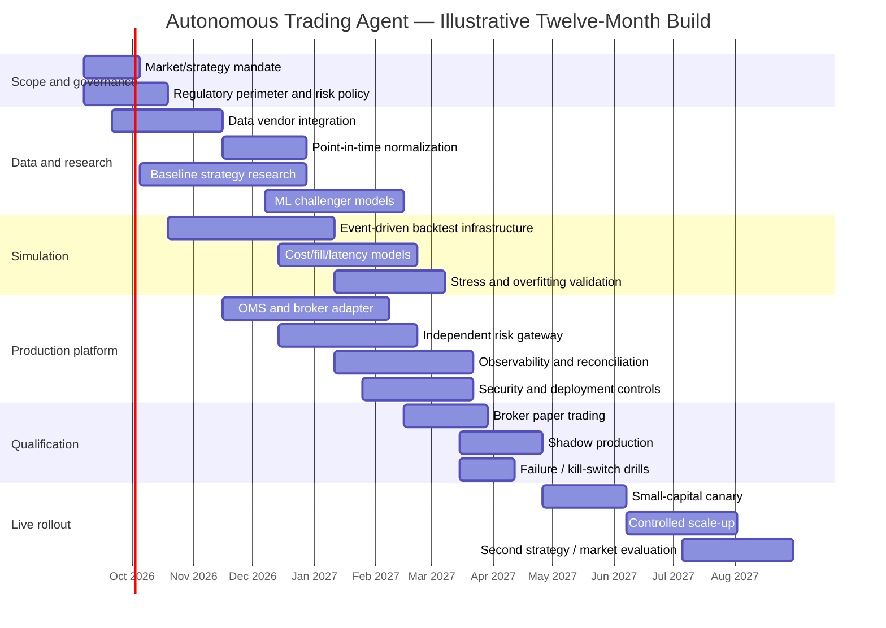

# Building an Autonomous Trading Agent: Research and Implementation Blueprint

## Executive summary

An autonomous trading system should be designed as a **controlled, event-driven decision system**, not as an unconstrained AI that is free to rewrite its strategy, alter risk limits, or deploy new models while capital is at risk. The production loop should be:

**market state → validated features → signal/policy → portfolio target → independent risk gate → execution → reconciliation → monitoring → feedback**.

Model training and strategy changes should remain outside that live loop and pass reproducible backtests, simulation, paper/shadow trading, risk review, and versioned deployment gates before reaching production. This architecture aligns with the direction of regulatory expectations for algorithmic trading: SEC market-access rules require documented pre-trade controls at broker-dealers providing market access, FINRA emphasizes supervision and controls around algorithmic strategies, and MiFID II Article 17 requires investment firms engaged in algorithmic trading to maintain resilient systems, thresholds, limits, testing, and controls. citeturn0search4turn15search0turn0search3

For a new system without a specified budget, **do not begin with market making, high-frequency trading, or end-to-end reinforcement learning**. The highest-probability engineering path is a medium-frequency system—roughly five-minute to daily decisions—on one asset class, using a simple and statistically defensible strategy such as futures trend following or liquid-equity mean reversion/statistical arbitrage. Time-series momentum has unusually broad empirical evidence across futures and related liquid markets, while pairs trading is a canonical relative-value baseline. Market making is substantially more dependent on queue position, inventory control, direct-book data, and latency. citeturn4search2turn4search17turn4search16

The recommended initial technology stack is **Python for research and model development, an event-driven backtester, object-storage/Parquet for immutable historical data, PostgreSQL or equivalent for transactional state, and a deterministic execution/risk service**. Rust or C++ should be introduced into the live hot path only when profiling demonstrates that Python/network/runtime latency is economically material. LEAN is attractive for broad multi-asset research-to-live workflows, while NautilusTrader is particularly compelling when deterministic event-driven simulation, order-book modeling, and research/live parity matter. vectorbt is useful for extremely fast hypothesis screening but should not be treated as a substitute for an event-driven execution simulator. citeturn12search8turn12search1turn12search5turn12search2

For market access, **Interactive Brokers is the strongest general-purpose starting point for a multi-asset system**, while Alpaca offers a comparatively straightforward API-first path for U.S. equities/crypto prototypes. OANDA is convenient for retail/API FX research but its documented v20 pricing stream publishes at most four prices per second per instrument, making that interface inappropriate for true high-frequency FX strategies. Coinbase and Kraken provide more direct crypto-oriented APIs; Kraken exposes REST, WebSocket, and FIX and describes FIX as its lowest-latency order-entry path. Futures teams needing more institutional connectivity can investigate FCM access through platforms such as Trading Technologies or CQG. citeturn18search0turn18search5turn18search3turn19search0turn19search1turn19search2turn19search3

Data and execution fidelity, rather than model sophistication, are likely to be the major determinants of whether a research result survives production. Every serious backtest should model fees, spread, slippage, market impact, financing or funding, borrow costs where relevant, contract rolls, corporate actions, latency, partial fills, and realistic position constraints. Strategy selection itself creates statistical bias: the probability-of-backtest-overfitting literature and the Deflated Sharpe Ratio explicitly address the inflation that results from testing many variants and reporting the winner. citeturn5search0turn5search1

Reinforcement learning is best treated as a **second-stage technique**, particularly for execution, dynamic sizing, or constrained control problems. Nevmyvaka, Feng, and Kearns demonstrated RL for optimized trade execution, which is a much more structured problem than asking an agent to discover unconstrained profitable trading behavior from noisy market data. Deep-learning architectures can be valuable when the data genuinely have high-dimensional temporal or order-book structure; DeepLOB is an influential example combining convolutional and recurrent components for limit-order-book prediction. citeturn5search3turn5search6

Cloud infrastructure is the default recommendation for research, batch training, data engineering, monitoring, and medium-frequency production. Exchange co-location is justified only when measured alpha decay makes microseconds economically important. Nasdaq explicitly advertises co-location improvements measured in microseconds, while CME states that its co-location connectivity provides the lowest-latency path to Globex; CME's current transition plan says its Aurora physical co-location remains its most performant Chicago-region access during market migrations through 2028. citeturn17search1turn17search4turn17search12

### Recommended baseline

| Decision | Recommended starting point | Why |
|---|---|---|
| Initial market | Liquid futures **or** U.S. equities | Mature infrastructure/data; easier to define an objective than a simultaneous four-market launch |
| Initial horizon | Five minutes to daily | Execution costs matter but microseconds usually do not |
| Initial strategies | Trend following plus one mean-reversion/stat-arb baseline | Empirically grounded and straightforward to falsify citeturn4search2turn4search17 |
| Initial models | Regularized linear models and gradient boosting | Strong tabular baselines; interpretable enough to diagnose |
| Deep learning | Add only after baseline proves feature/data value | Higher model and operational complexity |
| Reinforcement learning | Execution/sizing first | Better-defined state/action/reward problem citeturn5search3 |
| Research engine | LEAN or NautilusTrader; vectorbt for screening | Event-driven realism plus fast exploratory research citeturn12search8turn12search5turn12search2 |
| Market access | IBKR general-purpose; specialist venue/API where necessary | Broad API automation plus paper environment citeturn18search0turn18search4 |
| Infrastructure | Cloud-first; colocate only after latency economics are proven | Lower operational burden; HFT is a distinct infrastructure class citeturn17search2turn17search4 |
| Risk model | Independent deterministic risk gateway | The model must never be able to override limits |
| Deployment | Historical → event simulation → paper → shadow → canary capital → scale | Progressively exposes unmodeled execution and operational risk |
| Initial production target | Limited live deployment in approximately 8–10 months | Planning estimate for a competent 3–5 person team |
| Mature multi-strategy target | Approximately 12+ months | Planning estimate; HFT is materially longer/costlier |

**Cost convention used throughout this report:** *Low* means roughly **under $30,000/year** of non-labor technology/data/access spending; *Medium* means **$30,000–$200,000/year**; *High* means **above $200,000/year** and can exceed $1 million for direct feeds, institutional data licenses, connectivity, and co-location. These are planning estimates rather than vendor quotations and exclude trading capital, margin, commissions, and employee compensation.

## Markets, objectives, and strategy selection

### Defining the objective before selecting a model

The primary design error in autonomous trading projects is starting with “build an AI trader” rather than specifying an economic optimization problem. The objective should identify the capital base, expected holding period, target capacity, maximum drawdown, volatility target, turnover budget, permitted leverage, acceptable latency, liquidity constraints, expected operational uptime, and whether the system trades proprietary capital or money for others. The regulatory consequences can be dramatically different in the latter case.

A robust optimization objective is not simply:

\[
\max E[R]
\]

but more closely:

\[
\max_{\theta}\;
E[R_\theta]
-\lambda_\sigma \,\mathrm{Risk}_\theta
-\lambda_{tc}\,\mathrm{TradingCost}_\theta
-\lambda_{dd}\,\mathrm{Drawdown}_\theta
-\lambda_{cap}\,\mathrm{CapacityPenalty}_\theta
\]

subject to leverage, liquidity, exposure, position, order-size, venue and operational constraints.

The important implication is that **forecast accuracy is an intermediate metric**, not the production objective. A model with lower classification accuracy can be better if its errors are concentrated in low-value states, its high-confidence predictions are better calibrated, or it turns over the portfolio much less.

### Market comparison

| Market | Structural advantages | Principal difficulties | Best initial strategies | Data burden | Execution/latency burden | Recommended starting status |
|---|---|---|---|---|---|---|
| **Equities** | Huge universe; rich fundamentals; liquid index/mega-cap names; extensive historical data | Fragmented U.S. venues, corporate actions, delistings, survivorship bias, borrow/short-sale restrictions | Cross-sectional mean reversion, stat arb, factor/trend models | Medium–High | Medium; High for market making | **Recommended** |
| **Futures** | Centralized exchange books; standardized contracts; liquid macro exposure; leverage; clean directional expressions | Expiry/rolls, contract multipliers, limit rules, margin, term-structure modeling | Trend following, carry, spread/relative value, execution research | Medium | Medium; High for market making | **Strongly recommended** |
| **Crypto** | API-native, 24/7 markets, observable order books, unique funding/on-chain data | Venue/counterparty risk, fragmented liquidity, non-stop operations, changing market structure/regulation | Trend, cross-venue relative value, funding/basis, market making | Medium–High | Medium–Very High | **Second-stage** |
| **FX** | Deep major-pair liquidity; strong macro structure; 24/5 trading | OTC/dealer-specific prices, financing/roll, fragmented feeds, access model varies | Trend, carry, macro relative value, mean reversion | Medium | Medium–Very High | **Good specialist choice** |

Futures are particularly attractive for a first systematic trend system because standardized liquid contracts provide access to equity indices, rates, commodities and currencies through a relatively uniform execution model. The time-series momentum evidence of Moskowitz, Ooi and Pedersen found momentum across 58 liquid futures/forward instruments and showed persistence across approximately one-to-twelve-month horizons. citeturn4search2

Equities offer far more cross-sectional observations but create additional engineering obligations. A credible historical database needs point-in-time universe membership, delisted securities, split/dividend adjustments, trading halts, symbol/reference-data changes, and—when shorting—historical borrow availability and costs. U.S. short sales are also subject to Regulation SHO requirements implemented at the broker/market-access level, including order marking, locate/close-out rules and the Rule 201 price restriction when triggered. citeturn16search8turn16search0

Crypto makes experimentation easy but live operations harder. It is continuously traded, APIs and rate limits vary by venue, and a strategy must model venue outages, funding rates, liquidation mechanics, custody, stablecoin exposure and counterparty concentration. The U.S. regulatory framework is also unusually dynamic as of September 4, 2026: the SEC and CFTC issued a joint interpretive development in March 2026, and the SEC proposed “Regulation Crypto Assets” in August 2026. That proposed regulation is **not yet a final rule**, so U.S. crypto deployment should be reviewed instrument-by-instrument and venue-by-venue rather than relying on a generic “crypto” classification. citeturn16search18turn16search37turn16search2

FX is structurally different because there is no single consolidated spot-FX order book equivalent to a centralized futures exchange. Broker feeds can therefore be part of the economic model itself. For example, OANDA's v20 API provides programmatic FX access and historical pricing, but its documented pricing stream emits at most four prices per second per instrument, illustrating why a convenient retail/API feed and an institutional low-latency feed are not interchangeable. citeturn18search7turn18search3

### Strategy families

| Strategy | Core hypothesis | Ideal markets/horizon | Recommended modeling | Main failure mode | Cost/complexity |
|---|---|---|---|---|---|
| **Trend following** | Returns exhibit persistence over selected horizons | Futures, FX, equities; hours to months | Rules, linear models, boosted trees, regime filters | Choppy markets, crowding, excessive turnover | **Low–Medium** |
| **Mean reversion** | Relative or absolute deviations revert | Equities, futures spreads, crypto; seconds to days | Z-scores, state-space models, residual models, boosting | Structural breaks; transaction costs overwhelm edge | **Medium** |
| **Statistical arbitrage** | Cross-sectional residual mispricing can be neutralized and harvested | Equities, futures, crypto | Factor models, PCA, cointegration, ML ranking + optimizer | Hidden factor bets, borrow/liquidity shocks | **Medium–High** |
| **Market making** | Capture spread while controlling adverse selection and inventory | Liquid centralized/crypto order books; milliseconds–seconds | Inventory models + short-horizon prediction + optimal quoting | Toxic flow, queue disadvantage, latency, inventory runaway | **High** |
| **RL-based control** | Learn sequential policy under explicit reward and constraints | Execution, quoting, sizing; eventually alpha | PPO/SAC/DQN-family methods or custom actor-critic | Simulator exploitation and distribution shift | **High** |

The Avellaneda–Stoikov framework is a canonical mathematical starting point for market making because it explicitly couples bid/ask placement to inventory risk rather than treating spread capture as free profit. Real implementations must go much further by estimating fill probability, queue position, adverse selection and latency. citeturn4search16

For mean reversion and relative value, Gatev, Goetzmann and Rouwenhorst's pairs-trading work remains a useful reference baseline. A production statistical-arbitrage strategy should generalize beyond pair selection into a portfolio problem with factor neutralization, capacity, borrow and cost constraints. citeturn4search17

RL should not be viewed as inherently more autonomous or more profitable. Its largest challenge is that the learned policy optimizes against the environment it is given. A simulator with unrealistic fill mechanics can therefore produce an extremely successful agent that has learned to exploit the simulator rather than the market. The empirical execution work of Nevmyvaka, Feng and Kearns is instructive precisely because the action space and objective—executing an order—are more constrained than open-ended alpha discovery. citeturn5search3

### Workstream decisions

| Item | Recommended option | Principal trade-off | Implementation steps | Required skills | Cost | Priority |
|---|---|---|---|---|---|---|
| Objectives | Explicit risk-adjusted net-P&L objective with capacity/turnover constraints | More constraints can reduce headline backtest Sharpe while increasing realism | Define capital, horizon, instruments, leverage, drawdown, turnover, latency and capacity | Quant finance, portfolio/risk | Low | **P0** |
| Market scope | One asset class first | Less diversification initially; far less implementation ambiguity | Pick liquid universe, calendar, trading hours, contract/security master | Quant + market microstructure | Low | **P0** |
| Strategy scope | One baseline + one orthogonal challenger | Slower strategy proliferation; lower overfitting risk | Economic hypothesis → simple baseline → cost model → walk-forward test | Statistics, econometrics | Low–Medium | **P0** |
| Market making | Defer until event simulator and direct-book expertise exist | Forgoes HFT opportunities | Build L2/L3 replay, queue model, latency model, inventory controls | Microstructure, C++/Rust, networking | High | **P2** |
| RL | Apply first to execution/sizing | Does not provide an “AI-first” marketing story | Build validated environment, baseline policy, constrained reward, out-of-sample evaluation | RL, simulation, quant | High | **P2** |

## Data, features, and model architecture

### Data architecture and historical depth

Market data should be treated as an immutable, versioned input dataset. Do not make the broker's historical API the canonical research store. Broker histories can have depth, pacing and granularity limitations; independent vendor data lets the same historical dataset feed research, simulation and post-trade analysis. IBKR, for example, documents historical-data restrictions including limited availability for some small-bar histories and expired futures, reinforcing the value of a dedicated research-data layer. citeturn6search24

A practical schema has four layers:

**Raw layer.** Store exactly what the vendor supplied, including receive/exchange timestamps, sequence numbers and metadata.

**Normalized layer.** Resolve symbols to immutable instrument identifiers, normalize timestamps, standardize price/size units, map corporate actions and contract rolls, and preserve provenance.

**Feature layer.** Materialize only features that can be reproduced from information that genuinely existed at the feature timestamp.

**Training/evaluation layer.** Freeze datasets by version so every experiment can be reconstructed.

Suggested historical depth is strategy-dependent and is best treated as a design target rather than a universal rule:

| Strategy/horizon | Resolution | Practical target depth | Key data |
|---|---|---:|---|
| Medium/slow trend | Daily/hourly | 10–20+ years where available | OHLCV, term structure, rolls, rates |
| Cross-sectional equities | Daily–minute | 10–20 years daily; several years intraday | Prices, corporate actions, point-in-time universe, fundamentals |
| Intraday mean reversion | Tick/1-second/minute | 3–10 years | Quotes, trades, spreads, auction/session data |
| Market making | L2/L3 event data | Prefer multiple market regimes; often 1–5 years due volume | Every book event, trades, sequence numbers, venue rules |
| Crypto intraday | Trades/L2/L3 | Multiple bull/bear and venue-regime periods | Trades, books, funding, OI, liquidations |
| RL execution | Event-level replay | Enough orders/regimes to stress policy | Book events plus realistic execution labels/models |

For slow strategies, longer history is generally valuable because the objective is to see many macroeconomic and volatility regimes. For microstructure models, old data have diminishing relevance as matching engines, tick sizes, participant behavior and venue rules change; more data are not automatically better.

### Data-provider comparison

| Provider | Coverage/use case | Strengths | Limitations | Indicative fit/cost |
|---|---|---|---|---|
| **Databento** | Equities, futures, options; direct exchange-derived historical/live data | L1/L2/L3-style schemas; Python/C++/Rust APIs; self-service; CME history advertised from 2010; historical pricing can be usage based citeturn20search0turn20search16 | Coverage depth varies by dataset/venue; exchange licensing still matters | Excellent systematic/HFT research; **Low–High** |
| **Massive** | U.S. equities and related retail/developer datasets | Developer-friendly REST/WebSocket; U.S. stock history back to 2003 on its current product page citeturn20search1 | Lower tiers may omit tick quotes/trades or real-time entitlements | Excellent prototype/medium frequency; **Low–Medium** |
| **LSEG Tick History** | Institutional multi-asset/OTC/global history | 580+ venues/contributors and L1/L2 history as far back as 1996 citeturn20search2 | Enterprise contracting, licensing, cost and integration complexity | Institutional multi-asset; **High** |
| **dxFeed** | Equities, futures, options, FX, crypto | Tick and aggregate data, full-depth options, broad global coverage; history advertised from 1998 citeturn20search7 | Pricing/entitlements depend on requested markets | Strong multi-asset alternative; **Medium–High** |
| **Tardis.dev** | Crypto historical microstructure | Specialized tick-by-tick crypto order books, trades, funding/OI/liquidation data | Crypto-specific; venue history/quality varies | Crypto research; **Low–Medium** |
| **SEC EDGAR APIs** | U.S. filings/fundamentals alternative input | Official filings and structured XBRL/submission data; no commercial market-data license citeturn11search2 | Requires point-in-time parsing/entity mapping; not a market-price feed | Fundamental/alternative features; **Low** |

Data costs rise nonlinearly once the system needs **redistribution rights, enterprise use, multiple exchanges, full order-by-order books and real-time direct feeds**. A cheap historical API can support excellent daily research; it is not economically equivalent to operating direct feeds in a co-location facility.

### Alternative data

Alternative data should be introduced only after the market-data pipeline is point-in-time correct. Useful categories include filings and corporate events, machine-readable news, macroeconomic releases, web-derived business indicators, derivatives positioning/funding data, and crypto on-chain information.

The essential requirement is to record:

\[
(t_{\text{event}},\; t_{\text{published}},\; t_{\text{received}},\; t_{\text{revised}})
\]

rather than attaching today's cleaned value to yesterday's timestamp. A macroeconomic number revised three months later, a restated filing, or a corrected news record must not leak its revised value into the historical prediction state.

Alternative-data evaluation should therefore test **incremental out-of-sample information after realistic publication latency and transaction costs**, not merely correlation with future returns.

### Feature engineering

Recommended feature groups differ by strategy:

| Feature family | Examples | Best use |
|---|---|---|
| Returns/trend | Multi-horizon log returns, EMA difference, breakout distance, volatility-scaled momentum | Trend |
| Volatility/risk | Realized volatility, range estimators, downside volatility, correlation, beta | All strategies |
| Relative value | Cross-sectional ranks, residual returns, spread z-score, cointegration error | Mean reversion/stat arb |
| Liquidity | Bid-ask spread, depth, volume, participation rate, Amihud-like proxies | Execution/portfolio constraints |
| Microstructure | Book imbalance, microprice, order-flow imbalance, queue/depth dynamics | Market making/intraday |
| Futures/FX | Basis, curve slope, roll yield, carry, funding/rate differentials | Trend/carry/relative value |
| Crypto | Perpetual funding, basis, open interest, liquidations, cross-venue premium | Crypto |
| Fundamental/event | Point-in-time filings, earnings/event indicators, revisions | Equity cross-sectional |
| Calendar | Session phase, auction proximity, day-of-week, expiry/roll timing | Execution/intraday |

Features should normally be normalized by a scale that moves with market conditions—volatility, spread, ADV, depth or cross-sectional dispersion—rather than relying on raw price units. This improves cross-instrument comparability and reduces the tendency for a model to learn trivial differences such as “this security happens to have a higher nominal price.”

Feature generation must be explicitly timestamped. A safe convention is:

\[
x_t = f(\mathcal{I}_{t^-}), \qquad
y_t = R_{t+\Delta}
\]

where \(\mathcal{I}_{t^-}\) contains only information available before the decision.

### Model architecture

The recommended hierarchy is **simple model → sophisticated model → ensemble/hybrid**, with every additional layer required to beat the simpler model after costs.

| Framework / approach | Recommended use | Strengths | Weaknesses | Production role |
|---|---|---|---|---|
| **scikit-learn / linear models** | Baselines, regime models, calibration | Mature supervised-learning toolkit; fast, interpretable and easy to validate citeturn14search0 | Limited for raw high-dimensional sequence modeling | **Default baseline** |
| **XGBoost** | Tabular alpha, ranking, nonlinear interactions | Optimized gradient-boosting implementation and scalable training citeturn13search13 | Can overfit noisy financial features; no native market-state concept | **Strong default challenger** |
| **PyTorch** | LSTM/CNN/Transformer/order-book models | Flexible CPU/GPU tensor and deep-learning stack citeturn13search22 | Larger training/serving/debugging burden | Use with rich sequence data |
| **DeepLOB-like models** | L2/L3 order-book prediction | Architecture explicitly designed for limit-order-book structure citeturn5search6 | Data hungry; execution profitability can diverge from predictive accuracy | Advanced microstructure |
| **RLlib** | Distributed RL for execution/sizing/policy research | Scalable RL algorithms and distributed training support citeturn13search3turn13search23 | Environment correctness is difficult; high variance | **Second-stage** |
| **Hybrid deterministic + ML** | Production trading | Separates noisy forecasts from hard portfolio/risk constraints | Requires more explicit systems engineering | **Recommended production architecture** |

A high-quality production model normally outputs something like:

\[
(\hat\mu_i,\; \hat\sigma_i,\; c_i)
\]

where \(\hat\mu_i\) is expected return or relative score, \(\hat\sigma_i\) is uncertainty/risk and \(c_i\) is confidence. A separate optimizer then turns forecasts into positions:

\[
w^* =
\arg\max_w
\left(
\hat\mu^\top w
-\lambda w^\top\Sigma w
-C(\Delta w)
\right)
\]

subject to risk, leverage, liquidity and portfolio constraints.

This is preferable to training a model to emit raw broker instructions such as `BUY 7,500 shares` because the forecasting problem, portfolio problem and execution problem remain independently testable.

### Where an LLM-style agent belongs

An LLM can be useful in the **slow control plane** for parsing unstructured research/news, producing structured event records, explaining alerts, querying telemetry, generating research hypotheses, or assisting incident diagnosis. It should not initially be the direct low-latency authority sending orders.

Any agentic component should have an allow-listed action API:

`propose_target_positions()`  
`request_backtest()`  
`query_risk()`  
`explain_anomaly()`

rather than unrestricted shell, database, credential or brokerage access. Outputs should use typed schemas and be rejected if they violate bounds. Live code generation or self-deployment should require an offline CI/CD approval path.

### Data/model workstream

| Item | Recommended option | Trade-off | Implementation steps | Skills | Cost | Priority |
|---|---|---|---|---|---|---|
| Market data | Independent historical vendor + broker/venue live feed | More integrations; better reproducibility | Raw ingestion → normalization → validation → feature store | Data engineering, microstructure | Medium | **P0** |
| Historical depth | Match depth/resolution to horizon | High-frequency history becomes large/expensive | Acquire representative regimes; freeze dataset versions | Quant/data engineering | Medium | **P0** |
| Alternative data | Add only after baseline works | Potential alpha vs leakage/licensing complexity | Timestamp availability; entity-map; incremental-ablation test | NLP/data science/domain | Medium–High | **P2** |
| Features | Economically interpretable, timestamp-safe features first | May miss nonlinear structure; easier falsification | Feature contract → unit tests → lag/leakage tests → ablations | Quant/statistics | Low | **P0** |
| Classical ML | Linear + XGBoost baseline | Less expressive than deep nets | Walk-forward train/validate, calibration, stability analysis | ML/statistics | Low | **P0** |
| Deep learning | Only for sufficiently rich sequential data | Compute/debug complexity | Build simple benchmark first, then sequence model and ablation | PyTorch, ML engineering | Medium | **P1/P2** |
| RL | Execution/sizing environment first | Simulator gap | Define MDP, constraints/reward, realistic market replay, policy comparison | RL, simulation | High | **P2** |

## Research, backtesting, simulation, and execution

### Backtesting hierarchy

A single backtest is not sufficient. Use a hierarchy of increasingly realistic experiments:

**Research/vectorized test.** Quickly reject economically weak ideas.

**Event-driven test.** Reconstruct orders, positions, fills, calendars and portfolio state.

**Historical market replay.** Replay tick/L2/L3 events and model latency, queueing and partial fills.

**Paper broker/venue environment.** Verify API state machines and live market-data behavior.

**Shadow production.** Run the exact production strategy against real-time data while sending no orders.

**Canary live deployment.** Send genuinely executable but deliberately small orders.

**Controlled scale-up.** Increase exposure only after statistical and operational acceptance criteria are met.

This hierarchy is especially important because paper trading proves software integration more reliably than it proves profitability. Alpaca explicitly describes its paper environment as a simulator whose orders are not sent to the exchange but are filled against real-time quote information; IBKR likewise provides simulated paper accounts accessible through its APIs. citeturn18search1turn18search4

### Backtesting-platform comparison

| Platform | Architecture / language | Major strengths | Main limitations | Recommended use | Cost |
|---|---|---|---|---|---|
| **QuantConnect LEAN** | Open source; C#/Python; research/backtest/live | Multi-asset, large ecosystem, same engine can move toward live execution citeturn12search8turn12search0 | Fine-grained custom microstructure work can require substantial adaptation | Medium-frequency multi-asset | Low–Medium |
| **NautilusTrader** | Rust-native engine with Python interface | Nanosecond event model, configurable fill/latency/order-book simulation, research/live parity emphasis citeturn12search1turn12search5 | Smaller ecosystem than LEAN; steeper systems-learning curve | Intraday, market microstructure, production | Low–Medium |
| **vectorbt** | NumPy/pandas-oriented vectorized research | Extremely fast parameter sweeps and portfolio experimentation citeturn12search2 | Vectorized assumptions are weak for queue/latency/order-state simulation | Fast hypothesis screening | Low |
| **Backtrader** | Python event-driven | Simple conceptual model and useful for conventional strategies citeturn12search3 | Older integration ecosystem and less suited to modern high-fidelity microstructure | Education/simple prototypes | Low |
| **Custom simulator** | Usually Rust/C++/Python hybrid | Exact venue semantics, proprietary fill/queue/latency model | Long development and validation effort; simulator bugs become research bugs | Mature HFT/market making | High |

For a general-purpose project, a sensible combination is **vectorbt for rapid exploratory rejection and NautilusTrader or LEAN for the authoritative event-driven test**. A strategy does not graduate based on its vectorized backtest.

### Backtest correctness

The test harness should explicitly cover:

**Universe correctness.** No current-index constituent list applied retrospectively.

**Corporate actions.** Splits, dividends, symbol changes, mergers and delistings.

**Futures rolls.** Signal series and executable contract series must be distinguished; synthetic continuous prices are not themselves tradable.

**Timestamp correctness.** Exchange timestamp, publication timestamp and local receipt timestamp must not be conflated.

**Costs.** Commission + exchange fees + spread + expected slippage + impact + borrow/funding + financing + roll costs.

**Liquidity.** Cap participation rate and order size relative to observable depth/volume.

**Shorting.** Model availability/borrow cost rather than assuming unlimited free borrow.

**Order mechanics.** Partial fills, rejection, cancellation races, minimum size/tick, time-in-force.

**Latency.** At minimum, simulate observation-to-order and order-to-acknowledgement delays for intraday systems.

**Statistical multiplicity.** Preserve the number of strategies/parameters tried, not just the winner.

The latter is critical. Bailey and coauthors' Probability of Backtest Overfitting framework explicitly addresses strategy-selection bias, while the Deflated Sharpe Ratio adjusts reported performance for selection effects and non-normal return distributions. citeturn5search0turn5search1

A research acceptance scorecard should therefore include:

\[
\text{Net Sharpe},\quad
\text{Sortino},\quad
\text{Max DD},\quad
\text{Turnover},\quad
\text{Capacity},\quad
\text{Worst stress loss},
\]

plus performance by year, volatility regime, market regime, instrument, long/short side and cost assumption.

A candidate should survive at least 1.5–2× the central transaction-cost assumption before live consideration. That multiplier is an engineering stress-test recommendation, not a claim that any particular multiple predicts actual production costs.

### Simulation fidelity by strategy

For daily trend following, bar-based event simulation can be adequate if next-bar timing, contract rolls and realistic costs are handled correctly.

For intraday mean reversion/stat arb, use trades plus quotes and model order delay and partial fills.

For market making, bar-based backtesting is effectively unusable. The simulator needs book events, queue priority assumptions, order acknowledgement/cancel delay, self-trade prevention, maker/taker fees and adverse selection. This is one reason direct-book vendors expose L2/L3 or market-by-order data; Databento, for example, exposes market-by-order, market-depth and top-of-book schemas for U.S. equities. citeturn20search16

### Execution system

Execution should be a distinct service with a deterministic state machine:

```text
TARGET
  ↓
PRE-TRADE RISK
  ↓
ORDER INTENT
  ↓
ROUTING / CHILD-ORDER ALGORITHM
  ↓
BROKER OR VENUE
  ↓
ACK / PARTIAL FILL / FILL / REJECT / CANCEL
  ↓
AUTHORITATIVE ORDER LEDGER
  ↓
POSITION + CASH RECONCILIATION
```

Every order needs a unique idempotent client identifier. The OMS should tolerate duplicate messages, delayed acknowledgements, disconnects and out-of-order network events. The internal position is never allowed to diverge silently from the broker's authoritative account state.

Execution strategies should begin with simple choices—marketable limit, passive limit, TWAP/POV-style slicing—and add sophisticated optimization only when order sizes warrant it. The Almgren–Chriss framework remains a foundational model for balancing expected execution cost and price risk over an execution schedule. citeturn4search11

### Low-latency engineering

A low-latency system should be built around an **economic latency budget**, not an engineering vanity metric.

Measure:

\[
L_{\text{tick-to-trade}}
=
t_{\text{order transmitted}}
-
t_{\text{market event observed}}
\]

along with market-data propagation, feature computation, inference, risk check, serialization, network, gateway acknowledgement and fill latency. AWS similarly defines tick-to-trade around the response from a market-data event to transmission of the subsequent trading instruction. citeturn17search18

Track p50, p95, p99 and p99.9 latency as well as jitter. Median latency is insufficient for strategies in which rare stalls generate adverse fills.

A staged latency stack is preferable:

| Stage | Implementation | Typical use |
|---|---|---|
| Standard cloud/API | Python, REST/WebSocket, ordinary VMs | Minutes/daily |
| Optimized cloud | Long-lived streams, placement affinity, tuned VM/network, compiled execution service | Milliseconds–seconds |
| Proximity hosting | Financial data center / dedicated connectivity | Sub-ms to low-ms |
| Exchange co-location | Direct feed, C++/Rust, carefully tuned OS/network/hardware | Microsecond-sensitive HFT |

Azure specifically documents proximity placement groups for workloads including high-frequency trading where physical proximity between compute resources matters. citeturn17search3

At the extreme end, exchange proximity becomes part of the strategy. Nasdaq says its co-location connectivity can reduce round-trip latency by an average of two-to-five microseconds, while CME identifies its co-location option as its lowest-latency connectivity path. citeturn17search1turn17search4

At that point the engineering skill set changes: C++/Rust, CPU affinity, NUMA awareness, allocation avoidance, high-resolution timing, kernel/network tuning, multicast/direct-feed decoding and possibly hardware acceleration become more important than adding another machine-learning layer.

### Research/execution workstream

| Item | Recommended option | Trade-off | Implementation steps | Skills | Cost | Priority |
|---|---|---|---|---|---|---|
| Backtest | Authoritative event-driven engine | Slower than vectorized research; far more realistic | Define event model → costs → portfolio accounting → golden tests | Quant + software engineering | Low–Medium | **P0** |
| Statistical validation | Walk-forward/OOS + multiplicity accounting | Fewer apparently spectacular results | Freeze hypotheses, record trials, regime/stress tests | Statistics | Low | **P0** |
| Market simulation | Fidelity proportional to strategy frequency | Higher fidelity consumes data/engineering | Add quotes → latency → partial fills → L2/L3 queues as needed | Microstructure | Medium–High | **P1** |
| Paper/shadow | Run production binary/config against live feeds | Paper fills remain synthetic | Broker paper → shadow → reconcile hypothetical orders | Trading systems | Low | **P0/P1** |
| OMS/execution | Separate deterministic service | Additional component boundary; substantially safer | State machine, persistent log, retry/idempotency, reconciliation | Distributed systems, FIX/API | Medium | **P0** |
| Low latency | Optimize only from measured alpha decay | Avoids premature expensive engineering | Benchmark → decompose latency → optimize bottleneck → colocate if justified | C++/Rust/networking | High | **P2** |

## Market access, infrastructure, and system architecture

### Broker, exchange and API comparison

No single broker/API is optimal for all four requested markets.

| Access option | Markets | Interfaces | Simulation/paper | Latency profile | Best role | Main trade-off |
|---|---|---|---|---|---|---|
| **Interactive Brokers** | Broad multi-asset including equities, futures and FX | Web API, TWS API, FIX among documented options citeturn18search8 | API-compatible paper account citeturn18search4 | Good for ordinary systematic trading; not a substitute for direct-exchange HFT | **Best general multi-asset starting broker** | API/session architecture and data subscriptions need careful operations |
| **Alpaca** | U.S. stocks, crypto; options API support | REST + streaming WebSocket citeturn18search5turn18search25 | Free real-time paper simulator citeturn18search1 | API-first, appropriate for medium-frequency systems | **Fastest U.S.-equity prototype** | Narrower global/derivatives coverage |
| **Coinbase Advanced Trade** | Spot crypto, U.S. futures and global derivatives depending eligibility | REST, WebSocket, official SDKs citeturn19search0 | Environment/product dependent | Internet/API crypto; institutional products have separate offerings | Crypto prototype/production | Venue concentration and crypto-specific operational risk |
| **Kraken** | Spot and derivatives | REST, WebSocket, FIX citeturn19search12 | Testing access depends interface/account | FIX described as lowest-latency order-entry path citeturn19search1 | Crypto algo/MM/HFT progression | Multiple engines/protocols/rate limits |
| **OANDA v20** | Primarily FX/CFD depending jurisdiction | REST + streaming endpoints citeturn18search7 | Demo account supported citeturn18search7 | Stream max four prices/s/instrument on documented v20 interface citeturn18search3 | FX prototype/medium-frequency | Unsuitable interface for genuine HFT |
| **Trading Technologies via FCM/access provider** | Broad futures/options connectivity | TT platform APIs including REST citeturn19search2 | Environment varies | Institutional derivatives workflow | Futures institutional build | API usage plans can carry added fees citeturn19search6 |
| **CQG via FCM** | Futures and derivatives connectivity | FIX and other CQG interfaces | Documented FIX simulation/conformance environment citeturn19search3 | Institutional derivatives connectivity | Futures execution/integration | Commercial access and integration complexity |

For development, the key broker-selection criteria should be broader than commission rate:

\[
\text{Broker score} =
f(
\text{product coverage},
\text{API reliability},
\text{market-data quality},
\text{order types},
\text{risk controls},
\text{paper environment},
\text{rate limits},
\text{support},
\text{capital protection},
\text{latency}
)
\]

A production system should wrap all brokers behind an internal broker adapter so strategy code does not depend directly on vendor-specific message types.

### Recommended cloud/on-prem split

**Research and training:** cloud.

Elastic batch compute is valuable because backtests and model training are bursty rather than continuously latency sensitive.

**Historical storage:** cloud object storage or equivalent durable object store.

Use compressed columnar files such as Parquet organized by dataset/date/instrument, with checksums and a catalog.

**Metadata and transactional state:** relational database.

Positions, order metadata, deployment configuration, model registry and reconciliation information require transactional consistency.

**Streaming/event transport:** durable messaging where warranted.

The actual execution hot path should remain as short as possible; a complex distributed stream-processing topology is rarely desirable between “signal” and “send order.”

**Live execution:** cloud VM close to the broker for medium-frequency systems; proximity/colocation only when measurement demonstrates value.

AWS documents Local Zones as one option for lower-latency trading workloads, and Azure provides proximity placement functionality for latency-sensitive compute. Neither removes the need to benchmark the actual path to the chosen venue. citeturn17search2turn17search3

**HFT:** venue-specific infrastructure.

Physical location, cross-connects and direct feeds become first-class design variables. CME, for example, provides equidistant low-latency GLink access from its co-location service. citeturn17search0

### High-level architecture

```mermaid
flowchart LR
    A[Exchanges / Data Vendors] --> B[Market Data Adapters]
    C[Alternative Data] --> D[Point-in-Time Data Pipeline]

    B --> E[Raw Immutable Event Store]
    D --> E
    E --> F[Normalized Data / Feature Pipeline]

    F --> G[Research & Training]
    G --> H[Model Registry + Validation Gates]

    H -->|Approved version| I[Live Signal / Policy Service]
    B --> I

    I --> J[Portfolio Construction]
    J --> K[Independent Pre-Trade Risk Gateway]

    K -->|Approved order intent| L[OMS / Execution Engine]
    K -->|Reject| M[Risk & Operations Alerts]

    L --> N[Broker / FCM / Exchange APIs]
    N --> O[Fills / Acks / Rejects]

    O --> P[Authoritative Order Ledger]
    P --> Q[Position / Cash Reconciliation]
    Q --> J

    B --> R[Real-Time Telemetry]
    I --> R
    K --> R
    L --> R
    P --> R
    Q --> R

    R --> S[Monitoring / Drift / P&L / Latency]
    S --> M
    M --> T[Human Operator / Incident Response]

    T --> U[Global Kill Switch]
    U --> K
    U --> L
```



The most important boundary is between **model output and order transmission**. The risk gateway should be a separately deployed component with independently configured hard limits. The signal model cannot grant itself permission to exceed those limits.

A second important boundary separates **research credentials from execution credentials**. The research environment should not possess live broker keys merely because it trains or evaluates models.

### Core production services

A minimal non-HFT deployment normally needs:

| Service | Responsibility | Failure behavior |
|---|---|---|
| Market-data adapter | Normalize streaming vendor/venue messages | Stop or degrade affected strategy on stale/gapped data |
| Feature/state engine | Maintain online feature state | Reject output if feature freshness invalid |
| Signal service | Model inference/rules | No position changes on unhealthy model |
| Portfolio service | Translate signals to targets | Enforce portfolio-level constraints |
| Risk gateway | Hard pre-trade controls | **Fail closed** |
| OMS | Order lifecycle/state | Reconcile before resuming uncertain orders |
| Broker adapter | Vendor protocol translation | Retry only idempotently; respect rate limits |
| Ledger/reconciliation | Compare internal and external positions/cash | Raise critical incident on material mismatch |
| Telemetry | Metrics/traces/events | Trading can continue only within defined observability-loss policy |
| Control plane | Config/model deployment | Signed/versioned releases; no unrestricted live mutation |

### Infrastructure workstream

| Item | Recommendation | Trade-off | Steps | Skills | Cost | Priority |
|---|---|---|---|---|---|---|
| Market access | Adapter abstraction with one production broker first | More abstraction work; easier later expansion | Implement instruments/orders/fills/reconcile interface | Trading API/FIX engineering | Medium | **P0** |
| Cloud | Cloud-first for research and medium-frequency live | Internet/VM jitter vs lower operational burden | Separate research/prod accounts; IaC; private networking | Cloud/SRE | Medium | **P0** |
| Storage | Immutable object store + relational operational DB | Multiple data technologies | Partition, checksum, retention, backup and restore tests | Data/platform | Low–Medium | **P0** |
| Colocation | Only after measured economic latency requirement | Very expensive/specialized | Benchmark alpha decay → direct-feed pilot → proximity test | HFT systems/network | High | **P2** |
| Portability | Strategy logic broker-neutral | Initial adapter overhead | Typed internal event/order schemas | Software architecture | Low | **P1** |

## Risk, compliance, monitoring, and resilience

### Risk management and portfolio construction

Risk control should be hierarchical.

At the **order level**:

\[
|\text{order notional}| \le N_{\max}
\]

and validate price bands, quantity, tick/lot size, duplicate orders, estimated margin and order frequency.

At the **instrument level**:

\[
|w_i| \le w_i^{\max}
\]

with liquidity/ADV limits and, for derivatives, contract/expiry constraints.

At the **strategy level**, cap gross/net exposure, leverage, turnover, drawdown, daily loss and risk concentration.

At the **portfolio level**, monitor correlation, factors, sectors, currencies, volatility, stress scenarios and counterparty/venue exposure.

At the **firm/system level**, enforce absolute capital-loss, margin and connectivity constraints independently of any strategy.

A practical allocation model for multiple strategies is:

\[
w =
\operatorname{Optimize}
\left(
\hat\mu,
\Sigma,
TC,
L
\right)
\]

where \(TC\) models transaction cost and \(L\) liquidity/capacity. Depending on forecast reliability, production choices include volatility targeting, risk parity, constrained mean-variance optimization, factor-neutral portfolios, or combinations.

For a first deployment, **volatility targeting with explicit position/concentration constraints** is generally easier to validate than unconstrained return optimization.

Stress testing should include historical episodes and synthetic shocks: volatility doubling, correlation moving toward one, spread widening, liquidity disappearing, a data feed freezing, venue outage, broker disconnect, margin increase, gap moves and extreme funding/borrow changes.

### Hard safety controls

An autonomous trading model should be unable to disable:

| Control | Trigger/action |
|---|---|
| Maximum order size/notional | Reject order |
| Maximum position/gross/net leverage | Reject or only permit risk-reducing trades |
| Daily realized + unrealized loss limit | Halt new risk |
| Strategy drawdown threshold | De-risk or disable strategy |
| Stale market-data threshold | Cancel passive orders and/or stop trading |
| Position mismatch | Stop affected strategy and reconcile |
| Excess rejection/error rate | Throttle/halt |
| Abnormal order rate | Throttle/halt |
| Price-band sanity check | Reject anomalous price |
| Heartbeat/process failure | Cancel-on-disconnect where supported; fail closed |
| Global kill switch | Cancel open orders and prevent new risk |

Exchange-provided mechanisms should supplement—not replace—internal controls. CME provides a kill-switch capability as part of its electronic risk-control tooling. citeturn1search7

### U.S. compliance

The exact regulatory obligations depend on **who operates the agent, whose capital it trades, the instruments, and the market-access arrangement**. Proprietary trading through a broker, operating as a broker-dealer, running a fund, providing investment advice, acting as a CTA/CPO, or operating a crypto service are not interchangeable legal situations.

For securities market access, SEC Rule 15c3-5 requires broker-dealers with market access to establish, document and maintain risk-management controls. It was explicitly intended to prevent unfiltered or “naked” market access. A proprietary customer trading through such a broker may not itself be the party directly subject to every broker-dealer provision, but its automated flow will sit behind controls imposed by the access provider. citeturn0search4turn15search11

FINRA's algorithmic-trading guidance emphasizes supervision and controls around development, testing and implementation of trading algorithms at member firms. FINRA also maintains supervision requirements for members and specific guidance around personnel involved in developing or significantly modifying algorithmic strategies. citeturn15search0turn15search3turn15search15

For U.S. equity short selling, the system must be compatible with Regulation SHO controls, including order marking, locate/close-out requirements and the Rule 201 short-sale price restriction when applicable. citeturn16search8turn16search0

For futures and commodity derivatives, the CFTC regulates designated contract markets and related derivatives infrastructure, while NFA members are subject to electronic-trading supervisory expectations including security, capacity and risk-control procedures. citeturn16search1turn1search1

U.S. crypto needs current legal review immediately before launch. As of September 4, 2026, the SEC's March 17, 2026 crypto interpretation and August 2026 proposed Regulation Crypto Assets are significant recent developments, while CFTC-regulated derivatives and designated contract markets remain a separate access category. The proposed SEC regulation should not be implemented as though it were already final. citeturn16search18turn16search2turn16search1

Regardless of the asset class, manipulation-prevention controls should prohibit behaviors such as strategies designed to create misleading market interest. Autonomous optimization must never be allowed to discover and exploit manipulative order patterns merely because they increase simulated reward.

### European Union compliance

For an investment firm engaged in algorithmic trading, MiFID II Article 17 requires effective systems and risk controls appropriate to the business, sufficient resilience/capacity, trading thresholds and limits, prevention of erroneous orders, testing and monitoring; competent authorities can require descriptions of the strategy, parameters, limits and testing. citeturn0search3

ESMA updated supervisory expectations again in February 2026, focusing on algorithmic-trading governance, pre-trade controls, testing and outsourcing. That makes model governance, third-party/cloud dependencies and documented testing especially relevant to a 2026 deployment. citeturn0search23

The EU Market Abuse Regulation establishes the framework against insider dealing and market manipulation. Automated strategies therefore need surveillance capable of identifying problematic patterns rather than treating “the algorithm did it” as an operational defense. citeturn15search2

For crypto, MiCA's transitional grandfathering period ended on **July 1, 2026**. ESMA states that entities continuing to provide covered crypto-asset services to EU clients after the relevant transition without required MiCA authorization must cease such activity. This is particularly important because the date is already past as of this report's September 4, 2026 reference date. citeturn16search3turn15search25

For regulated financial entities within scope, DORA establishes EU requirements concerning ICT risk management and operational resilience. A production autonomous trader at a covered entity should therefore treat third-party technology, incident processes, resilience testing and recovery as compliance architecture rather than optional DevOps polish. citeturn2search0turn2search2

The EU AI Act should be scoped carefully rather than automatically categorizing an AI trading model as an Annex III “high-risk” financial system. Current EU materials identify particular Annex III financial-service cases such as creditworthiness/credit scoring and certain life/health insurance risk/pricing uses; proprietary trading is not automatically high-risk merely because machine learning is involved. Other AI Act provisions and ordinary financial regulation may still apply depending on the system. citeturn3search0turn3search2

Before a production launch in either jurisdiction, counsel should produce a **written regulatory perimeter assessment** covering entity status, instruments, venues, customer/client status if any, shorting/leverage, data rights, recordkeeping, surveillance, and applicable registrations.

### Monitoring and observability

Monitoring needs three independent layers.

**Market/model health** should track data freshness, sequence gaps, missing instruments, feature distributions, prediction distributions, confidence, model drift and realized versus expected signal behavior.

**Trading health** should track open orders, fills, reject ratio, cancel ratio, fill ratio, slippage versus arrival/midpoint, realized spread, maker/taker mix, queue assumptions, position reconciliation and execution latency.

**Risk/business health** should track P&L, gross/net exposure, leverage, drawdown, volatility, factor exposures, margin, concentration, liquidity, strategy contribution and venue/counterparty exposure.

Every release should carry identifiers such as:

```text
strategy_id
model_version
feature_version
dataset_version
code_commit
deployment_id
risk_config_version
broker_account
order_intent_id
client_order_id
```

This makes every live trade traceable from the actual fill back to the model, feature data, portfolio decision and risk rules that produced it.

Recommended service-level objectives include market-data freshness, broker connectivity, order acknowledgement latency, reconciliation lag and telemetry ingestion health. Thresholds must be defined from the actual strategy horizon rather than arbitrary infrastructure conventions.

### Incident response

A useful severity scheme is:

| Severity | Examples | Automated response | Human response |
|---|---|---|---|
| **Critical** | Unbounded exposure, position mismatch, unknown orders, risk gateway failure | Global/strategy halt; cancel orders; risk-reducing trades only | Immediate incident commander + broker/venue contact |
| **High** | Stale primary feed, elevated rejects, abnormal latency, model output anomaly | Halt affected market/strategy | Investigate before restart |
| **Medium** | Secondary-data lag, degraded metrics, non-critical reconciliation delay | Continue under tighter limits where safe | Repair within operating window |
| **Low** | Research or reporting degradation | No trade impact | Normal ticket |

Restart must be a controlled state transition:

**freeze → establish broker truth → reconcile cash/positions/open orders → repair cause → replay missed events if necessary → validate limits → canary resume**.

A crashed process should never automatically assume that its last in-memory position or order state was correct.

### Security and operational resilience

The highest-value security target is the **trade credential and control plane**.

Trading API keys should have the minimum available permission set. On crypto venues, withdrawal/custody permissions should be separated from trading credentials whenever the platform supports that separation. Production keys should live in a managed secret system or HSM-backed mechanism rather than source files or research notebooks.

Separate:

**research account / production account**  
**read-only data credentials / trading credentials**  
**model deployment / risk configuration privileges**  
**trading / treasury-withdrawal privileges**

Use short-lived service identities where supported, network allow-listing, signed artifacts, version-pinned dependencies, CI security scanning, immutable audit logs and explicit break-glass access.

Operational resilience needs redundant data/communication paths proportional to strategy criticality. For a medium-frequency system, a secondary data feed and broker connectivity monitor may suffice; an institutional market-making system may need A/B direct feeds, redundant network paths, hot or warm execution instances and explicit venue failover. Nasdaq and CME both expose specialized connectivity and testing infrastructure because automated trading systems must be tested against venue behavior rather than only unit-tested locally. citeturn17search29turn17search33turn17search0

### Risk/compliance/operations workstream

| Item | Recommended option | Trade-off | Implementation steps | Skills | Cost | Priority |
|---|---|---|---|---|---|---|
| Risk | Independent deterministic hard-risk service | Slight added latency; crucial containment | Order/position/portfolio/firm limits + kill switch | Risk quant + systems | Medium | **P0** |
| Portfolio | Volatility targeting + explicit exposure/liquidity constraints first | Less theoretically aggressive than unconstrained optimization | Covariance/risk model → optimizer → stress tests | Portfolio quant | Low–Medium | **P0** |
| Compliance | Written perimeter assessment before live capital | Legal cost; avoids existential regulatory error | Map entity/instruments/venues → counsel → control matrix | Securities/derivatives counsel | Medium–High | **P0** |
| Monitoring | Unified trading/model/infrastructure telemetry | Engineering overhead; dramatically faster diagnosis | Metrics, logs, traces, dashboards, alarms, SLOs | SRE + trading systems | Medium | **P0** |
| Incident response | Documented halt/reconcile/restart runbooks | Requires regular drills | Severity matrix, on-call, kill drills, recovery tests | SRE/operations/risk | Medium | **P0** |
| Security | Least privilege + isolated trading control plane | More operational ceremony | Vault/HSM, IAM, signed deploys, key rotation, audit trail | Security/cloud engineering | Medium | **P0** |
| DR/resilience | Strategy-dependent redundancy | Cost increases rapidly toward HFT | RPO/RTO, backups, secondary feed, failover exercises | SRE/networking | Medium–High | **P1** |

## Costs, staffing, and prioritized roadmap

### Cost model

The cost profile changes dramatically with frequency.

| Component | Lean medium-frequency prototype | Production systematic platform | Market making / low-latency |
|---|---:|---:|---:|
| Historical/live data | $1k–$20k/yr | $10k–$150k+/yr | $100k–$1m+/yr |
| Cloud compute/storage | $2k–$15k/yr | $15k–$100k+/yr | $50k–$300k+/yr outside colo |
| Broker/API/platform | $0–$10k/yr fixed, plus trading fees | $5k–$100k+/yr | Highly venue/access dependent |
| Connectivity/colo | Usually $0 | $0–$50k depending connectivity | $100k–$1m+ |
| Monitoring/security tooling | $1k–$15k | $15k–$100k | $50k–$250k+ |
| Legal/compliance | $10k–$50k initial | $25k–$200k+/yr | $100k+ |
| Total non-labor technology | **~$15k–$75k** | **~$75k–$500k+** | **$500k–several million+** |

These are **2026 planning ranges, not published vendor quotations**. Actual market-data licensing is particularly sensitive to exchange, professional/non-professional classification, display/non-display use, number of users/servers, redistribution, region and asset class. Databento, for example, advertises some historical data on usage-based per-GB pricing, while enterprise providers such as LSEG sell far broader institutional datasets through commercial arrangements. citeturn20search0turn20search2

Trading capital is separate. A strategy's required capital follows from margin, position diversification, drawdown tolerance and capacity; it should not be bundled into engineering cost.

### Staffing

A credible **minimum production team** for medium-frequency proprietary trading is approximately three-to-five experienced people, with some roles combined:

| Role | Core responsibility | Minimum involvement |
|---|---|---|
| Quant researcher / portfolio researcher | Hypotheses, models, portfolio/risk research | Full time |
| Trading systems engineer | OMS, broker APIs, event processing, execution | Full time |
| Data/platform engineer | Point-in-time data, storage, pipelines, reproducibility | Full or substantial part time |
| SRE/security engineer | Deployment, observability, incident response, IAM | Part time initially; full time as scale grows |
| Risk/compliance/legal | Risk framework and regulatory perimeter | Fractional/specialist initially |

A multi-strategy institutional operation commonly adds an execution quant, additional researchers, a dedicated risk quant, SRE/on-call coverage, security engineering and internal compliance.

Illustrative fully loaded labor planning—not market quotations—is approximately:

**Lean 3-person team:** $600k–$1.2m/year.  
**5–8 person production team:** $1.2m–$3m/year.  
**Specialized HFT team of 8–15+:** $2.5m–$7m+/year.

The huge variance reflects geography, seniority, equity/bonus structure and whether specialists are employees or contractors.

### Recommended delivery milestones

**Foundation gate.** The system has an explicit mandate, universe, risk budget and regulatory perimeter.

**Research gate.** A simple benchmark exhibits stable out-of-sample economic value after realistic costs.

**Simulation gate.** An event-driven simulator reproduces portfolio/accounting behavior and passes deterministic golden tests.

**Integration gate.** The production execution stack can run paper/shadow continuously while reconciling broker state.

**Risk gate.** Hard limits, stale-data handling, kill switches, incident procedures and security isolation are tested.

**Canary gate.** Small live capital behaves consistently with modeled execution within predefined tolerances.

**Scale gate.** Position sizing is increased only when statistical, execution and operational evidence remains acceptable.

A model does **not** pass the scale gate because its recent P&L is positive. Acceptance should examine slippage, exposure, errors, forecast calibration, turnover, drawdown and operational incidents as well.

### Sample implementation timeline

The following plan assumes work begins immediately after September 4, 2026 and targets a medium-frequency system rather than HFT.



This implies a first carefully constrained live canary around **late April 2027**, approximately seven-and-a-half months after project start, and a broader production validation period extending through summer 2027. A highly experienced team working on a simple daily strategy could move faster; market making/direct-access HFT should generally be treated as a different project rather than compressing this roadmap.

### Phased technical deliverables

| Phase | Exit criteria | Major deliverables | Cost intensity |
|---|---|---|---|
| **Months 1–2: specification** | Written mandate and legal/risk scope | Asset/universe spec, risk policy, data contracts, architecture ADRs | Low |
| **Months 2–4: research foundation** | Reproducible simple baseline | Raw/normalized data lake, feature pipeline, vectorized + event tests | Medium |
| **Months 3–5: execution foundation** | End-to-end simulated orders reconcile | OMS, broker adapter, portfolio accounting, API integration | Medium |
| **Months 4–6: model validation** | Stable OOS results after stressed costs | Walk-forward analysis, challenger models, model registry | Medium |
| **Months 5–7: production hardening** | Failures cannot bypass limits | Risk gateway, telemetry, security, runbooks, DR tests | Medium |
| **Months 6–8: paper/shadow** | Several weeks operationally stable | 24/5 or 24/7 operation as market requires, drift/execution reports | Medium |
| **Months 8–10: canary live** | Actual fills and modeled assumptions reconcile | Tiny-capital production, post-trade TCA, incident review | Medium |
| **Months 10–12: controlled scale** | Risk-adjusted live evidence remains acceptable | Scaling algorithm, second strategy, optional advanced ML/RL | Medium–High |

### Prioritized implementation checklist

| Priority | Checklist item | Acceptance criterion |
|---|---|---|
| **P0** | □ Define one market, universe, horizon and capital/risk mandate | Strategy spec includes leverage, turnover, drawdown, capacity and latency objectives |
| **P0** | □ Complete regulatory-perimeter review | Counsel/risk owner has documented applicable entity, market-access and instrument obligations |
| **P0** | □ Establish canonical point-in-time data store | Raw inputs immutable, timestamped, checksummed and reproducible |
| **P0** | □ Build a trivial economic benchmark before ML | Simple rule/linear model produces documented OOS baseline |
| **P0** | □ Implement realistic transaction-cost accounting | Fees, spread, slippage, financing/funding/borrow and rolls as applicable |
| **P0** | □ Build event-driven portfolio/order simulation | Deterministic replay reproduces positions, cash and order lifecycle |
| **P0** | □ Separate model, portfolio, risk and execution components | Model has no direct unrestricted broker access |
| **P0** | □ Deploy independent hard risk gateway | Position/order/loss/stale-data limits cannot be altered by strategy process |
| **P0** | □ Implement authoritative reconciliation | Internal orders, fills, positions and cash continuously agree with broker state |
| **P0** | □ Establish full observability | Every order traces to strategy/model/data/risk/deployment versions |
| **P0** | □ Test kill switch and uncertain-state recovery | Team demonstrates cancel/freeze/reconcile/restart drill successfully |
| **P0** | □ Isolate and secure live credentials | Research systems cannot retrieve unrestricted production credentials |
| **P1** | □ Run multiple weeks of production-identical paper/shadow trading | No unexplained position divergence; latency/error/freshness SLOs met |
| **P1** | □ Perform overfitting and regime robustness review | Results survive OOS periods, cost stress and strategy-selection corrections citeturn5search0turn5search1 |
| **P1** | □ Launch tiny-capital canary | Actual slippage, fill behavior and risk remain within predeclared tolerances |
| **P1** | □ Scale by risk rather than raw dollars | Volatility/liquidity/concentration limits determine capital increases |
| **P2** | □ Add deep learning only after measurable incremental value | Deep model beats simpler baseline after all costs and operational burden |
| **P2** | □ Add RL initially to constrained execution/sizing | RL policy beats deterministic execution benchmark in realistic replay and shadow tests |
| **P2** | □ Consider full L2/L3 market making only after queue simulator validation | Simulated fills calibrated against actual small-scale order outcomes |
| **P2** | □ Consider co-location only after measuring latency alpha-decay | Expected incremental P&L from latency improvement exceeds full infrastructure/access cost |

The resulting production system is therefore **not a single autonomous model**. It is a collection of independently testable components in which statistical models are given bounded authority over portfolio decisions, deterministic systems enforce capital constraints, execution is reconciled against external truth, and the entire process is observable and interruptible. That separation is what makes increasingly sophisticated classical ML, deep learning, market-making algorithms or reinforcement-learning policies deployable without allowing a model failure to become an uncontrolled capital or regulatory failure.