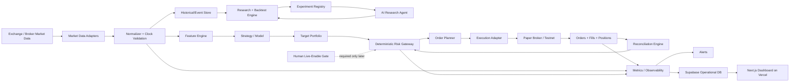
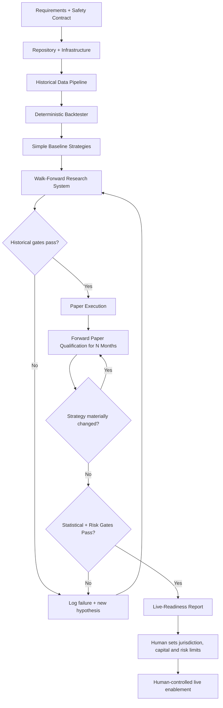

# Autonomous Trading Agent: Research, Architecture, and Paste-Ready Build Prompt

## Executive summary

The right way to build an autonomous trading system is **not** to begin by asking an LLM to predict prices and continuously mutate strategies until a backtest turns green. The correct architecture separates four concerns: **research**, **strategy/model inference**, **deterministic risk control**, and **execution**. The AI agent can autonomously write code, acquire data, generate hypotheses, run experiments, reject strategies, improve infrastructure, and operate a paper account, but the order-routing path should remain deterministic and constrained by hard risk rules. Recent live-agent research reinforces this distinction: the 2025 AI-Trader benchmark found that general LLM intelligence did not automatically translate into profitable trading and highlighted weak risk management as a major failure mode. citeturn15search2

The public DeEthiopian material you referenced describes the target outcome as a working trading bot with a strategy, server, and automated alerts. That is useful as a product specification, but the publicly surfaced material does not disclose enough proprietary strategy logic to reproduce the paid workshop's exact system. The project below therefore recreates the **capabilities** rather than pretending to recover a hidden strategy: automated data ingestion, research, reproducible backtesting, paper execution, risk controls, monitoring, alerts, and a dashboard. citeturn8search0

My recommended first implementation is a **broker-agnostic Python trading engine with Alpaca as the initial U.S.-equity paper broker**, followed by CCXT/Binance test environments for crypto and an Interactive Brokers adapter if broader asset coverage becomes necessary. Alpaca provides an official Python SDK, historical/real-time market-data APIs, and a paper environment; CCXT currently presents a unified interface to more than 100 crypto and prediction-market venues; Binance provides official Spot Testnet REST/WebSocket interfaces; and IBKR provides simulated trading and extensive market access. citeturn13search4turn13search28turn13search2turn13search7turn13search1

The initial product should **not attempt HFT**. A blank-repo personal trading system should begin with daily, hourly, or one-minute strategies where Python, ordinary cloud VMs, WebSockets, and REST order APIs are entirely adequate. Binance's WebSocket infrastructure, for example, includes explicit message and connection constraints, while Vercel Functions have finite execution-duration limits; these facts support using Vercel for the dashboard/control plane and a persistent Docker worker on a VM for the actual trading engine. citeturn13search3turn21search2

For storage, I recommend a hybrid architecture: **Parquet + DuckDB for large historical/replay datasets** and **PostgreSQL/Supabase for operational state, experiment metadata, signals, orders, fills, risk events, and application data**. Supabase currently supplies Postgres plus APIs, authentication, Realtime, Functions, and Storage, with its Pro plan starting at $25/month. citeturn16search24turn16search0

The first alpha models should deliberately be boring: trend following, mean reversion, pairs/statistical arbitrage, volatility-normalized signals, and simple linear/tree-based ML. The classic Gatev–Goetzmann–Rouwenhorst pairs-trading study is an example of why simple, economically interpretable rules deserve to precede sophisticated AI. Deep RL frameworks such as FinRL demonstrate PPO, SAC, DDPG, TD3, DQN, and related approaches while incorporating trading constraints, but RL should enter only after the simulator is sufficiently trustworthy that an agent cannot exploit simulator artifacts. citeturn14search10turn15search0

The most important research constraint is **preventing the autonomous agent from overfitting its own experimentation process**. The Probability of Backtest Overfitting literature explicitly addresses the danger created by selecting strategies from repeated historical simulations, while the Deflated Sharpe Ratio adjusts performance inference for selection bias, backtest overfitting, and non-normal returns. An agent that tries 10,000 strategies and reports the best Sharpe without tracking all 10,000 trials is not doing scientific research. citeturn14search0turn14search1

Therefore, every experiment should receive a permanent `run_id`, Git commit SHA, dataset hash, feature-set version, configuration hash, train/validation/test dates, transaction-cost assumptions, and result set. A final holdout must remain locked. More importantly, the actual paper-trading period must be treated as **forward out-of-sample evidence**, not another validation set: if the strategy is materially modified because of paper performance, the qualifying paper period must restart.

The requested **N months is unspecified**. The system should encode this explicitly:

```env
PAPER_MIN_MONTHS=
```

and fail the promotion-to-live-readiness check while it is blank. It must not silently assume three months, six months, twelve months, or any other value.

Likewise, the following user constraints remain unspecified and should stay explicit configuration requirements rather than hidden assumptions:

| Constraint | Current status | System behavior |
|---|---:|---|
| Markets | Unspecified | Default research adapter may use U.S. equities, but remain broker-agnostic |
| Instruments | Unspecified | Do not assume stocks, options, futures, forex, or crypto are authorized |
| Jurisdiction | Unspecified | Require jurisdiction review before live-readiness |
| Risk tolerance | Unspecified | No production risk limits may be inferred |
| Maximum drawdown | Unspecified | Required before live-readiness |
| Maximum leverage | Unspecified | Required before live-readiness |
| Production capital | Unspecified | Never infer position sizing from paper balance |
| Monthly infrastructure budget | Unspecified | Build low-cost defaults and report actual spend |
| `N` paper months | Unspecified | Promotion gate remains closed |
| Minimum paper trades/sample size | Unspecified | Require configuration before statistical promotion |

The initial capital is therefore **fake/paper money only**, as requested. Paper simulation itself is not proof of live profitability. Alpaca explicitly describes its paper environment as simulated rather than live routing, while IBKR documents limitations in its own paper simulator, including differences in order/fill behavior. citeturn13search28turn13search1

The ultimate acceptance condition should not be “keep changing things until something looks profitable.” It should be:

> **Develop autonomously until there is a strategy that passes predeclared, reproducible, net-of-cost historical validation and then produces positive forward paper expectancy for N months, where N remains a user-supplied parameter, with predefined statistical evidence and no material risk-control violations. Any material strategy modification resets the forward-paper qualification period. Real-money activation remains a separate human-gated operation.**

That distinction is what turns the project from an automated curve-fitting machine into a credible quantitative research and execution system. citeturn14search0turn14search1


## Research principles and system architecture

### Recommended architecture

The system should consist of an **autonomous research plane** and a **deterministic trading plane**.

The research plane can use Claude or another coding/reasoning agent extensively. It can browse documentation, write strategies, design experiments, run statistical tests, inspect logs, build reports, propose hypotheses, and refactor code. FinRL-X is directionally similar in emphasizing modular infrastructure spanning research, backtesting, and deployment rather than treating a trading model as an isolated notebook. citeturn15search6

The trading plane should be deliberately much less intelligent. Market events enter a deterministic pipeline; features are calculated from information available as of the decision timestamp; a strategy produces target positions; the portfolio/risk system clamps or rejects them; an order planner transforms targets into orders; and an execution adapter communicates with the broker.



A language model should **not have unrestricted credentials that let it submit arbitrary production orders**. Recent LLM-agent trading benchmarks show that capable general-purpose models can still exhibit poor trading and risk behavior. The safer architecture lets the agent propose a target or strategy modification while deterministic code enforces exposure, loss, stale-data, order-size, market-session, and account-state constraints. citeturn15search2turn15search5

### Recommended concrete stack

| Layer | Recommendation | Why |
|---|---|---|
| Quantitative engine | Python 3.12+ | Best ecosystem fit for numerical research, statistics, ML and broker SDKs |
| Core numerical tools | NumPy, pandas or Polars, SciPy | Research/transformation layer |
| Statistics | statsmodels, SciPy | Regression, time series, statistical testing |
| Classical ML | scikit-learn | Strong baseline models/pipelines |
| Boosted trees | XGBoost or LightGBM | Strong nonlinear tabular baselines |
| Deep learning | PyTorch | Use only after baseline pipeline is trustworthy |
| RL | Stable-Baselines3 / FinRL experimentation | FinRL demonstrates DQN, DDPG, PPO, SAC, A2C and TD3 approaches in trading environments. citeturn15search0 |
| Optimization | Optuna or custom parameter search | Must integrate with experiment ledger to count every trial |
| Historical storage | Parquet + DuckDB | Local analytical/replay layer |
| Operational DB | Supabase Postgres | Postgres plus app APIs/auth/storage/realtime capabilities. citeturn16search24 |
| Primary paper broker | Alpaca | Official Python SDK and paper environment. citeturn13search4turn13search28 |
| Crypto connector | CCXT | Unified interface across 100+ venues. citeturn13search2 |
| Crypto test venue | Binance Spot Testnet | Official REST/WebSocket test environment. citeturn13search7turn13search11 |
| Broader brokerage | IBKR | API access and paper trading; introduce later because TWS/Gateway add operational complexity. citeturn13search1turn13search9 |
| Worker deployment | Docker on persistent VM | Simple always-running architecture; Compose manages multi-container apps from YAML. citeturn17search1 |
| Scale-out deployment | Kubernetes later | Jobs/CronJobs become useful once multiple independent workers/research workloads justify orchestration. citeturn17search2turn17search14 |
| Dashboard | Next.js + Vercel | Appropriate control/visualization plane; avoid making finite-duration functions the persistent execution loop. citeturn21search2 |
| UI prototyping | Lovable | Useful to create the web application; its current product is an AI web-app builder. citeturn19search6turn19search21 |
| Autonomous coding | Claude | Use for repository engineering, experiments, reports and analysis rather than direct unchecked execution |
| Branding/content | Pomelli | I interpret the user's “Promelli” as Google's **Pomelli**; Google describes it as an on-brand marketing-content product, so it has no place in order execution. citeturn19search3turn19search7 |
| CI/CD | GitHub Actions | Build/test/deploy workflows with protected environments |
| Observability | OpenTelemetry + Prometheus/Grafana-compatible backend | OpenTelemetry Python supports traces, metrics and logs. citeturn16search3 |

### Why Docker first and Kubernetes later

Docker Compose is explicitly designed to define and run multi-container applications from a YAML configuration, making it an excellent fit for the first version of a trading worker, database-related utilities, monitoring services, and a dashboard-development environment. Kubernetes adds meaningful value only when the project reaches multiple workers, multiple strategies, horizontally scaled data processes, rolling deployment requirements, or substantial scheduling needs. Kubernetes CronJobs execute Jobs on repeating schedules, but those capabilities are unnecessary complexity for one personal strategy worker. citeturn17search1turn17search2

A simple production-like paper deployment can therefore be:

```text
Vercel
└── dashboard / control plane

Supabase
└── operational Postgres + auth + reports

Small VM
├── trader-worker container
├── data-worker container
├── otel-collector container
└── optional prometheus container

Object/local storage
└── Parquet historical datasets
```

Vercel should not become the always-on market-data connection or order engine. Vercel Functions have maximum execution durations rather than unlimited processes; the persistent market loop belongs on a VM/container or later Kubernetes workload. citeturn21search2turn21search5


## Staged implementation plan



### Foundation and safety contract

**Objective:** create a repository that is impossible to accidentally run against real money.

**Deliverables**

Create:

```text
README.md
AGENTS.md
docs/PRODUCT_SPEC.md
docs/SAFETY_CONTRACT.md
docs/UNRESOLVED_CONSTRAINTS.md
docs/ARCHITECTURE.md
docs/EXPERIMENT_PROTOCOL.md
.env.example
pyproject.toml
Dockerfile
compose.yaml
.github/workflows/ci.yml
```

The safety contract should explicitly say:

```yaml
initial_mode: paper
live_trading_enabled: false

unresolved:
  jurisdiction: null
  markets: null
  instruments: null
  risk_tolerance: null
  max_drawdown: null
  max_leverage: null
  production_capital: null
  monthly_budget: null
  paper_min_months: null
  paper_min_trades: null
```

**Acceptance criteria**

The worker must refuse to initialize any live connector unless all live-required variables exist and `LIVE_TRADING=true`. Even when that variable exists, the CI/deployment pipeline must require a separate protected production environment. GitHub Actions environment protection can withhold environment secrets until required reviewers approve the deployment, which is suitable for this final gate. citeturn17search4turn17search12

No source file, test fixture, `.env.example`, log, or generated report may contain real broker credentials.

### Data foundation

**Objective:** obtain reproducible point-in-time historical data and a low-latency live stream.

**Deliverables**

Implement:

```text
src/trader/data/base.py
src/trader/data/alpaca.py
src/trader/data/ccxt.py
src/trader/data/binance.py
src/trader/data/ibkr.py
src/trader/data/normalizer.py
src/trader/data/quality.py
src/trader/data/catalog.py
scripts/download_data.py
scripts/check_data_quality.py
```

Alpaca's SDK provides market-data clients for historical data, and its API covers equities, crypto and options. CCXT provides a common interface across many crypto venues. Binance's official test environment supports WebSocket and REST APIs, while IBKR can later provide broader broker connectivity. citeturn13search8turn13search4turn13search2turn13search7

**Acceptance criteria**

Historical download must be idempotent. Re-running a date range must not duplicate bars.

Every dataset receives:

```text
dataset_id
vendor
venue
asset_class
symbols
start_time
end_time
timeframe
downloaded_at
row_count
sha256
schema_version
adjustment_policy
```

The pipeline must detect missing intervals, duplicate timestamps, impossible OHLC relationships, negative prices/volumes, clock reversals, timezone mismatches, and unexpected symbol changes.

No strategy may consume a feature where:

```text
feature.asof_timestamp > decision_timestamp
```

### Backtesting foundation

**Objective:** prove that the simulation engine behaves correctly before optimizing alpha.

**Deliverables**

Implement:

```text
src/trader/backtest/engine.py
src/trader/backtest/broker_sim.py
src/trader/backtest/orders.py
src/trader/backtest/fills.py
src/trader/backtest/costs.py
src/trader/backtest/metrics.py
src/trader/backtest/walkforward.py
src/trader/backtest/bootstrap.py
```

Start with deterministic strategies rather than AI:

```text
buy_and_hold
SMA crossover
volatility-scaled trend
z-score mean reversion
pairs strategy
```

The pairs baseline has an established academic precedent in the Gatev–Goetzmann–Rouwenhorst work, but the historical paper's reported returns should **not** be assumed to persist today; its value here is as a reproducible statistical-strategy baseline. citeturn14search10

**Acceptance criteria**

A zero-cost, perfectly filled buy-and-hold simulation should reproduce an independently calculated buy-and-hold series within numeric tolerance.

A synthetic price fixture with predetermined order/fill outcomes must generate exact expected P&L.

A strategy cannot trade on the bar whose closing value was required to generate its signal unless the simulated order's fill semantics explicitly make that possible after the signal timestamp.

Every backtest must be exactly reproducible from:

```text
git_sha
dataset_hash
config_hash
random_seed
strategy_version
```

### Research and model development

**Objective:** create an autonomous hypothesis-testing loop without turning it into an autonomous overfitting loop.

**Deliverables**

Implement the model registry, feature registry, experiment ledger, trial counter, walk-forward framework, DSR/PBO analysis, bootstrap significance tests, sensitivity reports and comparison reports.

**Acceptance criteria**

Every attempted configuration counts as a trial, including failed or discarded experiments.

The agent may not overwrite unsuccessful experiments.

The final holdout may not be used for hyperparameter optimization.

The Probability of Backtest Overfitting and Deflated Sharpe Ratio literature exists precisely because repeated selection from backtests produces misleading apparent performance; the experiment registry is therefore part of the trading system, not merely project administration. citeturn14search0turn14search1

### Paper execution

**Objective:** operate the same strategy code continuously against simulated broker execution.

Alpaca provides a paper sandbox through the same SDK family used for its trading API. Binance provides testnet interfaces, and IBKR provides paper facilities, although paper simulators inevitably differ from real execution. citeturn13search28turn13search7turn13search1

**Deliverables**

Implement:

```text
src/trader/execution/base.py
src/trader/execution/alpaca.py
src/trader/execution/ccxt.py
src/trader/execution/ibkr.py

src/trader/live/engine.py
src/trader/live/reconciliation.py
src/trader/live/heartbeat.py

src/trader/risk/limits.py
src/trader/risk/kill_switch.py
src/trader/risk/stale_data.py
```

**Acceptance criteria**

The worker must restart safely after process termination.

On startup it must reconcile:

```text
broker cash
broker buying power
positions
open orders
recent fills
local expected positions
```

before new orders are allowed.

Every order requires a unique idempotent `client_order_id`.

A stale-data condition must disable new exposure.

A broker disconnect must not cause repeated duplicate orders.

### Forward paper qualification

**Objective:** obtain evidence not used in the optimization process.

The qualifying duration is:

```text
N months
```

where **N is unspecified by the user**.

The system should therefore expose:

```yaml
qualification:
  paper_min_months: null
  min_trades: null
  significance_alpha: 0.05
```

`paper_min_months` and `min_trades` must be supplied before qualification can succeed. A statistical significance level such as 5% can be a methodological default, but the system should report confidence intervals and corrected performance measures rather than treating one p-value as proof of profitability. The Deflated Sharpe Ratio is specifically designed to account for selection effects and non-normality. citeturn14search1

**Acceptance criteria**

The qualifying strategy must run without material logic changes throughout the full N-month period.

A material change to:

```text
features
prediction model
entry logic
exit logic
position-sizing algorithm
risk-adjusted target construction
universe selection
```

resets the qualification clock.

Operational bug fixes that provably do not alter signal semantics should be documented rather than automatically resetting the clock.

Required final output:

```text
reports/paper/YYYY-MM-DD-summary.md
reports/paper/qualification.json
reports/paper/tear_sheet.html
```

### Productization and live-readiness

**Objective:** produce a usable personal trading product, while keeping actual capital disabled.

**Deliverables**

Dashboard views:

```text
Account
Positions
Orders
Fills
PnL
Drawdown
Exposure
Strategy status
Market-data status
Risk events
System health
Experiments
Backtest comparisons
Paper qualification progress
Kill-switch status
Audit log
```

Lovable can be used to accelerate UI scaffolding and connected web-product construction, while Supabase supplies the backend application primitives and Vercel hosts the dashboard. citeturn19search21turn16search24

**Final acceptance criteria**

The system may call itself **live-ready** only when historical validation, qualifying paper evidence, deterministic risk tests, disaster/restart tests, credential review, broker reconciliation, monitoring, and jurisdiction-specific review all pass.

It must not automatically switch itself to live capital.


## Data, models, backtesting, and execution design

### Required data sources

| Data | MVP | Source candidates | Frequency | Storage | Purpose |
|---|---|---|---|---|---|
| OHLCV bars | Required | Alpaca, exchange API | Daily/1h/1m | Parquet | Baseline signals |
| Trades | Useful | Alpaca/exchange | Tick/event | Parquet | Execution/microstructure |
| Best bid/ask | Recommended intraday | WebSocket feeds | Event-driven | Parquet | Spread and slippage |
| Order book | Later | Binance/exchange | Event-driven | Parquet | Microstructure models |
| Corporate actions | Required for equities | Broker/data vendor | Daily/event | PostgreSQL + Parquet | Point-in-time adjustments |
| Trading calendar | Required for equities | Broker/exchange | Daily | PostgreSQL | Sessions/holidays |
| Instrument metadata | Required | Broker/exchange | Daily | PostgreSQL | Tick size/status |
| Borrow availability/rates | Strategy-dependent | Broker | Daily/intraday | PostgreSQL | Short strategies |
| Funding rates | Crypto derivatives only | Exchange | Venue interval | Parquet | Carry/costs |
| Fees/commissions | Required | Broker/exchange | Versioned config | PostgreSQL/YAML | Net returns |
| Fundamentals | Later | Point-in-time provider | Filing/event | Parquet | Fundamental ML |
| News | Later | Timestamped provider | Event | Object store | NLP strategies |

Alpaca exposes historical and current market data through its market-data APIs; CCXT normalizes common exchange functions; Binance supports streaming test data; and IBKR supports broker data subject to the relevant subscriptions/permissions. citeturn13search4turn13search2turn13search19turn13search5

For U.S. equities, **both adjusted and raw price series should be retained**, and model features must respect the information actually available at each historical point. A production-quality system must also avoid survivorship bias in changing universes.

### Ingestion design

Every real-time market record should contain both the source's market timestamp and your own receiving timestamp:

```sql
CREATE TABLE market_bars (
    venue              text NOT NULL,
    instrument         text NOT NULL,
    timeframe          text NOT NULL,
    event_ts           timestamptz NOT NULL,
    recv_ts            timestamptz NOT NULL,
    open                numeric NOT NULL,
    high                numeric NOT NULL,
    low                 numeric NOT NULL,
    close               numeric NOT NULL,
    volume              numeric NOT NULL,
    vwap                numeric,
    trade_count         bigint,
    source              text NOT NULL,
    quality_flags       jsonb NOT NULL DEFAULT '{}'::jsonb,
    ingested_at         timestamptz NOT NULL DEFAULT now(),
    PRIMARY KEY (venue, instrument, timeframe, event_ts)
);
```

Quotes:

```sql
CREATE TABLE quotes (
    venue       text NOT NULL,
    instrument  text NOT NULL,
    event_ts    timestamptz NOT NULL,
    recv_ts     timestamptz NOT NULL,
    bid_px      numeric,
    bid_sz      numeric,
    ask_px      numeric,
    ask_sz      numeric,
    sequence_no bigint,
    PRIMARY KEY (venue, instrument, event_ts)
);
```

Features:

```sql
CREATE TABLE feature_values (
    instrument          text NOT NULL,
    ts                  timestamptz NOT NULL,
    asof_ts             timestamptz NOT NULL,
    feature_set_version text NOT NULL,
    feature_name        text NOT NULL,
    value               double precision,
    PRIMARY KEY (
        instrument,
        ts,
        feature_set_version,
        feature_name
    )
);
```

Experiments:

```sql
CREATE TABLE experiments (
    run_id            uuid PRIMARY KEY,
    created_at        timestamptz NOT NULL DEFAULT now(),
    git_sha           text NOT NULL,
    dataset_hash      text NOT NULL,
    feature_version   text NOT NULL,
    strategy_version  text NOT NULL,
    config_hash       text NOT NULL,
    random_seed       bigint NOT NULL,
    train_start       timestamptz,
    train_end         timestamptz,
    validation_start  timestamptz,
    validation_end    timestamptz,
    test_start        timestamptz,
    test_end          timestamptz,
    parameters        jsonb NOT NULL,
    metrics           jsonb,
    status            text NOT NULL
);
```

Orders and fills:

```sql
CREATE TABLE orders (
    client_order_id text PRIMARY KEY,
    broker_order_id text,
    strategy_version text NOT NULL,
    instrument text NOT NULL,
    side text NOT NULL,
    order_type text NOT NULL,
    quantity numeric NOT NULL,
    limit_price numeric,
    stop_price numeric,
    time_in_force text,
    status text NOT NULL,
    created_ts timestamptz NOT NULL,
    submitted_ts timestamptz
);

CREATE TABLE fills (
    fill_id text PRIMARY KEY,
    client_order_id text NOT NULL REFERENCES orders(client_order_id),
    fill_ts timestamptz NOT NULL,
    price numeric NOT NULL,
    quantity numeric NOT NULL,
    fee numeric NOT NULL DEFAULT 0,
    liquidity_flag text
);
```

### Ingestion frequency and latency objectives

For a first personal product:

| Component | Recommended target |
|---|---|
| Historical bars | Nightly incremental backfill |
| Corporate actions/reference data | Nightly plus pre-market refresh |
| Daily strategy | Once after required source bars finalize |
| Hourly strategy | At finalized hourly boundary |
| Minute strategy | WebSocket-driven aggregation |
| Quote ingestion | Event-driven |
| Broker account events | Event-driven where supported |
| Account reconciliation | Startup + periodic + after anomalous fills |
| Risk snapshots | Every decision plus periodic heartbeat |
| Reporting | Daily |
| Experiment registry | Immediately after every run |

Binance's Spot Testnet documentation illustrates why production stream logic must include reconnect, rate-limit and connection-management behavior: WebSocket connections and messages have explicit constraints, and user-account events can be delivered through the exchange's data stream. citeturn13search3turn13search19

Do not design arbitrary “microsecond latency” targets for this MVP. Measure instead:

```text
source event -> receive
receive -> normalized event
normalized event -> feature completion
feature completion -> decision
decision -> risk approval
risk approval -> API submit
submit -> broker acknowledgement
acknowledgement -> fill
```

and report p50, p95 and p99 latency. Optimize only if the chosen strategy's horizon makes the observed latency economically important.

### Feature engineering

The first feature library should contain simple, auditable families.

**Price/trend**

```text
return_1
return_5
return_20
return_60
SMA ratios
EMA ratios
distance from rolling high
distance from rolling low
breakout indicators
```

**Volatility**

```text
realized volatility
ATR
high-low range
downside volatility
volatility ratio
volatility regime percentile
```

**Mean reversion**

```text
price/SMA z-score
return z-score
VWAP distance
Bollinger-style normalized displacement
```

**Volume/liquidity**

```text
volume z-score
relative volume
dollar volume
turnover
spread
spread percentile
```

**Cross-sectional**

```text
relative momentum
relative volatility
cross-sectional return rank
sector-relative return
beta-adjusted residual return
```

**Pairs/statistical arbitrage**

```text
rolling beta
spread
spread z-score
cointegration statistics
half-life estimates
residual volatility
```

**Microstructure, later**

```text
bid/ask spread
top-of-book imbalance
trade-sign imbalance
short-horizon realized volatility
book-pressure metrics
```

Every feature implementation requires a test proving that changing future observations cannot alter past feature values.

### Model-family comparison

| Family | Examples | Advantages | Major risks | Priority |
|---|---|---|---|---|
| Deterministic statistical rules | SMA, breakout, z-score mean reversion | Transparent, fast, easy to debug | Parameter sensitivity, regime changes | **First** |
| Classical time series | AR/ARIMA, state-space, Kalman-style models | Interpretable, data-efficient | Linear/structural assumptions | High |
| Volatility models | ARCH/GARCH family | Useful for sizing/risk | Not necessarily alpha-generating | High |
| Statistical arbitrage | Pairs, residual mean reversion | Economic interpretation, portfolio structure | Relationship instability | High |
| Linear supervised ML | Logistic/linear/Elastic Net | Stable baseline, explainable coefficients | Limited nonlinear interactions | **First ML** |
| Tree ensembles | Random Forest, XGBoost, LightGBM | Strong nonlinear tabular performance | Easy to overfit, unstable feature importance | High |
| Neural sequence models | LSTM, TCN, Transformers | Flexible sequence modeling | Data-hungry, expensive, difficult validation | Later |
| RL | PPO, SAC, TD3, DDPG, DQN | Direct sequential control/portfolio optimization | Simulator exploitation, instability, reward misspecification | Much later |
| LLM signal agent | News/text interpretation | Useful for unstructured data | Cost, latency, hallucination, difficult causal validation | Experimental only |
| LLM autonomous executor | Direct order decisions | Flexible reasoning | Unpredictable behavior and risk | **Do not use as primary execution layer** |

FinRL shows that RL environments can integrate transaction costs, liquidity and risk aversion and provides multiple standard DRL algorithms, making it useful for experimentation after the environment has been validated. Its existence is not evidence that RL is automatically superior to simpler methods. citeturn15search0

The recent AI-Trader results are an additional reason not to equate sophisticated language-agent behavior with investment skill: their live benchmark found poor performance and risk management among many tested autonomous agents. citeturn15search2

### Label design for supervised learning

Avoid “predict tomorrow's price” as the universal task. Test economically meaningful targets:

```text
future excess return
future residual return vs benchmark
probability future return exceeds transaction-cost hurdle
future volatility
future drawdown
expected return / expected risk
cross-sectional rank
```

A useful classification label might be:

```python
y_t = int(
    future_return_after_costs
    > minimum_required_edge
)
```

The threshold must be based on costs and research assumptions established before the final test, not chosen after looking at the holdout.

### Backtesting framework

The project should support **two engines**:

1. A fast vectorized engine for exploratory research.
2. An event-driven simulator whose signal, portfolio, risk and order interfaces closely resemble live execution.

The event-driven implementation becomes the authoritative result.

A backtest must simulate, where relevant:

```text
commissions
regulatory fees
maker/taker fees
bid/ask spread
market impact approximation
slippage
borrow fees
funding
partial fills
latency
order rejects
minimum tick/lot sizes
trading sessions
halts
corporate actions
cash constraints
leverage constraints
```

Even “commission-free” instruments cannot safely be modeled as economically cost-free because spreads, slippage and other applicable fees remain relevant. IBKR, for example, currently distinguishes $0 IBKR Lite U.S. equity pricing from fixed/tiered Pro pricing; its Pro fixed pricing is listed at $0.005/share with a $1 minimum, while tiered pricing spans $0.0005–$0.0035/share with a $0.35 minimum. The point is not to hardcode these prices forever but to version broker cost assumptions. citeturn21search4

### Walk-forward design

Use chronological rather than random train/test splitting.

Example structure:

```text
Train A -> Validate A -> Test A
              |
              v
Train B ----------> Validate B -> Test B
                             |
                             v
Train C --------------------------> Validate C -> Test C
```

Support:

```text
anchored expanding windows
rolling windows
purged/embargoed windows where labels overlap
nested parameter selection
locked terminal holdout
```

The autonomous agent should never repeatedly inspect the terminal holdout and continue modifying the strategy against it. The PBO literature explicitly addresses how repeated strategy selection can produce impressive but misleading backtests. citeturn14search0

### Required metrics

At minimum report:

```text
total return
annualized return
annualized volatility
Sharpe ratio
Sortino ratio
Calmar ratio
maximum drawdown
maximum drawdown duration
Value-at-Risk
expected shortfall / CVaR
win rate
average winner
average loser
profit factor
expectancy per trade
expectancy per unit capital
number of trades
turnover
gross exposure
net exposure
average holding period
slippage
commissions/fees
cost-to-gross-alpha ratio
benchmark return
alpha
beta
correlation to benchmark
monthly return distribution
worst day/week/month
Deflated Sharpe Ratio
Probability of Backtest Overfitting
bootstrap confidence intervals
```

DSR is particularly valuable because raw Sharpe comparisons become misleading when many candidates were tested and the winning strategy was selected afterward. citeturn14search1

### Historical acceptance gate

A strategy should advance toward paper trading only when all configured criteria pass.

A good template is:

```yaml
research_gate:
  require_positive_net_expectancy: true
  require_positive_locked_holdout: true
  require_majority_positive_walkforward_folds: true

  bootstrap:
    enabled: true
    alpha: 0.05

  deflated_sharpe:
    enabled: true

  probability_backtest_overfit:
    enabled: true
    max_allowed: CONFIG_REQUIRED

  stress:
    transaction_cost_multiplier: [1.0, 2.0, 3.0]
    slippage_multiplier: [1.0, 2.0, 3.0]

  max_drawdown:
    limit: CONFIG_REQUIRED
```

The autonomous agent may search for better strategies, but it may **not relax failed thresholds merely to promote a favorite strategy**.

### Risk-management architecture

Risk checks must sit between model output and order execution:

```text
model
  ↓
desired target
  ↓
portfolio constraints
  ↓
pre-trade risk
  ↓
order planner
  ↓
final order risk
  ↓
broker
```

Required controls:

```text
maximum gross exposure
maximum net exposure
maximum leverage
maximum position weight
maximum sector/asset concentration
maximum single-order notional
maximum daily loss
maximum drawdown
maximum turnover
maximum order frequency
maximum allowed spread
maximum expected slippage
stale-data cutoff
market-session check
instrument-tradability check
price sanity check
duplicate-order protection
unexpected-position protection
broker/account reconciliation
reject-rate breaker
disconnect breaker
clock-skew breaker
manual kill switch
automatic kill switch
```

The numerical production values for exposure, leverage, drawdown, and position concentration are intentionally **not provided** because the user's risk tolerance and production capital are unspecified.

The implementation should fail closed:

```python
if live_mode and config.risk.max_drawdown is None:
    raise ConfigurationError(
        "Production max_drawdown must be explicitly configured."
    )
```

This mirrors the broader principle regulators impose on professional automated market access: SEC Rule 15c3-5 is directed at broker-dealers with market access and requires controls intended to prevent uncontrolled electronic trading risk. It does not by itself mean a personal retail bot is a broker-dealer, but it provides a useful engineering model: automated trading should never imply unfiltered execution. citeturn18search1turn18search27

### Order support

Implement in stages:

```text
market
limit
stop
stop-limit
bracket/OCO
```

Not every broker or simulator behaves identically, so capability discovery belongs in each adapter.

Internal strategy code should request an abstract order:

```python
OrderIntent(
    symbol="SPY",
    side=Side.BUY,
    quantity=Decimal("1"),
    type=OrderType.LIMIT,
    limit_price=Decimal("500.10"),
    time_in_force=TimeInForce.DAY,
)
```

and allow the adapter to validate broker-specific support.

### Reconciliation is mandatory

Your internal database should **never be treated as the final authority on actual holdings**.

Periodically compare:

```text
internal position ↔ broker position
internal cash ↔ broker cash
internal open order ↔ broker open order
expected fill ↔ broker fill
```

Any unexplained mismatch should freeze new exposure until reconciliation succeeds.

### Paper qualification statistics

Paper trading produces a sequential forward sample. At the completion of the user-defined N-month period, report:

```text
number of observations
number of independent-ish trades
net expectancy
mean daily excess return
block-bootstrap CI
Sharpe
Deflated Sharpe
drawdown
monthly consistency
cost sensitivity
regime attribution
benchmark-relative performance
operational incidents
risk breaches
```

“Consistent” should not mean that every month must be positive unless the user explicitly defines it that way. Instead, establish the definition *before* qualification begins—for example, positive cumulative net expectancy plus predeclared statistical evidence, bounded drawdown, and robustness across subperiods.

The agent must never retroactively change what “significant” or “consistent” means after observing the result.


## Engineering, operations, security, and costs

### CI/CD

Every pull request should execute:

```text
format check
lint
static typing
unit tests
integration tests
data-contract tests
lookahead tests
risk tests
order-state-machine tests
broker-adapter mock tests
backtest deterministic regression
security scan
Docker build
```

Suggested commands:

```bash
ruff check .
ruff format --check .
mypy src
pytest -q
docker build -t autonomous-trader:test .
```

A deterministic “golden” backtest should run in CI against a tiny committed fixture:

```bash
python -m trader.cli backtest \
  --config tests/fixtures/golden_strategy.yaml
```

and CI should compare expected metrics to checked-in expected results.

Deployment pipeline:

```text
PR
 ↓
tests
 ↓
container build
 ↓
paper staging
 ↓
health check
 ↓
paper production worker
```

The hypothetical future live environment should be separate:

```text
live deployment request
        ↓
full CI
        ↓
paper qualification check
        ↓
configuration check
        ↓
required human reviewer
        ↓
live secret becomes available
```

GitHub's protected deployment environments support precisely this concept: a job can be denied access to environment secrets until required approval is received. citeturn17search4turn17search12

### Monitoring and observability

Instrument the worker with OpenTelemetry for traces, metrics and structured logs; OpenTelemetry's Python implementation currently covers all three telemetry categories. citeturn16search3turn16search15

**Trading metrics**

```text
equity
cash
buying power
gross exposure
net exposure
realized PnL
unrealized PnL
daily PnL
drawdown
orders/minute
fill ratio
cancel ratio
reject ratio
partial fills
slippage bps
turnover
position discrepancies
```

**Strategy/model metrics**

```text
signal count
long/short/flat distribution
prediction distribution
feature missingness
feature drift
prediction drift
rolling expectancy
rolling Sharpe
rolling hit rate
regime exposure
model version
```

**System metrics**

```text
worker heartbeat
market-data age
WebSocket reconnect count
API errors
rate-limit responses
queue depth
DB latency
broker response latency
decision latency
clock skew
CPU
memory
disk
container restart count
```

**High-severity alerts**

```text
risk kill switch triggered
daily-loss limit breached
drawdown limit breached
broker position mismatch
stale market data while market expected open
duplicate-order anomaly
unexpected live-mode attempt
authentication failure
large slippage anomaly
broker disconnected with open orders
database unavailable
```

### Security architecture

Never put broker secrets in:

```text
browser JavaScript
Next.js public environment variables
Git
Docker images
logs
experiment reports
LLM prompts
screenshots
analytics events
```

Separate:

```text
paper API credentials
live API credentials
market-data credentials
database credentials
LLM credentials
```

The production/live secret, if one is ever created, should exist only in the execution worker's protected secret environment.

For exchange APIs, restrict keys to the minimum required privileges; do not grant withdrawal capabilities to an automated strategy when withdrawal access is unnecessary. Use venue-supported key restrictions, rotation, and distinct test/live credentials.

### Audit trail

For every order, preserve:

```text
market timestamp
local receive timestamp
feature-set version
feature values/hash
strategy version
model version
signal
target portfolio
risk checks and results
order intent
broker request
broker response
fills
post-trade position
Git SHA
deployment ID
```

This makes it possible to answer the critical question:

> “Exactly why did the system place this order?”

without asking an LLM to reconstruct the explanation from memory.

### Compliance and tax considerations

The user's jurisdiction is unspecified, so the product must treat legal/compliance behavior as configurable and unresolved rather than assume U.S. rules universally apply.

For a U.S. user, a particularly important current development is that FINRA's new intraday-margin framework became effective on **June 4, 2026**, replacing the older day-trading requirements, but FINRA permits brokerage firms a transition period through **October 20, 2027**. Therefore, a 2026 bot should query and obey the actual broker/account restrictions rather than hardcode assumptions about the old Pattern Day Trader framework. citeturn18search0turn18search4

Tax accounting must also be treated as a product requirement. IRS Publication 550 covers investment-income and securities tax issues, including wash-sale treatment, while IRS Topic 429 separately discusses trader status and mark-to-market treatment. The software should preserve complete trades, tax lots and corporate-action records; it should not automatically assume that the user qualifies as a trader or should make a tax election. citeturn19search0turn19search16

### Infrastructure comparison

| Option | Best use | Advantages | Disadvantages | Recommendation |
|---|---|---|---|---|
| Laptop only | Initial development | $0 infrastructure | Not durable/always-on | Research only |
| Docker on one VM | Personal paper/live system | Simple, inexpensive, persistent | Single-node failure | **Recommended MVP** |
| Managed VM + Supabase + Vercel | Complete personal product | Clear separation of engine/data/UI | Several vendors | **Recommended target** |
| Kubernetes | Multi-strategy/multi-worker | Scheduling, scaling, deployment primitives | Operational complexity | Later |
| Pure Vercel serverless | UI/APIs | Excellent product frontend workflow | Finite function durations; poor fit for persistent stream loop | Dashboard only |
| Local Kubernetes | Experimentation | Production-style orchestration | Significant unnecessary complexity | Skip initially |

Docker Compose is built for multi-container stacks, while Kubernetes supports persistent workload orchestration and scheduled Jobs. Vercel's Functions remain bounded-duration workloads, supporting the architectural split above. citeturn17search1turn17search2turn21search2

### Cost estimates

Costs below are **planning estimates as of September 4, 2026**, not guarantees; market data, cloud, AI and brokerage pricing can change.

| Component | Lean | More serious paper system | Basis |
|---|---:|---:|---|
| Supabase | $0 | $25/mo | Current Pro price is $25/month. citeturn16search0 |
| Vercel | $0 Hobby | ≈$20+ Pro/usage | Vercel uses plan plus usage pricing; Pro includes usage credits. citeturn16search1turn16search17 |
| Persistent VM | ≈$4–24/mo | ≈$12–48/mo | DigitalOcean currently advertises Droplets from $4/month. citeturn17search15 |
| Kubernetes | $0 | Later only | DigitalOcean Kubernetes worker nodes currently start at $12/month, before associated resources. citeturn17search11 |
| Alpaca basic data/paper | $0 | $0 | Alpaca paper is free; market-data offerings include a free tier. citeturn13search28turn13search24 |
| Alpaca Algo Trader Plus | — | $99/mo optional | Alpaca currently describes the subscription as having a $99/month value. citeturn21search24 |
| Claude Sonnet 5 API | Usage | Usage | Current standard pricing is $2/M input tokens and $10/M output tokens. citeturn20search0 |
| Lovable | $0 possible | Usage/credit dependent | Lovable currently offers a free tier and credit-based paid usage. citeturn19search6 |
| Pomelli | Optional | Optional | Marketing layer, not trading infrastructure. citeturn19search3 |
| Broker commissions/fees | Paper $0 simulated | Variable | Must be modeled from the selected account/venue schedule |

A hypothetical month containing **10 million Claude Sonnet 5 input tokens plus 2 million output tokens** would cost about **$40** at current listed token rates:

```text
10 × $2 + 2 × $10 = $40
```

based on Anthropic's current $2/M input and $10/M output pricing. citeturn20search0

A lean paper system could therefore remain approximately **$4–$65/month** if it uses free Supabase/Vercel/data tiers and modest AI usage.

A more serious U.S.-equity paper environment might be roughly:

```text
Supabase Pro                   $25
Vercel Pro / usage            ~$20
VM                             $12–24
Alpaca Algo Trader Plus        $99
Claude API example             $40
Lovable                        $0–50 planning allowance
--------------------------------------------------------
Approximate total             $196–258/month
```

before optional observability services, extra storage, premium datasets or brokerage costs. The individual provider figures should always be refreshed programmatically or manually before budgeting because several are usage-based. citeturn16search0turn21search24turn20search0turn17search15


## Blank-repo bootstrap

### Folder structure

```text
autonomous-trader/
├── README.md
├── AGENTS.md
├── pyproject.toml
├── Dockerfile
├── compose.yaml
├── .env.example
├── .gitignore
│
├── apps/
│   └── dashboard/
│       ├── app/
│       ├── components/
│       ├── lib/
│       └── package.json
│
├── configs/
│   ├── base.yaml
│   ├── paper.yaml
│   └── live.example.yaml
│
├── docs/
│   ├── PRODUCT_SPEC.md
│   ├── SAFETY_CONTRACT.md
│   ├── ARCHITECTURE.md
│   ├── EXPERIMENT_PROTOCOL.md
│   ├── DATA_DICTIONARY.md
│   ├── RISK_POLICY.md
│   ├── PAPER_QUALIFICATION.md
│   └── UNRESOLVED_CONSTRAINTS.md
│
├── src/
│   └── trader/
│       ├── __init__.py
│       ├── config.py
│       ├── cli.py
│       │
│       ├── domain/
│       │   ├── events.py
│       │   ├── market.py
│       │   ├── orders.py
│       │   └── portfolio.py
│       │
│       ├── data/
│       │   ├── base.py
│       │   ├── alpaca.py
│       │   ├── ccxt.py
│       │   ├── ibkr.py
│       │   ├── normalizer.py
│       │   └── quality.py
│       │
│       ├── features/
│       │   ├── registry.py
│       │   ├── trend.py
│       │   ├── volatility.py
│       │   ├── mean_reversion.py
│       │   └── microstructure.py
│       │
│       ├── strategies/
│       │   ├── base.py
│       │   ├── buy_hold.py
│       │   ├── sma.py
│       │   ├── pairs.py
│       │   ├── supervised.py
│       │   └── rl.py
│       │
│       ├── models/
│       │   ├── registry.py
│       │   └── artifacts.py
│       │
│       ├── backtest/
│       │   ├── engine.py
│       │   ├── broker_sim.py
│       │   ├── costs.py
│       │   ├── fills.py
│       │   ├── metrics.py
│       │   └── walkforward.py
│       │
│       ├── risk/
│       │   ├── engine.py
│       │   ├── limits.py
│       │   ├── kill_switch.py
│       │   └── stale_data.py
│       │
│       ├── execution/
│       │   ├── base.py
│       │   ├── alpaca.py
│       │   ├── ccxt.py
│       │   └── ibkr.py
│       │
│       ├── live/
│       │   ├── engine.py
│       │   ├── reconciliation.py
│       │   └── heartbeat.py
│       │
│       ├── experiments/
│       │   ├── registry.py
│       │   ├── statistics.py
│       │   └── reporting.py
│       │
│       └── observability/
│           ├── metrics.py
│           ├── logging.py
│           └── tracing.py
│
├── scripts/
│   ├── download_data.py
│   ├── backtest.py
│   ├── paper_trade.py
│   └── generate_report.py
│
├── sql/
│   └── migrations/
│
├── tests/
│   ├── unit/
│   ├── integration/
│   ├── regression/
│   ├── property/
│   └── fixtures/
│
├── data/
│   ├── raw/
│   ├── curated/
│   └── features/
│
├── artifacts/
├── reports/
│   ├── experiments/
│   ├── backtests/
│   └── paper/
│
└── .github/
    └── workflows/
        ├── ci.yml
        └── deploy-paper.yml
```

### Shell bootstrap

```bash
mkdir autonomous-trader
cd autonomous-trader

git init

python3 -m venv .venv
source .venv/bin/activate

python -m pip install --upgrade pip

pip install \
  alpaca-py \
  ccxt \
  numpy \
  pandas \
  polars \
  pyarrow \
  duckdb \
  scipy \
  statsmodels \
  scikit-learn \
  pydantic \
  pydantic-settings \
  pyyaml \
  sqlalchemy \
  "psycopg[binary]" \
  prometheus-client \
  opentelemetry-api \
  opentelemetry-sdk \
  pytest \
  pytest-asyncio \
  hypothesis \
  ruff \
  mypy

mkdir -p \
  src/trader/{domain,data,features,strategies,models,backtest,risk,execution,live,experiments,observability} \
  scripts \
  configs \
  docs \
  sql/migrations \
  tests/{unit,integration,regression,property,fixtures} \
  data/{raw,curated,features} \
  reports/{experiments,backtests,paper} \
  artifacts \
  .github/workflows

touch src/trader/__init__.py
```

Alpaca's current official Python SDK exposes historical market-data and paper-trading APIs suitable for this bootstrap. citeturn13search4turn13search8

### Environment file

```dotenv
APP_ENV=development
EXECUTION_MODE=paper
LIVE_TRADING=false

# Alpaca paper credentials only
ALPACA_API_KEY=
ALPACA_SECRET_KEY=

# Optional crypto sandbox
BINANCE_TESTNET_API_KEY=
BINANCE_TESTNET_SECRET=

# Database
DATABASE_URL=
SUPABASE_URL=
SUPABASE_SERVICE_ROLE_KEY=

# AI research agent
ANTHROPIC_API_KEY=

# Paper qualification: intentionally unset
PAPER_MIN_MONTHS=
PAPER_MIN_TRADES=

# Production values intentionally unset
PRODUCTION_CAPITAL=
MAX_GROSS_EXPOSURE=
MAX_NET_EXPOSURE=
MAX_POSITION_WEIGHT=
MAX_DAILY_LOSS=
MAX_DRAWDOWN=
MAX_LEVERAGE=
```

### Configuration

```yaml
# configs/paper.yaml

mode: paper
live_trading: false

market:
  asset_class: equity
  symbols:
    - SPY
  timeframe: "1Min"

strategy:
  name: sma_crossover
  fast_window: 20
  slow_window: 50

execution:
  broker: alpaca
  allow_shorting: false
  default_order_type: market

cost_model:
  commission_bps: 0.0
  half_spread_bps: 1.0
  slippage_bps: 1.0

risk:
  # Demo paper limits only. Do not promote these as production assumptions.
  max_open_positions: 5

qualification:
  paper_min_months: null
  paper_min_trades: null
  significance_alpha: 0.05
```

### Initial historical-data downloader

```python
# scripts/download_data.py

from __future__ import annotations

import os
from datetime import datetime, timezone

from alpaca.data.historical import StockHistoricalDataClient
from alpaca.data.requests import StockBarsRequest
from alpaca.data.timeframe import TimeFrame


def main() -> None:
    key = os.environ["ALPACA_API_KEY"]
    secret = os.environ["ALPACA_SECRET_KEY"]

    client = StockHistoricalDataClient(key, secret)

    request = StockBarsRequest(
        symbol_or_symbols=["SPY"],
        timeframe=TimeFrame.Day,
        start=datetime(2020, 1, 1, tzinfo=timezone.utc),
        end=datetime.now(timezone.utc),
    )

    bars = client.get_stock_bars(request).df

    if bars.empty:
        raise RuntimeError("No data returned.")

    bars = bars.sort_index()

    os.makedirs("data/raw", exist_ok=True)
    output = "data/raw/SPY_1d.parquet"
    bars.to_parquet(output)

    print(f"Wrote {len(bars):,} rows to {output}")


if __name__ == "__main__":
    main()
```

The class and historical-data API pattern above follows Alpaca's current `alpaca-py` historical client architecture; the autonomous builder should still verify the exact current SDK signature before pinning dependencies. citeturn13search8

Run:

```bash
set -a
source .env
set +a

python scripts/download_data.py
```

### Simple baseline backtest

```python
# scripts/backtest.py

from __future__ import annotations

import math

import numpy as np
import pandas as pd


FAST = 20
SLOW = 50

# Combined spread + slippage assumption per unit turnover.
COST_BPS = 2.0


def main() -> None:
    df = pd.read_parquet("data/raw/SPY_1d.parquet").copy()

    # Alpaca multi-index output may contain symbol as one index level.
    if isinstance(df.index, pd.MultiIndex):
        try:
            df = df.xs("SPY", level="symbol")
        except (KeyError, ValueError):
            pass

    df = df.sort_index()

    df["fast"] = df["close"].rolling(FAST).mean()
    df["slow"] = df["close"].rolling(SLOW).mean()

    # Signal is known only after the bar closes.
    df["signal"] = (df["fast"] > df["slow"]).astype(float)

    # Trade beginning on next bar to avoid same-close lookahead.
    df["position"] = df["signal"].shift(1).fillna(0.0)

    df["asset_return"] = df["close"].pct_change().fillna(0.0)

    turnover = df["position"].diff().abs().fillna(df["position"].abs())

    cost_rate = COST_BPS / 10_000.0

    df["strategy_return"] = (
        df["position"] * df["asset_return"]
        - turnover * cost_rate
    )

    equity = (1.0 + df["strategy_return"]).cumprod()

    total_return = equity.iloc[-1] - 1.0

    ann_return = (
        equity.iloc[-1] ** (252.0 / max(len(df), 1)) - 1.0
        if equity.iloc[-1] > 0
        else float("nan")
    )

    ann_vol = df["strategy_return"].std(ddof=1) * math.sqrt(252)

    sharpe = (
        df["strategy_return"].mean()
        / df["strategy_return"].std(ddof=1)
        * math.sqrt(252)
        if df["strategy_return"].std(ddof=1) > 0
        else float("nan")
    )

    peak = equity.cummax()
    drawdown = equity / peak - 1.0
    max_drawdown = drawdown.min()

    print(
        {
            "total_return": round(total_return, 6),
            "annualized_return": round(ann_return, 6),
            "annualized_volatility": round(ann_vol, 6),
            "sharpe": round(sharpe, 4),
            "max_drawdown": round(max_drawdown, 6),
            "observations": len(df),
            "cost_bps": COST_BPS,
        }
    )


if __name__ == "__main__":
    main()
```

This is intentionally a **bootstrap baseline**, not the authoritative event-driven simulator. Its main purpose is to verify data flow, next-period execution semantics, transaction-cost handling and experiment logging.

Run:

```bash
python scripts/backtest.py
```

### Minimal paper-order code path

```python
# scripts/paper_trade.py

from __future__ import annotations

import os
from decimal import Decimal

from alpaca.trading.client import TradingClient
from alpaca.trading.enums import OrderSide, TimeInForce
from alpaca.trading.requests import MarketOrderRequest


SYMBOL = os.getenv("PAPER_SYMBOL", "SPY")
QUANTITY = Decimal(os.getenv("PAPER_QTY", "1"))


def main() -> None:
    if os.getenv("LIVE_TRADING", "false").lower() == "true":
        raise RuntimeError(
            "This bootstrap script is paper-only and refuses LIVE_TRADING=true."
        )

    key = os.environ["ALPACA_API_KEY"]
    secret = os.environ["ALPACA_SECRET_KEY"]

    trading = TradingClient(
        key,
        secret,
        paper=True,
    )

    account = trading.get_account()

    if getattr(account, "trading_blocked", False):
        raise RuntimeError("Paper account is trading-blocked.")

    order = MarketOrderRequest(
        symbol=SYMBOL,
        qty=float(QUANTITY),
        side=OrderSide.BUY,
        time_in_force=TimeInForce.DAY,
    )

    submitted = trading.submit_order(order_data=order)

    print(
        {
            "id": str(submitted.id),
            "symbol": SYMBOL,
            "quantity": str(QUANTITY),
            "mode": "paper",
        }
    )


if __name__ == "__main__":
    main()
```

Alpaca's SDK documents a paper sandbox specifically for testing order logic before live deployment. citeturn13search28

Do **not** turn this sample into the final continuous strategy loop. The production paper worker needs account reconciliation, risk validation, idempotency, market-data freshness checks and persistent order state first.

### Continuous paper-loop pseudocode

```python
while True:
    ensure_mode_is_paper()

    heartbeat()

    broker_state = reconcile_account()

    if broker_state.has_unresolved_mismatch:
        risk_engine.freeze("broker_state_mismatch")
        sleep()
        continue

    event = market_data.next_event()

    if event.is_stale:
        risk_engine.freeze("stale_market_data")
        continue

    features = feature_engine.update(event)

    if not strategy.should_evaluate(event):
        continue

    signal = strategy.evaluate(features)

    target = portfolio_constructor.build_target(
        signal=signal,
        account=broker_state,
    )

    approved_target = risk_engine.validate_target(
        target=target,
        account=broker_state,
        market=event,
    )

    intents = order_planner.create_orders(
        current=broker_state.positions,
        target=approved_target,
    )

    for intent in intents:
        checked = risk_engine.validate_order(intent)

        if checked.rejected:
            audit(checked)
            continue

        result = broker.submit(
            checked.order.with_idempotent_client_id()
        )

        persist(result)

    observe_and_alert()
```

### Dockerfile

```dockerfile
FROM python:3.12-slim

ENV PYTHONDONTWRITEBYTECODE=1
ENV PYTHONUNBUFFERED=1

WORKDIR /app

COPY pyproject.toml .
COPY src ./src
COPY configs ./configs
COPY scripts ./scripts

RUN pip install --no-cache-dir .

CMD ["python", "-m", "trader.cli", "paper"]
```

### Docker Compose

```yaml
services:
  trader:
    build: .
    restart: unless-stopped
    env_file:
      - .env
    volumes:
      - ./data:/app/data
      - ./reports:/app/reports

  otel-collector:
    image: otel/opentelemetry-collector:latest
    restart: unless-stopped
```

Compose is suitable here because Docker explicitly supports defining and controlling a multi-container application from one YAML configuration. citeturn17search1

### GitHub Actions starter

```yaml
name: CI

on:
  pull_request:
  push:
    branches:
      - main

jobs:
  test:
    runs-on: ubuntu-latest

    steps:
      - uses: actions/checkout@v4

      - uses: actions/setup-python@v5
        with:
          python-version: "3.12"

      - name: Install
        run: |
          python -m pip install --upgrade pip
          pip install -e ".[dev]"

      - name: Lint
        run: ruff check .

      - name: Format
        run: ruff format --check .

      - name: Type check
        run: mypy src

      - name: Tests
        run: pytest -q

      - name: Build container
        run: docker build -t autonomous-trader:${{ github.sha }} .
```

### Experiment report format

Each autonomous iteration should write:

```markdown
# Experiment EXP-000123

Hypothesis:
A volatility-normalized trend strategy should improve
risk-adjusted returns relative to an unscaled SMA baseline.

Git SHA:
...

Dataset hash:
...

Information set:
...

Train window:
...

Validation window:
...

Test window:
...

Configurations attempted before this experiment:
122

Costs:
...

Results:
...

Walk-forward results:
...

Bootstrap:
...

Deflated Sharpe:
...

PBO:
...

Sensitivity analysis:
...

Failure analysis:
...

Decision:
REJECT / ADVANCE / NEEDS_MORE_EVIDENCE

Reason:
...

Next hypothesis:
...
```

This trial ledger is essential because selection history itself affects how credible the final performance estimate is. citeturn14search0turn14search1


## Paste-ready autonomous build prompt

> **You are the principal quantitative researcher, senior software engineer, ML engineer, SRE, security engineer, and product engineer responsible for building a complete autonomous personal algorithmic-trading product from this blank repository.**
>
> Your job is not merely to generate example code. Your job is to autonomously create, run, test, measure, debug, improve, document, and productize the repository until it contains a rigorous end-to-end paper-trading system and a statistically defensible strategy candidate.
>
> The initial account uses **fake/paper money only**.
>
> **Never enable or submit real-money/live orders.**
>
> Production capital is unspecified.
>
> The following user constraints are also unspecified and must remain explicit unresolved configuration rather than being silently assumed:
>
> - jurisdiction;
> - permitted markets;
> - permitted asset classes;
> - permitted instruments;
> - risk tolerance;
> - maximum acceptable drawdown;
> - maximum leverage;
> - maximum position concentration;
> - production capital;
> - infrastructure budget;
> - minimum qualifying number of paper trades;
> - and the required forward paper-trading duration **N months**.
>
> `N` is intentionally unspecified. Create `PAPER_MIN_MONTHS` as a required-but-unset configuration variable. Do not invent a value. A paper strategy cannot receive a final qualification result until the user specifies N.
>
> The overall objective is to build an autonomous research and paper-trading product that can:
>
> 1. ingest trustworthy historical and live market data;
> 2. normalize and validate that data;
> 3. engineer point-in-time-safe features;
> 4. research statistical, machine-learning, and eventually reinforcement-learning strategies;
> 5. run reproducible backtests;
> 6. model realistic transaction costs and execution;
> 7. perform chronological walk-forward validation;
> 8. track every strategy/model configuration ever attempted;
> 9. detect backtest overfitting;
> 10. operate continuously in paper trading;
> 11. reconcile broker state;
> 12. enforce deterministic risk limits;
> 13. log signals, orders, fills, errors, latency, risk events and P&L;
> 14. produce reports automatically;
> 15. expose status and results through a dashboard;
> 16. autonomously propose and test research improvements;
> 17. and eventually determine whether a frozen strategy demonstrates positive net expectancy for N months of true forward paper trading with predefined statistical evidence.
>
> **Do not interpret this objective as permission to keep curve-fitting until a profitable-looking historical result appears.**
>
> Profitability is never guaranteed.
>
> Your job is to search for evidence of a genuine repeatable edge while aggressively attempting to falsify each proposed strategy.
>
> Maintain a permanent experiment ledger. Every attempted model, feature set, hyperparameter configuration, universe selection rule, cost assumption, or strategy variation must get a unique experiment ID. Failed trials count. Never delete failed trials merely because they reduce the apparent attractiveness of the final strategy.
>
> Create a repository-level `AGENTS.md` documenting these instructions and treat it as a permanent engineering contract.
>
> **Safety architecture**
>
> Architect the project as two conceptual planes:
>
> `research plane`
>
> and
>
> `deterministic trading plane`.
>
> The research plane may use AI extensively. It may inspect data, generate hypotheses, write code, run experiments, compare models, investigate failures, improve tests, optimize infrastructure, and generate reports.
>
> The trading plane must be deterministic. Its path must be:
>
> `market data -> normalization -> point-in-time features -> strategy/model -> target portfolio -> deterministic risk gateway -> order planner -> execution connector -> broker`.
>
> Do not place an unrestricted LLM directly in the critical order-routing path.
>
> A model or agent may generate a signal or desired target, but deterministic risk code must have final authority to reject, clamp, or disable orders.
>
> Create a hard default:
>
> ```env
> EXECUTION_MODE=paper
> LIVE_TRADING=false
> ```
>
> Every execution connector must fail closed.
>
> If an accidental code path attempts to initialize a live broker while `LIVE_TRADING=false`, raise a fatal exception.
>
> Do not implement an automatic transition from paper to live.
>
> A hypothetical future live environment must require explicit configuration, separate credentials, separate deployment secrets, successful qualification checks, and a human-controlled deployment approval.
>
> **Primary initial technology choices**
>
> Use Python 3.12 or newer for quantitative research, data processing, backtesting, risk logic and execution.
>
> Use NumPy and pandas or Polars for numerical/tabular processing.
>
> Use PyArrow/Parquet and DuckDB for large historical and replay datasets.
>
> Use SciPy and statsmodels for statistical analysis.
>
> Use scikit-learn for baseline machine-learning pipelines.
>
> Support XGBoost or LightGBM as optional nonlinear tabular models.
>
> Use PyTorch only when deep-learning experiments are justified by evidence and dataset size.
>
> RL can later use a library such as Stable-Baselines3 or FinRL-style environments, but do not begin with RL.
>
> Use Supabase/PostgreSQL for operational metadata, experiment records, configurations, users, orders, fills, position snapshots, risk events and dashboard data.
>
> Use Docker immediately.
>
> Use Docker Compose for local development and the initial persistent paper-worker deployment.
>
> Do not introduce Kubernetes until there is an actual orchestration requirement such as multiple workers, independent strategies, horizontal scaling, high-availability deployment, or substantial scheduled workloads.
>
> Use Next.js/TypeScript for the product dashboard.
>
> Vercel may host the dashboard and ordinary control-plane APIs, but the continuously running trading engine must live in a persistent Docker worker, not a request-lifetime serverless function.
>
> Lovable may be used to accelerate dashboard/UI creation.
>
> Supabase may provide the dashboard backend, authentication and application database.
>
> Claude may be used as the autonomous coding/research agent.
>
> Interpret “Promelli” as Pomelli only if that is what the user intended; keep Pomelli outside the trading runtime and use it only for future product branding/marketing content.
>
> **Broker and exchange architecture**
>
> Define broker-independent interfaces before binding strategy code to a vendor.
>
> Implement interfaces approximately like:
>
> ```python
> class MarketDataProvider(Protocol):
>     ...
>
> class ExecutionBroker(Protocol):
>     ...
>
> class AccountProvider(Protocol):
>     ...
>
> class HistoricalDataProvider(Protocol):
>     ...
> ```
>
> Implement Alpaca first for U.S.-equity historical data and paper execution.
>
> Implement CCXT as the generic crypto abstraction.
>
> Add a Binance Spot Testnet adapter as the first crypto sandbox if crypto work becomes applicable.
>
> Keep Interactive Brokers as a later adapter for broader markets and instruments.
>
> Before implementing any vendor SDK calls, verify the current official API/SDK documentation rather than assuming an old method signature from memory.
>
> Record the version of every external API and library used.
>
> **Repository structure**
>
> Create at least:
>
> ```text
> README.md
> AGENTS.md
> pyproject.toml
> Dockerfile
> compose.yaml
> .env.example
> .gitignore
>
> apps/dashboard/
>
> configs/
>   base.yaml
>   paper.yaml
>   live.example.yaml
>
> docs/
>   PRODUCT_SPEC.md
>   SAFETY_CONTRACT.md
>   ARCHITECTURE.md
>   EXPERIMENT_PROTOCOL.md
>   DATA_DICTIONARY.md
>   RISK_POLICY.md
>   PAPER_QUALIFICATION.md
>   UNRESOLVED_CONSTRAINTS.md
>
> src/trader/
>   config.py
>   cli.py
>   domain/
>   data/
>   features/
>   strategies/
>   models/
>   backtest/
>   risk/
>   execution/
>   live/
>   experiments/
>   observability/
>
> scripts/
>   download_data.py
>   check_data_quality.py
>   backtest.py
>   walkforward.py
>   paper_trade.py
>   generate_report.py
>
> sql/migrations/
>
> tests/
>   unit/
>   integration/
>   regression/
>   property/
>   fixtures/
>
> data/
>   raw/
>   curated/
>   features/
>
> artifacts/
>
> reports/
>   experiments/
>   backtests/
>   paper/
>
> .github/workflows/
>   ci.yml
>   deploy-paper.yml
> ```
>
> Improve this structure when justified, but preserve clear boundaries between research, strategy logic, risk, execution and observability.
>
> **Begin by creating the product specification**
>
> Before experimenting with strategies, write:
>
> `docs/PRODUCT_SPEC.md`
>
> It must state:
>
> - the system is paper-only initially;
> - live trading is disabled;
> - production capital is unspecified;
> - markets and instruments are unspecified;
> - jurisdiction is unspecified;
> - risk tolerance is unspecified;
> - infrastructure budget is unspecified;
> - N qualifying paper months is unspecified;
> - minimum statistical sample size is unspecified;
> - profitability cannot be guaranteed;
> - the project seeks statistically defensible positive expectancy after realistic costs rather than visually attractive backtests.
>
> Write `docs/UNRESOLVED_CONSTRAINTS.md` and update it throughout the project.
>
> Never silently resolve an unresolved user preference yourself when it would materially affect risk or legal status.
>
> **Data system**
>
> Build both historical and live ingestion.
>
> Historical data should be stored primarily as partitioned Parquet for research/replay.
>
> Operational information should live in PostgreSQL/Supabase.
>
> Every market event should preserve:
>
> - venue;
> - asset;
> - symbol/instrument identifier;
> - source event timestamp;
> - local receive timestamp;
> - ingest timestamp;
> - source;
> - sequence number when available;
> - quality flags.
>
> Design tables for at least:
>
> `market_bars`
>
> `quotes`
>
> `features`
>
> `signals`
>
> `orders`
>
> `fills`
>
> `positions`
>
> `account_snapshots`
>
> `experiments`
>
> `strategy_versions`
>
> `model_versions`
>
> `risk_events`
>
> `system_events`
>
> `paper_qualification_runs`
>
> Create SQL migrations.
>
> Historical datasets must be immutable/versioned enough that a completed experiment can be recreated exactly.
>
> For each dataset persist:
>
> ```text
> dataset_id
> vendor
> venue
> symbols
> asset_class
> start
> end
> timeframe
> adjustment policy
> retrieval time
> schema version
> row count
> checksum/hash
> ```
>
> Implement idempotent ingestion.
>
> Re-fetching a date range must not create duplicate bars.
>
> Implement data validation for:
>
> - duplicate timestamps;
> - missing intervals;
> - impossible OHLC values;
> - negative price/volume where invalid;
> - non-monotonic timestamps;
> - timezone mistakes;
> - unusually stale observations;
> - obvious gaps;
> - symbol/instrument mismatches;
> - sequence gaps where applicable.
>
> For equities, account for trading calendars and corporate actions.
>
> Preserve raw and adjusted data where feasible.
>
> Prevent survivorship bias when constructing historical universes.
>
> Store information as point-in-time data whenever a strategy would otherwise benefit from hindsight.
>
> **Point-in-time safety**
>
> This requirement is absolute:
>
> ```text
> feature_asof_timestamp <= decision_timestamp
> ```
>
> A model cannot use information that was unavailable at its historical decision time.
>
> Write automated tests that perturb future data and verify that historical feature values and historical signals do not change.
>
> Add these tests to CI.
>
> **Feature engineering**
>
> Start with simple features:
>
> price returns over multiple horizons;
>
> moving-average ratios;
>
> EMA/SMA differences;
>
> breakout distance;
>
> rolling highs/lows;
>
> ATR;
>
> realized volatility;
>
> downside volatility;
>
> volume z-scores;
>
> relative volume;
>
> dollar volume;
>
> VWAP distance where available;
>
> spread where quotes are available;
>
> market-relative returns;
>
> cross-sectional momentum ranks;
>
> rolling beta;
>
> residual returns;
>
> pair spreads;
>
> pair spread z-scores.
>
> Version feature sets.
>
> Do not indiscriminately generate thousands of indicators and then keep whichever combination backtests best.
>
> Whenever new features are proposed, document the economic/statistical hypothesis first.
>
> **Strategy research order**
>
> Implement simple baselines before ML:
>
> - buy and hold benchmark;
> - moving-average trend;
> - breakout trend;
> - volatility-normalized trend;
> - simple z-score mean reversion;
> - pairs/statistical-arbitrage baseline where appropriate.
>
> These baselines establish whether complicated models actually add value.
>
> Then test classical supervised ML:
>
> - linear regression;
> - logistic regression;
> - Elastic Net;
> - Random Forest;
> - gradient-boosted trees.
>
> Use economically meaningful labels such as:
>
> - future net excess return;
> - probability that future return exceeds estimated trading-cost hurdle;
> - future residual return;
> - future volatility;
> - future cross-sectional rank.
>
> Only after statistical and classical-ML infrastructure is mature may you experiment with:
>
> - LSTM;
> - temporal convolution;
> - Transformers;
> - reinforcement learning.
>
> For RL, explicitly define:
>
> ```text
> state
> observation timestamps
> action space
> portfolio constraints
> reward
> transaction costs
> fill mechanics
> episode boundaries
> risk penalties
> evaluation benchmark
> ```
>
> Attempt to discover whether the RL policy is exploiting simulator artifacts.
>
> Randomize or stress realistic execution assumptions.
>
> Reject an RL strategy if its advantage disappears under small plausible simulator changes.
>
> **LLM use**
>
> Do not use an LLM as the default price predictor merely because an LLM is available.
>
> Use LLMs primarily for:
>
> - software engineering;
> - hypothesis generation;
> - experiment interpretation;
> - literature/documentation research;
> - anomaly investigation;
> - report generation;
> - optional later analysis of timestamped unstructured text.
>
> If an LLM-derived textual signal is eventually tested, treat it exactly like every other model: version inputs, outputs, prompt, model identifier, timestamp, cost and experiment results.
>
> An LLM signal cannot bypass deterministic risk code.
>
> **Backtester**
>
> Build two levels:
>
> `fast vectorized exploratory backtest`
>
> and
>
> `authoritative event-driven backtest`.
>
> Reuse as much portfolio, risk and order logic as possible between event-driven backtesting and paper execution.
>
> The simulator must model, where applicable:
>
> - commissions;
> - exchange/broker fees;
> - bid/ask spread;
> - slippage;
> - order latency;
> - partial fills;
> - liquidity constraints;
> - borrow costs;
> - funding rates;
> - regulatory fees;
> - tick size;
> - lot size;
> - market sessions;
> - holidays;
> - halts;
> - rejects;
> - cash;
> - leverage;
> - corporate actions.
>
> Implement market, limit, stop, stop-limit and bracket/OCO semantics as required by supported brokers.
>
> Do not assume a limit order fills merely because a bar's low crossed the limit unless your simulation has a documented fill model consistent with available market information.
>
> Create deterministic synthetic scenarios for order execution and verify exact expected fills.
>
> **Metrics**
>
> Every authoritative backtest must report:
>
> ```text
> total return
> CAGR/annualized return
> annualized volatility
> Sharpe
> Sortino
> Calmar
> maximum drawdown
> drawdown duration
> expected shortfall
> win rate
> average winner
> average loser
> profit factor
> expectancy
> number of trades
> turnover
> gross exposure
> net exposure
> average holding time
> benchmark return
> alpha
> beta
> slippage
> commissions/fees
> cost-to-gross-alpha ratio
> monthly returns
> worst day/week/month
> bootstrap confidence intervals
> Deflated Sharpe Ratio
> Probability of Backtest Overfitting
> ```
>
> Store machine-readable JSON and a human-readable Markdown/HTML tear sheet.
>
> **Experiment discipline**
>
> Every experiment must be registered before final evaluation.
>
> Generate:
>
> ```text
> run_id
> timestamp
> hypothesis
> Git SHA
> dataset hash
> feature-set version
> strategy version
> model version
> configuration hash
> random seed
> train window
> validation window
> test window
> transaction-cost model
> parameter set
> number of previously attempted candidate configurations
> metrics
> statistical tests
> status
> conclusion
> ```
>
> Preserve failed runs.
>
> Do not rewrite history.
>
> **Walk-forward validation**
>
> Never randomly shuffle ordinary market time-series observations for strategy evaluation when that would destroy chronology.
>
> Implement expanding and rolling walk-forward modes.
>
> Support purging/embargoing overlapping samples where labels make it necessary.
>
> Use nested model selection:
>
> ```text
> training -> validation -> out-of-sample test
> ```
>
> Maintain an additional terminal holdout that is locked during normal research.
>
> Do not repeatedly inspect the locked holdout while adjusting a model.
>
> Once its result has influenced strategy changes, it is no longer pristine.
>
> Record that fact.
>
> **Multiple-testing controls**
>
> Because you are an autonomous agent capable of testing many strategies, you pose a particularly severe multiple-testing risk.
>
> Count every candidate.
>
> Implement and report Deflated Sharpe Ratio.
>
> Implement or integrate Probability of Backtest Overfitting analysis where sample structure permits.
>
> Run block/bootstrap confidence intervals suitable for dependent financial returns.
>
> Do not report raw Sharpe in isolation.
>
> Do not present a conventional p-value as if it ignored all prior strategy searches.
>
> **Stress testing**
>
> For every candidate that appears promising, rerun it with:
>
> ```text
> baseline trading costs
> 2x costs
> 3x costs
> baseline slippage
> 2x slippage
> 3x slippage
> delayed execution
> parameter perturbations
> subperiod tests
> volatility regimes
> bull/bear/sideways regimes when reasonably identifiable
> ```
>
> Measure dependence on individual symbols and individual periods.
>
> Reject strategies whose total result comes primarily from one anomalous trade, one instrument, or one narrow historical window unless the economic thesis explicitly explains and supports that behavior.
>
> **Research advancement gate**
>
> Create configurable criteria rather than manually deciding based on aesthetics.
>
> A candidate should not advance to forward paper qualification unless it demonstrates:
>
> - positive expected return after realistic estimated costs;
> - positive result on an untouched out-of-sample segment;
> - reasonable performance across walk-forward folds;
> - drawdown within configured research limits;
> - acceptable sensitivity to transaction costs;
> - acceptable sensitivity to parameter perturbations;
> - statistical evidence after accounting for strategy selection;
> - no point-in-time leakage;
> - and no unresolved backtest correctness issue.
>
> Do not weaken the gate because an interesting model failed it.
>
> **Risk engine**
>
> Implement deterministic, independently tested risk controls for:
>
> ```text
> max gross exposure
> max net exposure
> max leverage
> max position concentration
> max sector concentration where applicable
> max order notional
> max daily loss
> max drawdown
> max turnover
> max order frequency
> max allowed spread
> max expected slippage
> stale market data
> instrument status
> market session
> invalid price
> duplicate order
> unexpected existing position
> account mismatch
> broker disconnect
> excessive broker rejects
> excessive API errors
> clock drift
> ```
>
> Because the user's production risk tolerance is unspecified, do not invent production limits.
>
> Required production values must be unset by default and the live-ready validator must fail when they are missing.
>
> Paper-only demonstration defaults may exist only when clearly labeled as non-production placeholders.
>
> **Kill switches**
>
> Implement:
>
> - manual kill switch;
> - automatic daily-loss breaker;
> - automatic drawdown breaker;
> - stale-market-data breaker;
> - broker-state-mismatch breaker;
> - repeated-rejection breaker;
> - abnormal-slippage breaker;
> - abnormal-order-rate breaker.
>
> A breaker should prevent new exposure while still allowing appropriate cancellation/reconciliation logic.
>
> **Order idempotency**
>
> Generate unique deterministic client order IDs where appropriate.
>
> Persist order intent before or atomically with submission state.
>
> Ensure retries cannot unintentionally create duplicate exposure.
>
> Test network timeout scenarios in which the broker accepted the order but the local request timed out before receiving acknowledgement.
>
> **Reconciliation**
>
> On every worker startup:
>
> 1. connect to broker;
> 2. fetch account state;
> 3. fetch open positions;
> 4. fetch open orders;
> 5. fetch recent fills;
> 6. compare them to internal state;
> 7. resolve or flag discrepancies;
> 8. do not permit new exposure until reconciliation succeeds.
>
> Repeat reconciliation periodically and whenever an anomaly occurs.
>
> Treat broker state as authoritative for actual account holdings.
>
> **Paper execution**
>
> Use exactly the same strategy, portfolio and deterministic risk code intended for a potential future live worker.
>
> Only the broker adapter/configuration should distinguish paper from live.
>
> Maintain:
>
> ```text
> EXECUTION_MODE=paper
> ```
>
> during this project.
>
> For every paper order, record:
>
> - decision timestamp;
> - market timestamp;
> - relevant feature/model version;
> - signal;
> - desired target;
> - risk output;
> - expected price;
> - submitted price/order type;
> - acknowledgement time;
> - fill time;
> - fill price;
> - realized slippage;
> - resulting position.
>
> Compare paper-broker fills with an independent expected-fill/slippage model.
>
> Paper broker realism should itself be evaluated.
>
> **Forward-paper qualification**
>
> Once a strategy passes historical validation, freeze a qualifying version.
>
> Record:
>
> ```text
> qualifying_strategy_version
> qualifying_git_sha
> qualifying_feature_set
> qualifying_model_artifact
> qualification_start_time
> ```
>
> Run it forward for **N months**, where N remains unresolved until the user configures `PAPER_MIN_MONTHS`.
>
> Do not use the live-arriving paper period as training data while it is being used to qualify that same strategy.
>
> Do not tune the strategy based on every bad paper week and continue counting the original qualification window.
>
> A material strategy change resets the qualification period.
>
> Define a material change as any modification to:
>
> - core entry logic;
> - exit logic;
> - prediction features;
> - trained model specification;
> - meaningful model parameters;
> - portfolio construction;
> - universe selection;
> - or economically meaningful sizing behavior.
>
> Document non-semantic bug fixes separately.
>
> At the end of the N-month period calculate:
>
> ```text
> gross return
> net estimated-live return
> benchmark-relative return
> trade expectancy
> daily expectancy
> Sharpe
> Sortino
> drawdown
> number of trades
> monthly distribution
> block-bootstrap confidence interval
> Deflated Sharpe
> cost sensitivity
> paper vs simulated slippage difference
> operational incidents
> risk-rule violations
> uptime
> ```
>
> The qualification definition must be established before the result is observed.
>
> Require positive net expectancy.
>
> Require predefined statistical evidence.
>
> Use an initial methodological significance level of `alpha = 0.05` unless the project's statistical methodology provides a better explicitly documented threshold, but do not rely on a single naive p-value.
>
> Account for multiple testing.
>
> Require a user-configured minimum number of trades/observations before making a statistical claim.
>
> If sample size remains inadequate despite N months passing, report **insufficient evidence**, not “profitable.”
>
> If the paper period fails, do not hide the failure.
>
> Store it permanently.
>
> Form a new documented hypothesis and return to the research pipeline.
>
> **Autonomous iteration protocol**
>
> Work in repeated cycles:
>
> ```text
> observe current state
> -> identify highest-value unresolved problem
> -> formulate hypothesis
> -> define expected result before changing code
> -> implement smallest justified change
> -> run unit/integration tests
> -> run data-integrity tests
> -> run relevant backtest/walk-forward experiment
> -> register experiment
> -> analyze evidence
> -> perform stress tests
> -> decide reject/advance
> -> create report
> -> commit coherent artifact set
> -> repeat
> ```
>
> Do not ask the user to manually perform routine coding or analysis that you can perform yourself.
>
> Use shell commands and available tools autonomously.
>
> Read errors.
>
> Fix them.
>
> Run the tests again.
>
> Continue until the milestone is genuinely complete.
>
> Do not claim completion when commands have not been executed.
>
> **Failure behavior**
>
> When an experiment fails:
>
> do not randomly mutate parameters.
>
> Write a failure analysis.
>
> Identify likely reasons:
>
> ```text
> no economic edge
> insufficient sample
> feature leakage
> regime dependence
> transaction costs
> turnover
> execution assumption
> overfitting
> poor labeling
> poor model calibration
> risk concentration
> data-quality error
> implementation error
> ```
>
> Choose the next experiment because it tests one of those hypotheses.
>
> **Observability**
>
> Instrument the application with structured logging and OpenTelemetry-compatible telemetry.
>
> Track:
>
> ```text
> worker heartbeat
> process restarts
> market-data age
> ingest lag
> WebSocket reconnects
> API failures
> broker latency
> decision latency
> submission latency
> acknowledgement latency
> database latency
> queue depth
> CPU
> memory
> disk
> clock skew
> account equity
> realized PnL
> unrealized PnL
> drawdown
> gross exposure
> net exposure
> order rate
> rejection rate
> fill rate
> slippage
> position mismatches
> feature missingness
> feature drift
> signal distribution
> rolling expectancy
> ```
>
> Create alerts for high-severity conditions.
>
> **Dashboard**
>
> Build a clean dashboard showing:
>
> ```text
> current execution mode
> explicit PAPER badge
> live trading disabled state
> account value
> PnL
> drawdown
> positions
> open orders
> fills
> strategy version
> model version
> signal state
> gross/net exposure
> risk limits
> kill-switch state
> market-data freshness
> worker heartbeat
> recent alerts
> recent risk events
> latency
> experiment leaderboard
> experiment count
> walk-forward results
> paper qualification progress
> N months configured/unconfigured state
> ```
>
> If `PAPER_MIN_MONTHS` is unset, display:
>
> `Qualification duration N has not been specified by the user.`
>
> Do not display an invented completion date.
>
> **Security**
>
> Never commit secrets.
>
> Add all credential files to `.gitignore`.
>
> Use environment/secret managers.
>
> Keep paper and eventual live credentials separate.
>
> Never expose service-role or broker credentials to browser code.
>
> Redact secrets from logs.
>
> Do not send trading API secrets to an LLM prompt.
>
> Use least-privilege API credentials.
>
> Exchange credentials should not receive withdrawal capabilities unless there is an independently justified requirement, which this trading project does not currently have.
>
> Rotate compromised credentials immediately.
>
> Add secret scanning/security checks to CI.
>
> **CI/CD**
>
> Build GitHub Actions workflows that execute:
>
> ```bash
> ruff check .
> ruff format --check .
> mypy src
> pytest
> docker build .
> ```
>
> Add:
>
> - unit tests;
> - property-based tests;
> - integration tests;
> - deterministic regression backtests;
> - no-lookahead tests;
> - risk-engine tests;
> - broker-state-machine tests.
>
> Paper deployments may occur automatically after all appropriate tests pass.
>
> Do not build automatic real-money deployment.
>
> Create a hypothetical future `live` deployment environment that requires human approval and inaccessible-by-default live credentials.
>
> **Cost tracking**
>
> Create:
>
> `reports/costs/current.md`
>
> Track:
>
> ```text
> database
> compute
> storage
> market data
> broker fees
> AI API usage
> dashboard hosting
> observability
> external datasets
> ```
>
> Maintain estimated monthly burn and actual monthly burn.
>
> Prefer low-cost architecture until a more expensive service has demonstrated measurable value.
>
> Do not adopt Kubernetes simply because it sounds production-grade.
>
> Do not buy expensive market data before the strategy requires it.
>
> **Compliance**
>
> Because jurisdiction and instruments are unspecified, create a compliance checklist rather than assuming a legal regime.
>
> Before any future real-money readiness designation, identify:
>
> ```text
> user's jurisdiction
> brokerage jurisdiction
> instrument type
> exchange rules
> broker automation/API terms
> margin restrictions
> short-sale restrictions
> applicable trading restrictions
> market-data licensing restrictions
> recordkeeping requirements
> tax-record requirements
> ```
>
> For U.S. securities, check current SEC/FINRA/broker requirements at that future date rather than relying on stale assumptions.
>
> Preserve transaction and tax-lot information necessary for later tax reporting.
>
> Do not make tax elections or legal determinations on behalf of the user.
>
> **Milestone requirements**
>
> Milestone: Foundation
>
> Deliver:
>
> ```text
> repo structure
> safety contract
> unresolved-constraints document
> configs
> Docker build
> CI
> ```
>
> Acceptance:
>
> all tests pass;
>
> paper mode is the only executable mode;
>
> live initialization is impossible by default.
>
> Milestone: Data
>
> Deliver:
>
> ```text
> historical downloader
> normalized schema
> Parquet catalog
> operational database schema
> quality reports
> live stream adapter
> ```
>
> Acceptance:
>
> idempotent ingestion;
>
> no duplicate records;
>
> timestamp/quality validation passes;
>
> dataset hashes are reproducible.
>
> Milestone: Backtesting
>
> Deliver:
>
> ```text
> vectorized baseline
> event-driven simulator
> cost model
> order simulator
> benchmark strategy
> SMA strategy
> mean-reversion strategy
> metrics
> reports
> ```
>
> Acceptance:
>
> synthetic expected P&L tests pass;
>
> no-lookahead tests pass;
>
> repeated run with identical artifact/config gives identical results.
>
> Milestone: Research
>
> Deliver:
>
> ```text
> feature registry
> model registry
> experiment registry
> walk-forward engine
> bootstrap statistics
> DSR/PBO reporting
> candidate statistical and ML strategies
> ```
>
> Acceptance:
>
> every trial is logged;
>
> locked holdout is protected;
>
> no candidate advances without passing predefined historical gates.
>
> Milestone: Paper execution
>
> Deliver:
>
> ```text
> paper broker adapter
> persistent worker
> reconciliation
> risk engine
> kill switches
> observability
> alerts
> dashboard
> ```
>
> Acceptance:
>
> restart/recovery tests pass;
>
> duplicate-order tests pass;
>
> stale-data tests pass;
>
> position mismatch freezes new exposure;
>
> live mode remains disabled.
>
> Milestone: Forward qualification
>
> Deliver:
>
> ```text
> frozen strategy version
> qualification state machine
> N-month progress tracking
> daily reports
> statistical report
> operational report
> ```
>
> Acceptance:
>
> N must be explicitly configured;
>
> minimum sample requirement must be explicitly configured;
>
> qualifying strategy remains frozen;
>
> material modification resets qualification;
>
> positive net expectancy and predefined statistical criteria pass;
>
> no unresolved material risk failures exist.
>
> Milestone: Product readiness
>
> Deliver:
>
> ```text
> complete dashboard
> runbooks
> architecture documentation
> disaster recovery procedure
> cost report
> security report
> compliance checklist
> paper qualification report
> live-readiness checklist
> ```
>
> Acceptance:
>
> repository is reproducible from clean checkout;
>
> Docker deployment works;
>
> CI is green;
>
> paper worker is stable;
>
> reports explain exactly what was tested;
>
> product remains paper-only unless a separate human-controlled future process changes that.
>
> **Required reports**
>
> Maintain:
>
> ```text
> reports/STATUS.md
> reports/RESEARCH_LOG.md
> reports/BEST_CURRENT_STRATEGY.md
> reports/FAILED_STRATEGIES.md
> reports/DATA_QUALITY.md
> reports/RISK_REVIEW.md
> reports/SECURITY_REVIEW.md
> reports/OPERATIONS.md
> reports/costs/current.md
> reports/paper/current.md
> ```
>
> Update `reports/STATUS.md` after every meaningful autonomous cycle with:
>
> ```text
> current milestone
> completed work
> tests run
> tests passed/failed
> most recent experiment
> best valid OOS candidate
> unresolved defects
> unresolved user constraints
> next autonomous task
> ```
>
> **Definition of profitable**
>
> Never use the phrase “profitable strategy” merely because historical cumulative P&L is positive.
>
> Distinguish:
>
> ```text
> positive in-sample
> positive validation
> positive historical out-of-sample
> statistically supported historical candidate
> positive paper result
> statistically supported N-month forward-paper candidate
> ```
>
> Only the last category satisfies the project's requested research objective, and even then it is evidence about past/paper performance, not a guarantee of future real-money profits.
>
> **Your operating principle**
>
> Prefer:
>
> ```text
> simple > complicated
> reproducible > impressive
> out-of-sample > in-sample
> net returns > gross returns
> forward evidence > optimized history
> deterministic risk > agent discretion
> measured latency > assumed latency
> explicit uncertainty > invented assumptions
> rejecting weak strategies > forcing profitability
> ```
>
> Begin immediately from the blank repository.
>
> First inspect the environment and existing files.
>
> Then create the safety contract, architecture, unresolved-constraint registry, repository structure and tests.
>
> Bootstrap historical data.
>
> Implement the simple deterministic baseline.
>
> Validate the backtester.
>
> Establish the experiment registry before large-scale strategy search.
>
> Then iterate autonomously:
>
> **build → test → measure → falsify → document → improve → rerun.**
>
> Continue through all milestones that can be completed with the information and tools available.
>
> When a strategy fails, preserve the result and investigate why.
>
> When infrastructure fails, inspect logs, fix it and rerun the relevant tests.
>
> When documentation for an external API may have changed, consult the current official source before coding against it.
>
> Do not ask for approval for ordinary reversible development steps.
>
> Do not fake successful command execution.
>
> Do not fabricate market data, experiment results, statistical significance, paper history or profitability.
>
> Do not silently fill in unresolved risk, jurisdiction, capital, budget or N-month requirements.
>
> Produce actual source files, tests, database migrations, configurations, Docker assets, CI workflows, experiment artifacts and reports in the repository.
>
> Your target is a **real, reproducible, continuously operating autonomous paper-trading personal product with scientifically defensible research practices**, not a demo notebook and not a backtest screenshot.