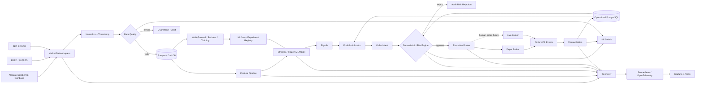

# Autonomous Trading Agent: Research-Backed Build Specification and AI Developer Prompt

## Executive summary

The right first objective is **not “build an AI that makes money.”** It is to build a **reproducible trading research and execution system that can determine whether a strategy has a statistically credible edge, reject strategies that do not, operate safely in paper trading, and only later permit tightly constrained real-money execution**. Regulators explicitly warn that AI cannot reliably predict sudden market changes and that promises of unusually high or guaranteed automated-trading returns are a red flag. citeturn14search1turn14search13

The most important engineering decision is to separate the system into deterministic layers:

**data → features → signal/model → portfolio construction → deterministic risk engine → execution → reconciliation → telemetry**.

An LLM or autonomous coding/research agent may generate hypotheses, write experiments, interpret results, and propose strategy changes, but it should **never have a direct unguarded path to broker order submission**. All orders should be typed, validated, size-limited, checked against current account state, and approved by a deterministic risk engine. This design is especially important because backtest selection itself produces false discoveries: Bailey et al.'s Probability of Backtest Overfitting framework explicitly addresses the risk of choosing the apparent best strategy from repeated historical experiments, while the Deflated Sharpe Ratio adjusts performance evidence for selection bias, non-normal returns, and backtest overfitting. citeturn16search0turn16search1turn16search13

The recommended initial implementation is a **Python monorepo targeting liquid U.S. equities/ETFs, with BTC/USD and ETH/USD added after the equity pipeline works**. Start with 5-minute, hourly, and daily strategies—not high-frequency trading. Use Alpaca as the first paper broker because its paper environment exposes API-based simulated trading, but explicitly compensate for the simulator's shortcomings: Alpaca states that paper trading does not model market impact, information leakage, latency slippage, order-queue position, price improvement, regulatory fees, or dividends. citeturn13search0

For market data, Alpaca's current Basic plan is free and covers U.S. stocks/ETFs but provides IEX rather than all-exchange real-time equity coverage; its $99/month Algo Trader Plus plan supplies broader U.S. exchange coverage and higher limits. citeturn17search2turn17search6 For fundamentals, use SEC EDGAR's official JSON/XBRL APIs; for macroeconomic features, use FRED/ALFRED, particularly ALFRED vintages so a historical backtest sees the values that were actually known at the time rather than subsequently revised data. citeturn13search3turn13search6turn13search20turn13search29 For higher-resolution equities data later, Databento currently offers a $199/month U.S. equities Standard tier with deeper historical/live coverage. citeturn17search21turn17search33

The central research discipline should be:

> **Hypothesis → immutable experiment specification → train/validation → walk-forward evaluation → untouched final holdout → transaction-cost stress → paper trading → promotion or rejection.**

Do not repeatedly inspect the final holdout and then modify the model. Every strategy/configuration tried must be recorded in a **trial ledger**, because the number of alternatives examined is itself relevant to whether the best-looking Sharpe ratio represents skill or selection luck. citeturn16search0turn16search1 Also do not treat a point-estimate Sharpe ratio as exact: Andrew Lo's work demonstrates that Sharpe estimates have sampling uncertainty and that naïve annualization can be materially wrong when returns are serially correlated. citeturn16search6turn16search14

### Recommended initial success gates

These are **engineering/research promotion targets, not promises of achievable investment returns**.

| Dimension | Initial target |
|---|---:|
| Net historical return objective | ≥ 8–12% annualized over sufficiently long OOS history, or convincingly positive excess return where the market regime makes an absolute target inappropriate |
| OOS Sharpe | ≥ 1.0 after modeled costs |
| OOS Sortino | ≥ 1.25 |
| Maximum strategy drawdown | ≤ 10% |
| Preferred production drawdown warning | 5% |
| Calmar ratio | ≥ 0.75 |
| Walk-forward consistency | Positive risk-adjusted performance in ≥ 60% of OOS folds |
| Benchmark | SPY/appropriate ETF for equities; BTC buy-and-hold for BTC strategy; cash/risk-free benchmark as appropriate |
| Cost robustness | Still acceptable at 2× expected costs; preferably not catastrophically negative at 3× |
| Delay robustness | Remains acceptable after 1-bar delay stress; evaluate 2-bar delay |
| Paper observation | At least 60 U.S. equity trading days before any live canary consideration |
| Unresolved reconciliation mismatches | Zero |
| Risk-limit violations | Zero tolerated |
| Data-leakage failures | Zero tolerated |
| Event-to-order-ack p95 | < 2 seconds |
| Feature calculation p95 | < 300 ms |
| Strategy calculation p95 | < 200 ms |
| Risk authorization p95 | < 50 ms |
| Local order-submit call p95 | < 500 ms |
| Availability during required trading window | ≥ 99.5% for production-grade paper system |

The latency goals above are intentionally ordinary software-system targets rather than HFT targets. At five-minute/hourly horizons, correctness, timestamp handling, stale-data detection, execution realism, and risk controls should dominate microsecond optimization.

A realistic build sequence is approximately **16 development weeks to production-grade paper trading**, followed by at least **60 equity trading days of unattended-but-monitored paper operation** before contemplating a small live canary. The live transition should be a human decision, never an automatic milestone.

## Research findings, assumptions, and system design

### Default assumptions

Because no asset class, capital amount, broker, or strategy horizon was specified, the build should assume:

| Item | Default |
|---|---|
| Jurisdiction | United States |
| Initial assets | U.S. equities/ETFs |
| Secondary assets | BTC/USD and ETH/USD |
| Initial universe | SPY, QQQ, IWM plus roughly 20–30 highly liquid large-cap equities |
| Bar frequencies | 5-minute, 1-hour, daily |
| Trading style | Intraday/swing systematic trading; not HFT |
| Starting capital | Configurable virtual NAV; default $100,000 paper |
| Leverage | Disabled initially |
| Shorting | Disabled initially |
| Options/futures | Excluded initially |
| Strategy family | Simple interpretable systematic models before complex ML |
| Execution | Paper only by default |
| Cloud | Single small Linux VM/container deployment initially |
| Database | Parquet/DuckDB research store + PostgreSQL operational store |
| Primary language | Python |
| Live-money activation | Intentionally impossible without human-controlled credentials/approval |

A 20–30 symbol universe also fits comfortably inside Alpaca's current free Basic market-data plan's 30-symbol WebSocket subscription limit, although that plan supplies only IEX real-time equity coverage; upgrading to full-market data should therefore be part of the beta/live-quality-data evaluation. citeturn17search6

### System boundaries

The architecture should contain three logically separate control planes.

**Research plane**

Historical data ingestion, point-in-time normalization, feature generation, strategy research, ML training, walk-forward tests, experiment registry, and reports live here. Research code cannot place broker orders.

**Trading plane**

Real-time data, feature calculation, a frozen strategy artifact, portfolio sizing, deterministic risk validation, execution routing, order-state processing, position reconciliation, and kill switches live here.

**Agent plane**

An autonomous developer/research agent can modify source code and propose experiments. It can inspect results and produce candidate model artifacts. It must not change production parameters silently, see live broker secrets, turn off risk constraints, or promote models into a live-money environment without an explicit human-controlled gate.

That distinction is crucial: an autonomous *researcher* can search an enormous hypothesis space, and large search spaces increase selection-bias/backtest-overfitting risk. The research literature therefore supports explicit tracking of trials and independent OOS testing rather than simply selecting whichever run produced the highest historical Sharpe. citeturn16search0turn16search1turn16search13

### Recommended stack

| Layer | Recommended default | Alternatives |
|---|---|---|
| Language | Python 3.12 | C# if adopting LEAN deeply |
| Dataframes | Polars/Pandas | NumPy directly for hot paths |
| File format | Parquet + PyArrow | HDF5 where appropriate |
| Research querying | DuckDB | PostgreSQL |
| Operational state | PostgreSQL | SQLite only for MVP |
| Schemas/settings | Pydantic | Dataclasses |
| ML | scikit-learn first | LightGBM/XGBoost; PyTorch much later |
| Optimization | Optuna with strict trial logging | Small manual grids |
| Fast exploratory backtests | vectorbt | Custom vectorized engine |
| Canonical execution backtest | Custom event-driven simulator | QuantConnect LEAN |
| Experiment tracking | MLflow | File-based MVP registry |
| Equity paper broker | Alpaca | IBKR after broker-specific evaluation |
| Crypto live adapter | Coinbase Advanced Trade | Kraken |
| Equity data | Alpaca | Databento for higher-quality/deeper data |
| Fundamentals | SEC EDGAR | Provider-derived copies only as cache |
| Macro | FRED/ALFRED | Other official statistical agencies |
| Metrics | Prometheus | Managed monitoring later |
| Dashboards | Grafana | Cloud-native alternatives |
| Telemetry | OpenTelemetry | Direct Prometheus instrumentation |
| Packaging/deployment | Docker + Compose | Kubernetes only if complexity justifies it |
| CI/CD | GitHub Actions | Azure DevOps/GitLab CI |
| Secrets | Environment/secret manager | Never plaintext repository files |

QuantConnect's LEAN is an open-source engine explicitly intended for research, backtesting, optimization, and live trading, so it is a strong alternative if maintaining a custom event-driven engine becomes a burden. citeturn17search3turn17search15turn17search23 MLflow supports recording experimental parameters, metrics, code/artifacts and is suitable for a self-hosted experiment registry. citeturn6search2turn6search21 OpenTelemetry can instrument Python applications with metrics, traces, and logs; Prometheus/Grafana then provide the monitoring and visualization layer. citeturn15search3turn15search11turn7search2turn7search11

### Core component contracts

The most important architectural rule is that strategies should not know which broker is underneath them.

```python
from __future__ import annotations

from dataclasses import dataclass
from datetime import datetime
from decimal import Decimal
from typing import AsyncIterator, Protocol, Sequence


@dataclass(frozen=True)
class Bar:
    symbol: str
    timestamp: datetime
    open: Decimal
    high: Decimal
    low: Decimal
    close: Decimal
    volume: Decimal


@dataclass(frozen=True)
class Signal:
    symbol: str
    timestamp: datetime
    score: float
    horizon_seconds: int
    strategy_id: str


@dataclass(frozen=True)
class OrderIntent:
    symbol: str
    side: str
    quantity: Decimal
    order_type: str
    limit_price: Decimal | None
    strategy_id: str
    client_order_id: str


@dataclass(frozen=True)
class RiskDecision:
    approved: bool
    reason: str
    adjusted_quantity: Decimal | None = None


class MarketDataProvider(Protocol):
    async def get_bars(
        self,
        symbols: Sequence[str],
        start: datetime,
        end: datetime,
        timeframe: str,
    ) -> Sequence[Bar]:
        ...

    def stream_bars(
        self,
        symbols: Sequence[str],
        timeframe: str,
    ) -> AsyncIterator[Bar]:
        ...


class Strategy(Protocol):
    def on_bar(self, bar: Bar, context: "StrategyContext") -> list[Signal]:
        ...


class PortfolioAllocator(Protocol):
    def allocate(
        self,
        signals: Sequence[Signal],
        portfolio: "PortfolioSnapshot",
    ) -> list[OrderIntent]:
        ...


class RiskManager(Protocol):
    def authorize(
        self,
        order: OrderIntent,
        portfolio: "PortfolioSnapshot",
        market: "MarketSnapshot",
    ) -> RiskDecision:
        ...


class Broker(Protocol):
    async def submit(self, order: OrderIntent) -> "BrokerOrder":
        ...

    async def cancel(self, broker_order_id: str) -> None:
        ...

    async def open_orders(self) -> Sequence["BrokerOrder"]:
        ...

    async def positions(self) -> Sequence["Position"]:
        ...

    async def account(self) -> "AccountSnapshot":
        ...
```

Coinbase's Advanced Trade interface follows a useful analogous division: REST endpoints perform order management while WebSockets deliver live market/order/account information, with official SDKs available including Python. citeturn13search1turn13search4turn13search13

### Required safety envelope

For the first paper version:

| Control | Initial setting |
|---|---:|
| Leverage | 1.0× maximum; effectively disabled |
| Short positions | Disallowed |
| Maximum gross exposure | 50% NAV |
| Maximum single position | 5% NAV |
| Maximum new order | 2% NAV |
| Maximum concurrent positions | 10 |
| Daily P&L stop | −1.0% NAV |
| Intraday peak-to-trough stop | −1.5% NAV |
| Rolling/strategy warning | −5% |
| Strategy hard drawdown ceiling | −10% |
| Broker rejects | Kill entries after 3 rejects in 5 minutes |
| Missing/stale price | No new orders after >2 expected bar intervals |
| State mismatch | Disable new entries immediately |
| Unknown broker order | Disable entries and reconcile |
| Duplicate client order ID | Reject |
| Quantity/price nonfinite | Reject |
| Spread excessive | Reject according to asset-specific threshold |
| Market-data timestamp in future | Reject event |
| Clock drift | Alert and suspend if outside configured tolerance |
| Order rate | Hard configurable cap |
| Daily traded notional | Hard cap |
| Kill switch | Local + remote/manual |
| Restart behavior | Start in `SAFE` state and reconcile before trading |

The code should enforce these controls **outside the strategy**. A strategy is allowed to request an impossible trade; the risk layer must refuse it.

### Backtest realism

At minimum, the simulator must model:

`signal time → decision delay → order arrival → execution eligibility → fill → fees → slippage → updated cash/position`.

Never fill a strategy using a price that would not have been available after the signal was generated. Market orders should not magically execute at the bar's pre-signal open. Limit orders should have configurable conservative fill rules.

Maintain multiple cost assumptions:

```text
base_cost
2x_cost
3x_cost
one_bar_delay
two_bar_delay
spread_widening
reduced_liquidity
partial_fill
broker_rejection
```

This is particularly important because a real broker's paper simulator can omit impact, queue position and latency slippage. citeturn13search0

## Comprehensive prompt for the autonomous AI developer

The following is the single copy/paste prompt for the AI developer. Its profitability thresholds are **promotion criteria for research**, not instructions to manipulate results until those thresholds appear.

```text
You are the principal quantitative developer, ML engineer, reliability engineer,
security engineer, and research engineer for a personal autonomous trading system.

You have been given a blank repository.

Your job is to incrementally build a production-grade AUTONOMOUS PAPER-TRADING
product. It should eventually be technically capable of live execution, but LIVE
TRADING MUST REMAIN DISABLED BY DEFAULT and MUST NOT become active through an
autonomous code or configuration change.

====================================
MISSION
====================================

Build a modular, reproducible, observable, statistically rigorous algorithmic
trading platform that:

1. Ingests historical and real-time market data.
2. Validates, normalizes, timestamps, stores, and versions that data.
3. Creates causal features without look-ahead leakage.
4. Supports deterministic rule-based strategies and ML strategies.
5. Trains models reproducibly.
6. Runs realistic historical simulations.
7. Implements rolling/walk-forward testing.
8. Tracks every strategy/model/configuration attempted.
9. Calculates risk-adjusted and statistical performance metrics.
10. Rejects strategies that fail predefined promotion criteria.
11. Executes approved strategies with simulated/paper money.
12. Reconciles internal state with the broker.
13. Applies deterministic risk controls before every order.
14. Exposes metrics, structured logs, traces, dashboards, and alerts.
15. Can later support a tightly gated live broker adapter.
16. Is testable from a clean checkout.
17. Never places a live-money trade without explicit human-controlled activation.

Do NOT optimize merely for backtest return.
Do NOT claim the product is guaranteed to be profitable.
Do NOT hide failed experiments.
Do NOT alter acceptance thresholds after seeing an OOS result without recording
that change as a new research hypothesis.
Do NOT let an LLM directly call a broker endpoint.
Do NOT make execution dependent on free-form natural-language output.

====================================
DEFAULT PRODUCT ASSUMPTIONS
====================================

Unless overridden in version-controlled configuration:

Jurisdiction:
    United States.

Initial asset class:
    Liquid U.S. equities and ETFs.

Secondary asset class:
    BTC/USD and ETH/USD.

Initial universe:
    SPY
    QQQ
    IWM
    approximately 20-30 highly liquid U.S. large-cap equities

Initial frequencies:
    5-minute
    1-hour
    daily

Initial virtual NAV:
    $100,000

Initial broker:
    Alpaca paper trading.

Secondary crypto adapter:
    Coinbase Advanced Trade.

Historical/real-time market data:
    Alpaca initially.
    Support Databento as an optional future provider.

Fundamental data:
    SEC EDGAR official APIs.

Macroeconomic data:
    FRED/ALFRED official APIs.

No:
    leverage,
    short selling,
    options,
    futures,
    illiquid microcaps,
    martingale position sizing,
    averaging down solely because a trade is losing,
    unrestricted reinforcement-learning execution,
    LLM-to-broker direct execution.

====================================
NON-NEGOTIABLE ARCHITECTURE
====================================

Implement these modules behind typed interfaces:

MarketDataProvider
DataNormalizer
DataQualityValidator
FeaturePipeline
Strategy
ModelTrainer
ModelRegistry
PortfolioAllocator
RiskManager
Broker
FillModel
BacktestEngine
WalkForwardEngine
ExperimentRegistry
PositionRepository
OrderRepository
Reconciler
Telemetry
KillSwitch

The dependency flow must be:

raw data
    -> normalization
    -> quality validation
    -> versioned canonical storage
    -> causal feature pipeline
    -> strategy/model
    -> signal
    -> portfolio allocation
    -> order intent
    -> deterministic risk engine
    -> execution router
    -> broker
    -> fills/order updates
    -> reconciliation
    -> portfolio state

Never let Strategy depend directly on Broker.

Never let ModelTrainer depend directly on Broker.

Never let an LLM tool call Broker.

RiskManager is authoritative: rejected OrderIntent objects never reach Broker.

All external provider integrations must be isolated behind adapters.

Backtest and paper/live trading should use the SAME:
    strategy interface,
    feature interface,
    portfolio-sizing logic,
    risk logic,
    domain objects,

with only the market-data clock and broker/fill adapter swapped.

====================================
INITIAL TECHNICAL STACK
====================================

Use Python 3.12 unless a dependency forces a documented change.

Suggested dependencies:

runtime:
    pydantic
    pydantic-settings
    numpy
    pandas and/or polars
    pyarrow
    duckdb
    sqlalchemy
    psycopg
    httpx
    websockets
    tenacity
    structlog
    prometheus-client
    opentelemetry
    scikit-learn
    joblib
    mlflow

research:
    scipy
    statsmodels
    vectorbt if helpful
    optuna only after the baseline framework exists

testing/dev:
    pytest
    pytest-asyncio
    pytest-cov
    hypothesis
    respx
    ruff
    mypy

Use PostgreSQL for operational orders/positions/execution records.
Use Parquet partitioned files for historical market/features data.
Use DuckDB for local analytical queries.

Do not introduce Kafka, Kubernetes, Spark, feature-store infrastructure, or
microservices in the MVP unless actual measured requirements justify them.

Prefer a modular monolith initially.

====================================
FIRST REPOSITORY ACTIONS
====================================

Start by creating:

README.md
pyproject.toml
Makefile
.env.example
.gitignore
compose.yaml

config/
src/trader/
tests/
experiments/
data/
docs/
infra/
.github/workflows/

Immediately create documentation:

docs/architecture.md
docs/risk-policy.md
docs/data-contract.md
docs/experiment-protocol.md
docs/security.md
docs/live-trading-gate.md
docs/runbooks/kill-switch.md
docs/runbooks/broker-disconnect.md
docs/runbooks/data-stale.md
docs/runbooks/reconciliation-failure.md
docs/decision-log.md

The README must explain:

- system architecture
- local setup
- paper-only status
- command list
- how backtests work
- how experiment artifacts are stored
- how to run tests
- how to start/stop the paper trader
- risk disclaimer
- the fact that historical/paper performance does not guarantee future results

Initialize Git.

Create small commits after coherent milestones if Git access is available.

====================================
STANDARD COMMANDS
====================================

Provide Make targets or equivalent commands for:

make install
make lint
make typecheck
make test
make test-unit
make test-integration
make test-backtest
make data-smoke
make backtest-smoke
make walk-forward
make paper
make dashboards
make ci

`make ci` must perform all checks that pull requests require.

A clean clone should be able to execute:

python -m venv .venv
source .venv/bin/activate
python -m pip install --upgrade pip
pip install -e ".[dev]"
make ci

without real broker credentials.

Tests must use deterministic fixtures/fakes where credentials are unavailable.

====================================
DATA MODEL
====================================

Define canonical schemas for:

Instrument
Bar
Quote
Trade
CorporateAction
FundamentalObservation
MacroObservation
FeatureObservation
Signal
TargetPosition
OrderIntent
RiskDecision
BrokerOrder
Fill
Position
PortfolioSnapshot
AccountSnapshot
StrategyArtifact
Experiment
ModelArtifact

Every market record should preserve where applicable:

provider
dataset/feed
symbol
canonical instrument ID
exchange timestamp
received timestamp
timezone
price
size/volume
adjustment status
retrieval timestamp
schema version

Store timestamps internally in UTC.

Clearly distinguish:
    event time
    arrival/received time
    processing time

Reject or quarantine malformed records.

Build data-quality checks for:

duplicates
nonmonotonic timestamps
impossible OHLC relationships
negative prices
negative volume
unexpected gaps
timezone errors
future timestamps
stale feeds
symbol changes
corporate-action effects

Create a data-quality report for every ingestion run.

====================================
POINT-IN-TIME DISCIPLINE
====================================

This requirement is critical.

No feature may use information that was unavailable at the decision timestamp.

For SEC fundamentals:
    use filing/release availability time, not simply fiscal-period end.

For macro data:
    support vintage/realtime dates so revised historical information does not
    leak into earlier simulations.

For rolling indicators:
    verify value at t is invariant when all records after t are removed.

Create automated leakage tests.

====================================
BASELINE STRATEGIES
====================================

Do not begin with a neural network or RL.

Implement benchmark/reference strategies first:

1. Cash/no-trade.
2. Buy-and-hold.
3. Long-only moving-average trend/momentum.
4. Cross-sectional momentum if universe data supports it.
5. Simple mean reversion.
6. Volatility-targeted variant.

Each strategy must have:
    written economic/statistical hypothesis,
    parameters,
    applicable assets,
    expected holding period,
    expected turnover,
    obvious failure regimes,
    benchmark,
    transaction-cost assumptions.

Use these strategies to verify infrastructure, NOT because they are presumed
profitable.

Only after the full validation pipeline exists should you implement ML models.

First ML candidates:
    logistic regression,
    regularized linear regression,
    random forest / gradient-boosted trees.

Possible labels:
    future excess return,
    directional probability,
    volatility-adjusted forward return.

Do not train directly on final P&L without carefully defining leakage-safe
labels.

====================================
FEATURE ENGINEERING
====================================

Candidate feature families:

returns:
    lagged 1/2/3/6/12-period returns

trend:
    moving-average distances
    rolling breakout location
    MACD-like differences

volatility:
    rolling realized volatility
    ATR-like range
    downside volatility

volume/liquidity:
    relative volume
    dollar volume
    spread where quotes are available

cross-sectional:
    relative momentum rank
    volatility rank

market context:
    SPY/market return
    market realized volatility

macro, only where point-in-time safe:
    rates
    yield curve
    relevant economic observations

fundamentals, only where point-in-time safe:
    filing-derived ratios

Do not generate hundreds of arbitrary indicators initially.

Maintain feature metadata:
    name
    version
    inputs
    lookback
    availability lag
    transformation
    implementation hash

====================================
BACKTEST ENGINE
====================================

The canonical backtest must be event-driven.

It must model:

cash
positions
mark-to-market equity
orders
open orders
partial fills
cancellations
fees
slippage
spread assumptions
trading calendar
market hours
decision latency
order latency
rejections
position limits
risk stops

Do not assume unlimited liquidity.

A signal formed using a completed bar cannot fill retroactively at the beginning
of that bar.

Create explicit FillModel classes:

ConservativeBarFillModel
ConfigurableSlippageFillModel
PartialFillModel

Make transaction costs configurable by asset/provider.

Do not hard-code a single universal fee/slippage number.

Starting synthetic assumptions for robustness tests may be conservative and
should be replaced/calibrated using paper/live observations.

Run every promoted strategy under:

base modeled costs
2x costs
3x costs
one-bar delayed execution
two-bar delayed execution
wider spread
random rejected orders
partial fills

====================================
BACKTEST METRICS
====================================

Calculate at least:

total return
CAGR
annualized volatility
Sharpe
autocorrelation-aware/robust Sharpe where appropriate
Sortino
maximum drawdown
Calmar
profit factor
win rate
average win
average loss
expectancy
turnover
number of trades
average holding period
exposure
gross exposure
net exposure
beta
alpha where meaningful
information ratio
benchmark-relative return
slippage
fees
capacity/liquidity diagnostics

Also implement research-selection diagnostics:

trial count
Deflated Sharpe Ratio or equivalent selection-aware statistic
Probability of Backtest Overfitting where practical

A report must show BOTH:
    gross performance
    net performance after costs

====================================
EXPERIMENT PROTOCOL
====================================

Every experiment receives a unique experiment_id.

Before executing it, persist:

experiment_id
timestamp
Git commit
dataset/version
hypothesis
strategy name
parameter search space
features
training period
validation period
walk-forward design
final holdout period
cost assumptions
benchmark
predefined promotion criteria

Then run it.

Afterward record:
    full metrics
    artifact paths
    plots
    failures
    conclusion
    promoted/rejected status

Never delete failed trials.

Maintain:
    experiments/trial-ledger.parquet
or an equivalent append-only registry.

Do not look at the final holdout repeatedly while tuning.

If the final holdout is inspected and then the strategy is changed, it is no
longer an untouched holdout. Record that fact and define a new future/OOS test.

====================================
WALK-FORWARD EVALUATION
====================================

Implement expanding-window and rolling-window evaluation.

For each fold:

train only on past data
fit preprocessing only on the training set
fit model only on the training set
freeze the artifact
evaluate on the next OOS interval
roll forward
repeat

Add purge/embargo gaps if feature/label horizons overlap boundaries.

Concatenate OOS predictions/trades into one genuine walk-forward equity curve.

Never average only the best folds.

Report:
    fold-level metrics
    aggregated OOS metrics
    dispersion across folds
    percentage profitable folds
    regime sensitivity

Reserve a final untouched block beyond walk-forward model development whenever
data quantity permits.

====================================
INITIAL RESEARCH PROMOTION GATES
====================================

Treat these as starting research gates, not guarantees:

OOS annualized Sharpe:
    >= 1.0

OOS Sortino:
    >= 1.25

Maximum drawdown:
    <= 10%

Calmar:
    >= 0.75

Walk-forward positive risk-adjusted folds:
    >= 60%

Historical net annualized return objective:
    approximately 8-12%+ when the available sample is sufficiently long and the
    comparison is economically appropriate

Cost stress:
    acceptable at 2x expected transaction costs

Latency stress:
    acceptable after one-bar delay

Benchmark:
    must outperform cash and/or appropriate passive benchmark on an economically
    meaningful risk-adjusted basis, not merely generate positive nominal P&L.

Statistical selection evidence:
    must not rely exclusively on an unadjusted Sharpe from the best experiment.

Reject a strategy if the edge disappears under a trivially larger cost/slippage
assumption.

Never modify a promotion threshold merely to make a strategy pass.

====================================
RISK ENGINE
====================================

Implement the RiskManager independently of strategy code.

Starting PAPER limits:

max_gross_exposure_pct = 0.50
max_position_pct = 0.05
max_order_pct = 0.02
max_concurrent_positions = 10
max_daily_loss_pct = 0.01
max_intraday_drawdown_pct = 0.015
drawdown_warning_pct = 0.05
hard_strategy_drawdown_pct = 0.10
allow_shorting = false
max_leverage = 1.0
max_broker_rejects_5m = 3

Also implement:

maximum daily notional
maximum orders/minute
maximum pending orders
price sanity checks
maximum spread
stale-data detection
duplicate-order detection
idempotent client order IDs
broker-health gating
exchange-calendar gating
position reconciliation gating
account-equity sanity checks

Risk evaluation must fail closed.

An unexpected exception in a risk check means REJECT, not APPROVE.

====================================
KILL SWITCH
====================================

Create a first-class kill switch.

States:
    SAFE
    ACTIVE_PAPER
    HALTED
    LIVE_CANDIDATE
    ACTIVE_LIVE

The repository must default to SAFE/ACTIVE_PAPER.

HALTED must:
    reject new entry orders
    optionally cancel open entry orders
    permit configured risk-reducing exits
    emit a critical alert

Automatically halt on:

daily loss breach
drawdown breach
stale data
repeated broker failures
reconciliation mismatch
invalid account equity
clock/timestamp anomaly
unexpected live account detection while paper mode is configured

Provide a manual command:

trader kill-switch activate --reason "..."

and a status command:

trader kill-switch status

Restarting the process must NOT automatically clear HALTED.

====================================
LIVE-TRADING SECURITY BOUNDARY
====================================

Implement a live broker adapter eventually, but protect it.

A live process must require ALL of:

1. config.mode == "live"
2. config.live.enabled == true
3. a human-controlled live credential not stored in the repository
4. a separate explicit human approval mechanism
5. successful broker/account identity validation
6. successful preflight reconciliation
7. successful risk-engine self-test
8. a live capital allocation > 0 set independently

The autonomous coding/research agent must never possess the human approval
credential.

Do not place production broker credentials in:
    source files
    Git history
    notebooks
    CI logs
    test fixtures
    exception messages

Create `.env.example` with names only.

Paper and live credentials must be different.

====================================
ORDER LIFECYCLE
====================================

Implement explicit states such as:

CREATED
RISK_REJECTED
AUTHORIZED
SUBMITTING
SUBMITTED
PARTIALLY_FILLED
FILLED
CANCEL_PENDING
CANCELED
REJECTED
UNKNOWN

Persist transitions.

Generate idempotent client_order_id values.

On timeout:
    do not blindly submit a duplicate.
    first query/reconcile the broker.

On restart:
    fetch broker account,
    positions,
    open orders,
    recent fills,
    then reconcile before enabling entries.

====================================
PAPER TRADING
====================================

Integrate Alpaca paper trading only after simulator/backtest tests pass.

Record:

signal timestamp
order-intent timestamp
risk-decision timestamp
HTTP submit timestamp
broker acknowledgment timestamp
first-fill timestamp
final-fill timestamp
expected price
submitted limit/market parameters
fill price
spread
slippage in bps
broker status
strategy/model version

Compare paper behavior with backtest assumptions.

Build a calibration report:
    empirical slippage distribution
    order acknowledgment latency
    fill latency
    reject rate
    missing-data rate

Do not treat paper performance as identical to live performance.

====================================
OBSERVABILITY
====================================

Use structured JSON logs.

Every record should include when applicable:

timestamp
environment
run_id
strategy_id
model_version
symbol
client_order_id
broker_order_id
trace_id
event_type
severity

Expose Prometheus metrics including:

trader_nav
trader_daily_pnl
trader_drawdown
trader_gross_exposure
trader_net_exposure
trader_position_count
trader_orders_total
trader_order_rejections_total
trader_fills_total
trader_slippage_bps
trader_broker_ack_latency_seconds
trader_feature_latency_seconds
trader_strategy_latency_seconds
trader_risk_latency_seconds
trader_data_age_seconds
trader_missing_bars_total
trader_reconciliation_errors_total
trader_websocket_reconnects_total
trader_kill_switch_state

Instrument important request flows with OpenTelemetry.

Create Grafana dashboard definitions under:
    infra/grafana/

Create Prometheus config under:
    infra/prometheus/

====================================
PERFORMANCE/LATENCY TARGETS
====================================

For initial 5-minute/1-hour strategies:

feature computation p95 < 300 ms
strategy evaluation p95 < 200 ms
risk authorization p95 < 50 ms
local broker-submit operation p95 < 500 ms where network conditions permit
event-to-broker-ack p95 < 2 seconds

Do not spend significant engineering time optimizing below these values unless
profiling demonstrates need.

Correctness is more important than microsecond latency.

====================================
CI/CD
====================================

Create GitHub Actions that run on pull requests and pushes.

Required gates:

ruff format/check
mypy
unit tests
integration tests using mocks/fakes
backtest smoke test
coverage
configuration validation
secret scan if practical
dependency/security scan if practical

CI must never need live broker credentials.

CI should use minimal permissions.

Build a Docker image after tests pass.

Do not automatically deploy a live-money environment.

Production-grade PAPER deployments may be automated after tests pass.

====================================
TESTING REQUIREMENTS
====================================

UNIT:

data parsers
timestamp conversion
feature calculations
position accounting
PnL accounting
fee calculation
slippage calculation
risk rules
order IDs
config validation
performance metrics

PROPERTY/INVARIANT:

OHLC validation
cash + marked position value == account equity within tolerance
no negative position when shorting disabled
gross exposure never exceeds configured maximum after risk approval
same order ID cannot generate duplicate economic exposure
risk exceptions fail closed

LEAKAGE:

feature(t) using full dataset equals feature(t) using data truncated at t
normalizers/scalers fit exclusively on train periods
targets never enter features
fundamental features cannot appear before release timestamp

INTEGRATION:

historical provider -> normalization -> storage
stored data -> features -> strategy
strategy -> allocator -> risk manager
risk manager -> fake broker
broker events -> reconciler -> portfolio
WebSocket disconnect -> reconnect -> sequence recovery
timeout -> reconciliation without duplicate submission

BACKTEST REGRESSION:

run a tiny deterministic fixture and assert exact fills/PnL
run buy-and-hold fixture
run a losing strategy
run no-trade strategy
assert look-ahead test fails for deliberately broken feature

STRESS:

2x/3x costs
execution delays
dropped bars
duplicate bars
out-of-order events
partial fills
rejected orders
broker timeout
database temporarily unavailable
process restart while order pending
stale market feed
wide spreads
flash-crash synthetic sequence

PAPER:

minimum 60 equity trading days before live consideration
zero unresolved reconciliation failures
zero risk-control bypasses

====================================
MODEL PROMOTION
====================================

A model artifact should contain:

model
feature schema/version
training range
training dataset hash
parameters
Git SHA
metrics
walk-forward report
cost-stress report
created timestamp

Candidate models enter:
    CANDIDATE

Passing offline tests makes:
    PAPER_APPROVED

Only human authorization can create:
    LIVE_APPROVED

A new model must never silently replace the active one.

====================================
MILESTONES
====================================

MVP — approximately weeks 1-4

Deliver:
    repository foundation
    canonical data models
    Alpaca historical ingestion
    Parquet/DuckDB storage
    data-quality checks
    event-driven backtest
    benchmark + simple momentum strategy
    basic metrics
    risk engine
    unit/integration/backtest tests
    reproducible CLI
    CI

Exit criterion:
    deterministic clean-clone backtest produces versioned report and passes CI.

ALPHA — approximately weeks 5-8

Deliver:
    walk-forward engine
    experiment registry/trial ledger
    robust statistics
    cost/delay stress tests
    Alpaca paper adapter
    order persistence
    reconciliation
    kill switch
    Prometheus metrics
    Grafana dashboard
    structured logging

Exit criterion:
    one full paper trading vertical slice runs safely and reconciles accurately.

BETA — approximately weeks 9-12

Deliver:
    first ML baselines
    MLflow tracking
    point-in-time FRED/ALFRED pipeline
    SEC EDGAR fundamentals pipeline
    BTC/ETH support
    optional Coinbase adapter
    stronger execution simulator
    chaos/failure testing
    paper/backtest calibration

Exit criterion:
    strategy candidate passes predefined offline gates and behaves consistently
    under paper execution assumptions.

PRODUCTION-GRADE PAPER — approximately weeks 13-16

Deliver:
    hardened deployment
    backups
    alerts
    runbooks
    process supervision
    secure secret injection
    nightly evaluation jobs
    rollback
    model registry
    promotion workflow
    full observability
    incident reports
    performance reports

Exit criterion:
    unattended paper system runs with monitoring and no material safety defects.

LIVE CANARY — NOT AN AUTOMATIC MILESTONE

Only consider after:
    >= 60 U.S. equity trading days paper observation
    offline robustness criteria still pass
    zero unresolved reconciliation errors
    empirical paper slippage incorporated into backtests
    broker rules reviewed
    tax/compliance requirements reviewed
    human approval

If eventually enabled:
    allocate only a small fraction of intended capital initially,
    e.g. 10-25% of final allocated strategy capital,
    retain all tighter loss limits,
    compare actual live execution with paper assumptions,
    automatically halt rather than scale when unexpected behavior appears.

====================================
ITERATION RULES
====================================

Work in short, testable cycles.

For every cycle:

1. State the hypothesis/problem.
2. Identify files to change.
3. Write/update tests first where practical.
4. Implement the smallest coherent change.
5. Run targeted tests.
6. Run lint/type checks.
7. Run the full CI suite.
8. Produce/report objective results.
9. Update docs and decision log.
10. Record failed approaches.
11. Stop and fix regressions before adding functionality.

For quantitative experiments additionally:

1. Register the experiment before seeing results.
2. Freeze split/cost assumptions.
3. Run experiment.
4. Store full result, not just best parameter set.
5. Compare against benchmark.
6. Run robustness tests.
7. Reject/promote mechanically using recorded criteria.
8. Never cherry-pick only profitable periods.

After each major milestone produce:

artifacts/status/<date>-status.md

containing:

implemented items
test counts/results
known defects
risk concerns
research results
cost estimate
next prioritized work
exact commands needed to reproduce results

====================================
FIRST IMPLEMENTATION SEQUENCE
====================================

Perform these tasks now in order:

A. Initialize repository/tooling.
B. Write architecture/risk/research protocol documents.
C. Implement domain objects and interfaces.
D. Implement config loading and PAPER-safe defaults.
E. Implement canonical bar schema.
F. Implement historical market-data provider.
G. Implement data validator and local Parquet/DuckDB storage.
H. Create deterministic fixture dataset.
I. Implement portfolio/accounting primitives.
J. Implement event-driven backtest clock.
K. Implement conservative fill model.
L. Implement fee/slippage model.
M. Implement deterministic risk engine.
N. Implement cash/no-trade and buy-and-hold benchmarks.
O. Implement simple trend/momentum strategy.
P. Implement metrics/reporting.
Q. Implement leakage/invariant tests.
R. Implement experiment registry.
S. Implement walk-forward engine.
T. Run the first registered experiment.
U. Only then build the paper broker adapter.
V. Add observability and reconciliation before continuous paper operation.
W. Add ML only after the above pipeline is reliable.

====================================
EXPECTED FIRST RESEARCH REPORT
====================================

Generate:

artifacts/backtests/baseline-report.md

Include:

dataset
date span
symbols
missing-data summary
strategy definition
benchmark definition
cost assumptions
trade count
gross return
net return
CAGR
Sharpe
Sortino
max drawdown
Calmar
turnover
cost impact
2x-cost result
3x-cost result
1-bar-delay result
walk-forward metrics if available
known limitations

Include equity and drawdown series in machine-readable CSV/Parquet.

Do not describe the strategy as successful unless it passes the predefined gates.

====================================
SECURITY
====================================

Never commit:
    API keys
    access tokens
    passwords
    live account identifiers where unnecessary
    database credentials
    signing keys

Redact secrets from:
    exceptions
    HTTP logs
    traces
    screenshots
    test snapshots

Use least-privilege API keys.

Use read-only data credentials where trading permission is unnecessary.

Separate research credentials from execution credentials.

Back up operational/audit data.

Record configuration/version with every execution event.

====================================
COMPLIANCE/TAX RECORDKEEPING
====================================

The system must generate durable records for every executed transaction:

instrument
side
quantity
order time
fill time
fill price
fees
broker order ID
strategy
model version
cost basis metadata where available

Do not implement tax advice.

Provide exportable transaction records suitable for later reconciliation with
broker tax documents.

Document that legal/regulatory obligations depend on jurisdiction, account type,
broker, instruments, and whether the software ever manages money or provides
services/signals for anyone other than its owner.

====================================
FINAL PRINCIPLE
====================================

Your job is not to find a backtest that looks profitable.

Your job is to construct a system in which a real edge, if one exists, has a
reasonable chance of surviving skeptical statistical testing, realistic costs,
paper execution, operational failures, and deterministic risk controls.

Prefer rejecting a questionable strategy over weakening the validation protocol.

Begin implementing the repository from the FIRST IMPLEMENTATION SEQUENCE.
```

## Prioritized backlog and milestone roadmap

The following backlog places correctness and risk infrastructure ahead of ML. That ordering is deliberate: if the simulator, timestamp model, accounting, execution assumptions, or experiment protocol are wrong, adding a more powerful learner merely produces more sophisticated false confidence. The backtest-overfitting literature particularly supports constraining and recording the research search process. citeturn16search0turn16search1

| Priority | Phase | Task | Deliverable / definition of done | Required validation | Depends on |
|---|---|---|---|---|---|
| P0 | MVP | Repository/bootstrap | Installable package, Makefile, README, CI | Clean checkout passes CI | None |
| P0 | MVP | Domain model | Typed Bar, Signal, Order, Fill, Position, Portfolio objects | Unit tests | Bootstrap |
| P0 | MVP | Configuration system | Paper-safe typed configs; invalid limits fail startup | Config tests | Domain |
| P0 | MVP | Historical ingestion | Fetch/cache historical equity bars | Provider integration test | Config |
| P0 | MVP | Canonical storage | Partitioned Parquet + DuckDB metadata/catalog | Round-trip tests | Ingestion |
| P0 | MVP | Data-quality layer | Gap/duplicate/OHLC/timestamp checks | Corrupt-fixture tests | Storage |
| P0 | MVP | Accounting engine | Cash, positions, realized/unrealized P&L | Exact fixture tests | Domain |
| P0 | MVP | Event backtester | Deterministic clock/order/fill lifecycle | Golden-result tests | Accounting |
| P0 | MVP | Risk engine | Exposure/loss/order/rate/staleness limits | Boundary/property tests | Accounting |
| P0 | MVP | Conservative fill/cost model | Fees, spread/slippage, delays, partial-fill capability | Known fixture | Backtester |
| P0 | MVP | Benchmarks | Cash, buy-and-hold | Regression tests | Backtester |
| P0 | MVP | Baseline strategies | Momentum/trend + mean-reversion candidate | Backtests | Backtester |
| P0 | Alpha | Experiment registry | Immutable experiment manifests + trial ledger | Duplicate/trial tests | Research pipeline |
| P0 | Alpha | Walk-forward engine | Rolling/expanding OOS evaluation | Synthetic no-leakage fixture | Registry |
| P0 | Alpha | Leakage test suite | Time-truncation and train-only-transform tests | Deliberately broken feature rejected | Feature pipeline |
| P0 | Alpha | Paper execution adapter | Paper order submit/cancel/update | Broker paper smoke test | Risk |
| P0 | Alpha | Reconciliation | Internal/broker state convergence before entries | Restart/timeout tests | Execution |
| P0 | Alpha | Kill switch | Persistent halt and safe restart behavior | Fault-injection tests | Risk |
| P1 | Alpha | Observability | Logs, Prometheus metrics, Grafana dashboards | Dashboard smoke test | Paper loop |
| P1 | Alpha | Execution calibration | Slippage/latency/fill reports | Paper sample | Paper adapter |
| P1 | Beta | SEC pipeline | Point-in-time filing/fundamental records | Availability-time tests | Data |
| P1 | Beta | FRED/ALFRED pipeline | Macro observations plus vintages | Vintage leakage test | Data |
| P1 | Beta | ML baseline | Leakage-safe linear/logistic/trees | Walk-forward only | Validation |
| P1 | Beta | MLflow registry | Experiment/model artifacts persisted | Artifact reload test | ML |
| P1 | Beta | Crypto data | BTC/ETH canonical ingestion | Provider test | Data |
| P1 | Beta | Crypto execution adapter | Broker-neutral crypto interface | Fake/integration tests | Execution |
| P1 | Beta | Stress harness | Latency, dropped data, rejects, crashes, costs | Automated scenarios | Paper system |
| P1 | Beta | DSR/PBO analysis | Selection-aware performance report | Statistical test fixtures | Trial registry |
| P2 | Production-paper | Deployment | Containerized persistent paper service | Restart/recovery test | Alpha/Beta |
| P2 | Production-paper | Backup/restore | Database + artifacts recovery | Restore drill | Deployment |
| P2 | Production-paper | Alerts/runbooks | Critical alerts mapped to runbook | Simulated incidents | Observability |
| P2 | Production-paper | Nightly research jobs | Drift/performance/data-quality reports | Scheduled smoke run | Deployment |
| P2 | Production-paper | Model promotion workflow | Candidate → paper-approved state | Promotion tests | ML registry |
| P2 | Production-paper | Security hardening | Secrets, permissions, dependency policy | Security CI | Deployment |
| P3 | Future | Databento adapter | Higher-fidelity equities data | Cross-provider comparison | Stable system |
| P3 | Future | LEAN comparison | Compare custom simulator against mature engine | Same strategy comparison | Stable backtests |
| P3 | Future | Live broker adapter | Compiles/functions but disabled | Sandbox/fake tests | Production-paper |
| P3 | Future | Human live gate | Separate credentials/approval mechanism | Security review | Live adapter |
| P3 | Future | Live canary | Tiny allocation after all promotion criteria | Explicit human approval | ≥60 paper days |

### Development timeline

| Period | Main objective | Exit artifact |
|---|---|---|
| Week 1 | Repo, architecture, domain/configuration | Green CI |
| Week 2 | Ingestion, storage, quality | Reproducible dataset |
| Week 3 | Accounting + backtest engine | Golden backtest |
| Week 4 | Costs, risk, benchmark strategies | MVP baseline report |
| Week 5 | Experiment registry | Complete trial ledger |
| Week 6 | Walk-forward + leakage testing | OOS report |
| Week 7 | Paper broker execution | One-order vertical slice |
| Week 8 | Reconciliation + kill switch + telemetry | Alpha |
| Week 9 | SEC/FRED point-in-time features | Data provenance report |
| Week 10 | ML baselines | ML walk-forward report |
| Week 11 | BTC/ETH pipeline | Multi-asset research run |
| Week 12 | Stress/chaos testing | Beta |
| Week 13 | Persistent deployment | Recovery-tested service |
| Week 14 | Dashboards/alerting/runbooks | Operations review |
| Week 15 | Security and model promotion | Hardened paper build |
| Week 16 | End-to-end validation | Production-grade paper release |
| Following ≥60 equity trading days | Real operational observation | Paper-performance dossier |
| Only thereafter | Optional live canary | Human-controlled decision |

A recent 2026 walk-forward study similarly emphasizes independent OOS testing and cost sensitivity rather than treating an optimized training result as sufficient evidence; its results also illustrate that window selection itself can materially affect apparent performance. citeturn16search3

## Repository scaffold, configuration, and CI

### Suggested repository layout

```text
autonomous-trader/
├── README.md
├── LICENSE
├── pyproject.toml
├── Makefile
├── compose.yaml
├── .env.example
├── .gitignore
│
├── config/
│   ├── base.yaml
│   ├── paper.yaml
│   ├── live.yaml
│   ├── logging.yaml
│   ├── universes/
│   │   ├── liquid_equities.yaml
│   │   └── crypto.yaml
│   └── strategies/
│       ├── momentum.yaml
│       ├── mean_reversion.yaml
│       └── ml_baseline.yaml
│
├── src/
│   └── trader/
│       ├── __init__.py
│       ├── cli.py
│       │
│       ├── domain/
│       │   ├── events.py
│       │   ├── instruments.py
│       │   ├── market.py
│       │   ├── orders.py
│       │   ├── portfolio.py
│       │   └── interfaces.py
│       │
│       ├── data/
│       │   ├── providers/
│       │   │   ├── alpaca.py
│       │   │   ├── coinbase.py
│       │   │   ├── databento.py
│       │   │   ├── fred.py
│       │   │   └── sec_edgar.py
│       │   ├── normalize.py
│       │   ├── quality.py
│       │   ├── corporate_actions.py
│       │   └── point_in_time.py
│       │
│       ├── features/
│       │   ├── base.py
│       │   ├── pipeline.py
│       │   ├── returns.py
│       │   ├── momentum.py
│       │   ├── volatility.py
│       │   ├── liquidity.py
│       │   └── fundamentals.py
│       │
│       ├── strategies/
│       │   ├── base.py
│       │   ├── benchmark.py
│       │   ├── momentum.py
│       │   ├── mean_reversion.py
│       │   └── ml_signal.py
│       │
│       ├── models/
│       │   ├── dataset.py
│       │   ├── train.py
│       │   ├── predict.py
│       │   ├── calibration.py
│       │   └── registry.py
│       │
│       ├── portfolio/
│       │   ├── accounting.py
│       │   ├── allocator.py
│       │   └── positions.py
│       │
│       ├── risk/
│       │   ├── engine.py
│       │   ├── limits.py
│       │   ├── checks.py
│       │   └── kill_switch.py
│       │
│       ├── backtest/
│       │   ├── engine.py
│       │   ├── clock.py
│       │   ├── simulated_broker.py
│       │   ├── fills.py
│       │   ├── costs.py
│       │   ├── metrics.py
│       │   ├── reports.py
│       │   ├── walk_forward.py
│       │   └── robustness.py
│       │
│       ├── execution/
│       │   ├── router.py
│       │   ├── alpaca_broker.py
│       │   ├── coinbase_broker.py
│       │   ├── order_state.py
│       │   └── reconcile.py
│       │
│       ├── research/
│       │   ├── experiments.py
│       │   ├── registry.py
│       │   ├── splits.py
│       │   ├── statistics.py
│       │   └── trial_ledger.py
│       │
│       ├── storage/
│       │   ├── parquet.py
│       │   ├── duckdb.py
│       │   ├── postgres.py
│       │   ├── repositories.py
│       │   └── migrations/
│       │
│       ├── orchestration/
│       │   ├── research_loop.py
│       │   ├── paper_loop.py
│       │   ├── scheduler.py
│       │   └── preflight.py
│       │
│       └── observability/
│           ├── logging.py
│           ├── metrics.py
│           ├── tracing.py
│           └── health.py
│
├── tests/
│   ├── unit/
│   │   ├── test_accounting.py
│   │   ├── test_features.py
│   │   ├── test_risk.py
│   │   ├── test_costs.py
│   │   └── test_metrics.py
│   ├── integration/
│   │   ├── test_data_pipeline.py
│   │   ├── test_execution.py
│   │   └── test_reconciliation.py
│   ├── backtest/
│   │   ├── test_golden_backtest.py
│   │   ├── test_no_lookahead.py
│   │   └── test_robustness.py
│   ├── property/
│   ├── fixtures/
│   │   ├── bars/
│   │   └── broker/
│   └── conftest.py
│
├── experiments/
│   ├── templates/
│   │   └── walk_forward.yaml
│   ├── manifests/
│   └── trial-ledger.parquet
│
├── notebooks/
│   └── exploratory/
│
├── data/
│   ├── raw/.gitkeep
│   ├── canonical/.gitkeep
│   ├── features/.gitkeep
│   └── README.md
│
├── artifacts/
│   ├── backtests/
│   ├── walk_forward/
│   ├── models/
│   ├── paper/
│   └── status/
│
├── docs/
│   ├── architecture.md
│   ├── data-contract.md
│   ├── experiment-protocol.md
│   ├── risk-policy.md
│   ├── security.md
│   ├── compliance-notes.md
│   ├── live-trading-gate.md
│   ├── decision-log.md
│   └── runbooks/
│       ├── kill-switch.md
│       ├── broker-disconnect.md
│       ├── reconciliation-failure.md
│       └── stale-data.md
│
├── infra/
│   ├── docker/
│   │   └── Dockerfile
│   ├── prometheus/
│   │   └── prometheus.yml
│   └── grafana/
│       ├── provisioning/
│       └── dashboards/
│
└── .github/
    └── workflows/
        ├── ci.yml
        └── nightly-backtest.yml
```

Docker Compose is appropriate for this stage because it can define the application, PostgreSQL, Prometheus and Grafana as a single multi-container configuration without introducing Kubernetes-level orchestration. citeturn15search2turn15search30

### Example paper configuration

```yaml
# config/paper.yaml

environment: paper
timezone: America/New_York

account:
  initial_nav_usd: 100000

market:
  asset_classes:
    equities:
      enabled: true
      universe:
        - SPY
        - QQQ
        - IWM
        - AAPL
        - MSFT
        - AMZN
        - GOOGL
        - META
        - NVDA
    crypto:
      enabled: false
      universe:
        - BTC/USD
        - ETH/USD

  primary_timeframe: 5Min
  decision_on_closed_bar_only: true

data:
  equity_provider: alpaca
  crypto_provider: alpaca
  raw_dir: data/raw
  canonical_dir: data/canonical
  feature_dir: data/features
  stale_after_seconds: 620

execution:
  broker: alpaca
  paper: true

  # Research assumptions, not claims about actual realized costs.
  assumed_slippage_bps:
    equities: 5
    crypto: 15

  reject_if_spread_bps_above:
    equities: 30
    crypto: 50

  max_order_rate_per_minute: 10
  max_pending_orders: 10

risk:
  allow_shorting: false
  max_leverage: 1.0

  max_gross_exposure_pct: 0.50
  max_position_pct: 0.05
  max_order_pct: 0.02
  max_concurrent_positions: 10

  max_daily_loss_pct: 0.01
  max_intraday_drawdown_pct: 0.015
  warning_drawdown_pct: 0.05
  hard_strategy_drawdown_pct: 0.10

  max_broker_rejects_5m: 3

  halt_on:
    stale_data: true
    reconciliation_mismatch: true
    unknown_order: true
    invalid_account_equity: true

research:
  minimum_oos_sharpe: 1.0
  minimum_oos_sortino: 1.25
  maximum_oos_drawdown: 0.10
  minimum_calmar: 0.75
  minimum_positive_fold_fraction: 0.60

  stress:
    transaction_cost_multipliers: [1.0, 2.0, 3.0]
    execution_delay_bars: [0, 1, 2]

live:
  enabled: false
```

### Intentionally locked live configuration

```yaml
# config/live.yaml

environment: live

# Intentionally disabled in source control.
live:
  enabled: false
  require_human_approval: true

execution:
  paper: false

risk:
  # Live canary limits should initially be tighter than paper.
  max_gross_exposure_pct: 0.10
  max_position_pct: 0.02
  max_order_pct: 0.005

# Startup code MUST still refuse live execution unless a separate,
# human-controlled authorization mechanism succeeds.
```

### Example environment file

```bash
# .env.example

# Historical / paper data
APCA_API_KEY_ID=
APCA_API_SECRET_KEY=
APCA_PAPER=true

FRED_API_KEY=

# Optional later adapter
COINBASE_API_KEY_NAME=
COINBASE_API_PRIVATE_KEY=

POSTGRES_USER=trader
POSTGRES_PASSWORD=
POSTGRES_DB=trader

OTEL_SERVICE_NAME=autonomous-trader

# This must remain absent/false in autonomous development.
ENABLE_LIVE_TRADING=
```

### GitHub Actions CI example

GitHub officially supports Python build/test workflows through Actions, and its documentation recommends secrets/environment controls and OIDC/protected environments for deployment credentials rather than embedding long-lived credentials in workflow files. citeturn15search0turn15search5turn15search17

```yaml
# .github/workflows/ci.yml

name: CI

on:
  push:
    branches: ["main"]
  pull_request:

permissions:
  contents: read

jobs:
  test:
    runs-on: ubuntu-latest
    timeout-minutes: 20

    strategy:
      matrix:
        python-version: ["3.12"]

    steps:
      - name: Checkout
        uses: actions/checkout@v4

      - name: Set up Python
        uses: actions/setup-python@v5
        with:
          python-version: ${{ matrix.python-version }}
          cache: pip

      - name: Install
        run: |
          python -m pip install --upgrade pip
          pip install -e ".[dev]"

      - name: Ruff
        run: |
          ruff format --check .
          ruff check .

      - name: Type check
        run: mypy src

      - name: Unit tests
        run: pytest tests/unit tests/property -q --cov=src/trader --cov-report=term-missing

      - name: Integration tests
        run: pytest tests/integration -q

      - name: Backtest regression tests
        run: pytest tests/backtest -q

      - name: Paper-safe configuration check
        run: |
          python -m trader.cli config validate config/paper.yaml
          python -m trader.cli safety assert-no-live-default
```

An additional deployment job should deploy **only paper trading**, use an environment-protected credential mechanism, and never contain the secret that would authorize real-money trading. GitHub Actions can automate build/test/deployment pipelines, while environment protection/OIDC can constrain deployment access. citeturn15search8turn15search9

## Testing, datasets, and experiment templates

### Testing matrix

| Test class | Purpose | Failure means |
|---|---|---|
| Unit | Correct individual calculation | Code defect |
| Property/invariant | Enforce universal accounting/risk rules | Architecture defect |
| Integration | Validate component boundaries | Adapter/state defect |
| Golden backtest | Detect simulator changes | Backtest behavior changed |
| Leakage | Detect future information | Research result invalid |
| Walk-forward | Measure temporal OOS behavior | Strategy not promotable |
| Final holdout | Independent confirmation | Candidate rejected/researched anew |
| Cost stress | Determine sensitivity to frictions | Edge may be uneconomic |
| Delay stress | Test timing dependence | Fragile execution edge |
| Monte Carlo/bootstrap | Characterize path uncertainty | Risk estimate unreliable |
| Paper trading | Observe real-time system behavior | No live consideration |
| Chaos/failure | Broker/data/DB/process problems | Operational defect |
| Security | Credential/config protections | Deployment blocked |

### Example risk unit test

```python
from decimal import Decimal

from trader.domain.orders import OrderIntent
from trader.risk.engine import RiskEngine


def test_risk_rejects_position_above_max_position_pct(
    portfolio_snapshot,
    market_snapshot,
    risk_config,
):
    risk_config.max_position_pct = 0.05

    order = OrderIntent(
        symbol="SPY",
        side="buy",
        quantity=Decimal("1000"),
        order_type="market",
        limit_price=None,
        strategy_id="test",
        client_order_id="risk-test-001",
    )

    decision = RiskEngine(risk_config).authorize(
        order=order,
        portfolio=portfolio_snapshot,
        market=market_snapshot,
    )

    assert decision.approved is False
    assert "position" in decision.reason.lower()
```

### Fail-closed test

```python
def test_unexpected_risk_error_never_approves_order(
    monkeypatch,
    risk_engine,
    valid_order,
    portfolio_snapshot,
    market_snapshot,
):
    def explode(*args, **kwargs):
        raise RuntimeError("unexpected failure")

    monkeypatch.setattr(
        risk_engine,
        "_calculate_exposure",
        explode,
    )

    decision = risk_engine.authorize(
        valid_order,
        portfolio_snapshot,
        market_snapshot,
    )

    assert decision.approved is False
```

### No-look-ahead feature test

This is one of the most valuable tests in the entire project.

```python
import numpy as np


def test_feature_at_t_is_independent_of_future_rows(feature_pipeline, bars):
    full_features = feature_pipeline.transform(bars)

    for t in range(50, len(bars) - 1):
        truncated = bars.iloc[: t + 1]
        truncated_features = feature_pipeline.transform(truncated)

        a = full_features.iloc[t]["momentum_20"]
        b = truncated_features.iloc[-1]["momentum_20"]

        assert np.isclose(a, b, equal_nan=True)
```

A complementary negative test should deliberately implement:

```python
df["BROKEN_future_return"] = df["close"].shift(-1) / df["close"] - 1
```

and prove that the leakage suite detects it.

### Accounting invariant test

```python
from decimal import Decimal


def test_equity_equals_cash_plus_marked_positions(account):
    expected = account.cash

    for position in account.positions.values():
        expected += position.quantity * position.mark_price

    assert abs(account.equity - expected) <= Decimal("0.01")
```

### Shorting-disabled property

```python
def test_approved_orders_cannot_create_short_position(
    risk_engine,
    portfolio,
    market,
):
    sell = make_sell_order(
        symbol="SPY",
        quantity=portfolio.position_quantity("SPY") + 1,
    )

    result = risk_engine.authorize(sell, portfolio, market)

    assert not result.approved
```

### Broker timeout/idempotency integration case

The scenario should be:

```text
Agent submits client_order_id=ABC
        ↓
Broker receives order
        ↓
HTTP response is lost
        ↓
Client experiences timeout
        ↓
Client MUST NOT immediately submit ABC again
        ↓
Client queries broker by ID / reconciles orders
        ↓
Existing order discovered
        ↓
Local state updated to SUBMITTED
```

Coinbase's APIs support client-assigned identifiers in relevant order workflows, illustrating why client-generated idempotent identity is valuable for reconciliation. citeturn13search16turn13search28

### Walk-forward experiment template

```yaml
# experiments/templates/walk_forward.yaml

experiment:
  id: momentum_v001
  hypothesis: >
    Intermediate-horizon positive relative momentum contains enough persistence
    among liquid equities to compensate for turnover and modeled execution costs.

  strategy: momentum
  strategy_version: "1"

dataset:
  provider: alpaca
  asset_class: equities
  universe_config: config/universes/liquid_equities.yaml
  timeframe: 1Hour
  start: "2018-01-01"
  end: "2026-06-30"
  adjusted: true

features:
  - return_1
  - return_6
  - return_24
  - realized_vol_24
  - distance_sma_20
  - relative_volume_20

validation:
  method: rolling_walk_forward

  training:
    duration_months: 24

  validation:
    duration_months: 3

  step:
    duration_months: 3

  purge:
    bars: 1

  final_holdout:
    enabled: true
    start: "2025-07-01"

execution:
  decision_delay_bars: 1

  costs:
    base:
      slippage_bps: 5
    stress_multipliers:
      - 1
      - 2
      - 3

risk:
  max_gross_exposure_pct: 0.50
  max_position_pct: 0.05

benchmarks:
  - cash
  - SPY_buy_and_hold

promotion:
  min_oos_sharpe: 1.0
  min_sortino: 1.25
  max_drawdown: 0.10
  min_calmar: 0.75
  min_positive_fold_fraction: 0.60
  require_cost_2x_pass: true
  require_one_bar_delay_pass: true
```

The exact split lengths should eventually depend on the signal horizon and amount of available data. The important invariant is chronological independence. Walk-forward analysis is not immunity from overfitting: optimizing the split/window design itself can become another parameter search, which is why the split configuration should also be recorded before the final evaluation. Recent empirical work demonstrates meaningful sensitivity to walk-forward window choice. citeturn16search3

### Recommended datasets

| Dataset/provider | Use | Stage | Key caveat |
|---|---|---|---|
| Alpaca Market Data | U.S. equities bars/quotes/trades | MVP | Free real-time equity feed is IEX; broader feed paid |
| Alpaca crypto data | BTC/ETH historical/real-time data | Alpha/Beta | Normalize 24/7 calendar separately |
| SEC EDGAR APIs | Filing/fundamental data | Beta | Feature becomes available at filing/publication time, not fiscal period end |
| FRED | Macro observations | Beta | Today's API representation may include revised historical values |
| ALFRED | Historical macro vintages | Beta | Prefer vintages in historical strategy research |
| Coinbase Advanced Trade | Crypto market/execution integration | Beta | Implement behind broker/data interfaces |
| Databento U.S. equities | Higher-resolution market data | Later | Paid service/data licensing/cost |
| Broker execution records | Slippage/fill calibration | Alpha onward | Paper behavior is not identical to live |

SEC officially exposes submissions and extracted XBRL data through JSON APIs on `data.sec.gov`. citeturn13search3turn13search6turn13search12 Its financial-statement datasets contain structured numeric information extracted from filings and are updated quarterly, but the SEC itself cautions that derived datasets are not substitutes for reviewing source filings. citeturn13search27

FRED exposes economic series programmatically, while ALFRED preserves historical vintages and revisions. That distinction is crucial in trading research because macroeconomic figures can be revised after their original release. citeturn13search2turn13search20turn13search26turn13search29

### Alpaca historical-data example

```python
import os
from datetime import datetime, timezone

from alpaca.data.historical import StockHistoricalDataClient
from alpaca.data.requests import StockBarsRequest
from alpaca.data.timeframe import TimeFrame


client = StockHistoricalDataClient(
    os.environ["APCA_API_KEY_ID"],
    os.environ["APCA_API_SECRET_KEY"],
)

request = StockBarsRequest(
    symbol_or_symbols=["SPY", "QQQ", "IWM"],
    timeframe=TimeFrame.Hour,
    start=datetime(2024, 1, 1, tzinfo=timezone.utc),
    end=datetime(2025, 1, 1, tzinfo=timezone.utc),
)

bars = client.get_stock_bars(request).df

print(bars.head())
```

Alpaca maintains official SDK support and both historical and real-time market-data interfaces. citeturn17search6turn13search0

### Alpaca crypto example

```python
from datetime import datetime, timezone

from alpaca.data.historical import CryptoHistoricalDataClient
from alpaca.data.requests import CryptoBarsRequest
from alpaca.data.timeframe import TimeFrame


client = CryptoHistoricalDataClient()

request = CryptoBarsRequest(
    symbol_or_symbols=["BTC/USD", "ETH/USD"],
    timeframe=TimeFrame.Hour,
    start=datetime(2024, 1, 1, tzinfo=timezone.utc),
    end=datetime(2025, 1, 1, tzinfo=timezone.utc),
)

bars = client.get_crypto_bars(request)

print(bars.df.head())
```

### FRED fetch example

```python
import os

import requests


def fetch_fred_series(
    series_id: str,
    observation_start: str,
    observation_end: str,
) -> dict:
    response = requests.get(
        "https://api.stlouisfed.org/fred/series/observations",
        params={
            "series_id": series_id,
            "api_key": os.environ["FRED_API_KEY"],
            "file_type": "json",
            "observation_start": observation_start,
            "observation_end": observation_end,
        },
        timeout=30,
    )
    response.raise_for_status()
    return response.json()


data = fetch_fred_series(
    series_id="DGS10",
    observation_start="2020-01-01",
    observation_end="2025-01-01",
)
```

FRED's series-observations API supports the historical observations, while its vintage-date and real-time-period parameters are what should be used when reconstructing what information was known historically. citeturn13search5turn13search20

A point-in-time version should therefore explicitly provide the research date:

```python
def fetch_fred_as_known_on(
    series_id: str,
    start: str,
    end: str,
    known_on: str,
) -> dict:
    response = requests.get(
        "https://api.stlouisfed.org/fred/series/observations",
        params={
            "series_id": series_id,
            "api_key": os.environ["FRED_API_KEY"],
            "file_type": "json",
            "observation_start": start,
            "observation_end": end,
            "realtime_start": known_on,
            "realtime_end": known_on,
        },
        timeout=30,
    )
    response.raise_for_status()
    return response.json()
```

### SEC EDGAR Company Facts example

```python
import requests


def fetch_company_facts(cik: int) -> dict:
    cik_text = f"{cik:010d}"

    response = requests.get(
        f"https://data.sec.gov/api/xbrl/companyfacts/CIK{cik_text}.json",
        headers={
            # Replace with an identifying application/contact value
            # consistent with SEC automated-access requirements.
            "User-Agent": "personal-quant-research contact@example.com",
        },
        timeout=30,
    )
    response.raise_for_status()
    return response.json()


apple = fetch_company_facts(320193)
```

The important modeling step comes *after* ingestion: convert each observation into something like:

```text
value
fiscal_period_end
filing_date
accepted_timestamp
earliest_model_availability_timestamp
source_accession
```

and join features using `earliest_model_availability_timestamp <= decision_time`, not simply the reporting quarter. SEC provides company submissions and XBRL-derived company facts programmatically. citeturn13search3turn13search6

### Trial ledger example

```text
experiment_id
git_sha
created_at
researcher
hypothesis
strategy
dataset_hash
train_start
train_end
oos_start
oos_end
parameter_space_hash
num_trials
best_is_sharpe
oos_sharpe
deflated_sharpe
pbo
max_drawdown
net_return
cost_2x_sharpe
status
notes
```

This ledger is not administrative busywork. Multiple-testing/selection effects are exactly what the Deflated Sharpe Ratio and Probability of Backtest Overfitting literature are designed to quantify. citeturn16search0turn16search1

## Deployment, monitoring, costs, compliance, and open questions

### Deployment strategy

**Local development**

Run the app, PostgreSQL, Prometheus and Grafana using Compose. Maintain historical Parquet files outside container ephemeral filesystems. Docker Compose is officially designed around defining multi-container applications in a shared YAML configuration. citeturn15search2turn15search6

**MVP paper deployment**

One small Linux VM is sufficient for this deliberately low-frequency architecture:

```text
VM
├── trader-paper
├── PostgreSQL
├── Prometheus
├── Grafana
└── backup/snapshot job
```

A 2–4 GB VM is enough as an initial engineering assumption, subject to actual profiling. Current AWS Lightsail pricing starts around $10/month for a 2 GB IPv6-only Linux instance and $20/month for 4 GB in that configuration; other networking/bundle variants have somewhat different prices. citeturn17search0turn17search4

Do not begin with Kubernetes or multiple trading microservices. The main operational requirement is predictable recovery:

```text
process starts
    ↓
load configuration
    ↓
enter SAFE
    ↓
verify clock
    ↓
verify database
    ↓
verify market-data connection
    ↓
query broker account
    ↓
query positions
    ↓
query open orders
    ↓
query recent fills
    ↓
reconcile
    ↓
risk self-test
    ↓
ACTIVE_PAPER
```

An unresolved reconciliation mismatch must leave the process halted.

### Monitoring dashboard mockup

```text
┌──────────────────────────────────────────────────────────────────────┐
│ AUTONOMOUS TRADER                      MODE: PAPER     STATE: ACTIVE │
├────────────────────────┬────────────────────────┬────────────────────┤
│ NAV                    │ Daily P&L              │ Drawdown           │
│ $101,284               │ +$183 / +0.18%         │ -1.72%             │
├────────────────────────┴────────────────────────┴────────────────────┤
│ NAV vs SPY benchmark                                                   │
│                                                                      │
│ 102k ┤                           ╭──────── strategy                  │
│ 101k ┤                ╭──────────╯                                   │
│ 100k ┼──────╮─────────╯ ............... benchmark                   │
│  99k ┤      ╰──╮                                                    │
│      └────────────────────────────────────────────────────── time    │
├──────────────────────────────┬───────────────────────────────────────┤
│ RISK                         │ EXECUTION                             │
│ Gross exposure     31.2%     │ Orders today             18          │
│ Largest position    4.1%     │ Fill ratio             94%          │
│ Daily loss limit   -1.0%     │ Mean slippage          4.7 bp        │
│ Intraday DD limit  -1.5%     │ Ack latency p95       330 ms         │
│ Kill switch         ARMED    │ Rejected orders           0          │
├──────────────────────────────┼───────────────────────────────────────┤
│ STRATEGY                     │ DATA                                  │
│ Rolling Sharpe       1.12    │ Feed age              0.8 sec        │
│ Rolling Sortino      1.48    │ Missing bars today       0           │
│ Turnover            18.4%    │ Duplicate bars           0           │
│ Active signals          3    │ WS reconnects             0           │
├──────────────────────────────┴───────────────────────────────────────┤
│ HEALTH                                                               │
│ Broker: OK | PostgreSQL: OK | Feed: OK | Reconcile: OK | Clock: OK │
└──────────────────────────────────────────────────────────────────────┘
```

The strongest top-level visualization is **strategy NAV versus benchmark plus an underwater/drawdown panel**. It answers two questions immediately: whether the system is adding value relative to passive exposure, and how painful the path has been. Additional panels should plot rolling Sharpe, daily turnover, empirical versus assumed slippage, order-ack p50/p95, feed age, and exposure.

OpenTelemetry can carry traces/metrics/logs from the Python service, while Prometheus/Grafana provide the metrics and dashboard layer. citeturn15search3turn15search19turn7search2turn7search11

### Data and execution flow



### Alert policy

| Severity | Condition | Automated action |
|---|---|---|
| Critical | Daily loss limit breached | Halt new entries |
| Critical | Drawdown hard limit | Halt |
| Critical | Broker/internal positions disagree | Halt |
| Critical | Unexpected live account in paper environment | Refuse startup |
| Critical | Invalid NAV/cash state | Halt |
| High | Market data stale >2 bars | Suspend new entries |
| High | ≥3 broker rejects/5 min | Suspend/halt |
| High | Database unavailable | Halt or safe mode |
| High | Unknown pending broker order | Suspend and reconcile |
| Medium | Slippage >2× modeled expectation | Alert/research flag |
| Medium | Rolling strategy performance deteriorates | Alert; do not auto-retune |
| Medium | WebSocket reconnect | Track/reconnect |
| Low | Missing noncritical data | Data-quality report |

The phrase **“do not auto-retune”** matters. Performance deterioration should produce diagnosis, not autonomous parameter chasing. Otherwise the production system becomes a continuously overfitted experiment.

### Approximate operating costs

Prices are current as of September 2026 and can change.

| Configuration | Compute | Market data | Observability | Approx. monthly total |
|---|---:|---:|---:|---:|
| Local research | Existing PC | $0 | $0 self-hosted | ~$0 incremental |
| Basic cloud paper | ~$10–$24 | $0 Alpaca Basic | Self-hosted | ~$10–$30 |
| Better equity data | ~$10–$40 | $99 Alpaca Plus | Self-hosted | ~$110–$150 |
| Higher-fidelity market-data research | ~$20–$50 | ~$199+ Databento | Self-hosted | ~$220–$350+ |
| Larger ML research | Variable | Same | Same | Potentially substantially higher |

Alpaca currently lists Basic equity data at $0 and Algo Trader Plus at $99/month. citeturn17search2turn17search6 Databento currently lists its U.S. equities Standard tier at $199/month. citeturn17search21turn17search33 AWS currently lists small Lightsail Linux instances in roughly the $10–$24/month range depending on memory and network bundle. citeturn17search0turn17search4turn17search32

Those totals exclude trading capital, commissions/transaction fees, regulatory/exchange fees, taxes, paid backups, alerting services, domain/network costs and any paid AI-model usage.

A GPU should **not** be part of the baseline budget. Logistic regression, tree models, feature engineering and low-frequency backtesting can begin CPU-only. A GPU becomes justifiable only if a later experiment requires it and has already demonstrated incremental value under the same rigorous OOS framework.

### Compliance and recordkeeping

For a U.S.-based personal implementation, code should not encode a hard assumption about the old `$25,000 pattern day trader` regime. FINRA's new intraday margin standards became effective **June 4, 2026**, replacing the prior pattern-day-trader framework, but brokerage firms have a transition period through **October 20, 2027**. Therefore, as of September 4, 2026, the application should query/document the actual broker/account constraints rather than assuming every broker has completed migration. citeturn14search0turn14search3turn14search18

That makes the safest MVP simpler: **avoid leverage and margin dependence entirely**. Margin and frequent intraday trading remain activities that require explicit account/broker risk handling even under the changed framework. citeturn14search3turn14search21

For crypto, tax-recordkeeping should be designed in from the beginning. IRS Form 1099-DA broker reporting applies to relevant digital-asset transactions beginning with transactions on or after January 1, 2025, and 2026 rules expand basis-related treatment for certain covered assets; taxpayers remain responsible for reporting relevant digital-asset income, gains and losses. citeturn14search2turn14search8turn14search11turn14search17 Thus every fill should retain quantity, timestamp, price, fees and cost-basis/reconciliation metadata.

Do not attempt to make the software decide whether the owner is an investment adviser, broker-dealer, commodity trading adviser, or otherwise subject to registration. Those questions become especially important if the product ever trades for other people, pools funds, offers individualized advice, or sells signals. That is a jurisdiction- and business-model-specific legal determination and should be reviewed separately before expanding beyond personal use.

### Live-transition gates

Real-money trading should remain impossible until all of these are satisfied:

| Gate | Requirement |
|---|---|
| Backtesting | All leakage/invariant/backtest tests green |
| Experiment discipline | Complete trial ledger |
| Statistical | Predeclared OOS metrics met |
| Costs | 2× cost stress acceptable |
| Timing | 1-bar-delay stress acceptable |
| Drawdown | OOS max DD ≤ policy limit |
| Paper duration | ≥60 U.S. equity trading days |
| Execution | Paper slippage/latency calibrated |
| Reconciliation | Zero unresolved mismatches |
| Reliability | Restart/disconnect/broker timeout drills pass |
| Security | Live secrets unavailable to research agent/CI |
| Compliance | Current broker/account rules checked |
| Tax | Durable transaction records verified |
| Human decision | Explicit authorization |
| Capital | Small canary allocation only |

Even then, paper-to-live degradation should be expected as a possibility because the paper simulator omits several aspects of actual execution. Alpaca explicitly identifies market impact, latency slippage, queue position and other differences between paper and live environments. citeturn13search0

### Open questions to preserve in the project backlog

Because the build must proceed without additional clarification, these should be captured in `docs/open-questions.md` and answered later without blocking the MVP.

| Open question | Default until answered |
|---|---|
| What amount of real capital might eventually be allocated? | Build percentage-based controls around $100k virtual NAV |
| What is the maximum tolerable real-dollar loss? | Use percentage limits only; no live trading |
| Is the desired horizon minutes, hours, days, or weeks? | 5-minute/hourly/swing |
| Is absolute return or benchmark alpha more important? | Require both sensible nominal and risk-adjusted benchmark evaluation |
| Are overnight positions acceptable? | Yes for swing strategies; configurable |
| Is crypto genuinely desired? | Secondary after equities |
| Are short positions acceptable eventually? | No until separately validated |
| Is leverage acceptable eventually? | No until separately validated |
| Are options/futures desired? | Excluded |
| Preferred equity broker? | Alpaca paper first |
| Preferred eventual crypto venue? | Coinbase adapter first |
| Maximum monthly market-data budget? | Assume $0 initially, ~$100 tolerated in beta |
| Cloud preference? | Containerized provider-neutral VM |
| Is continuous 24/7 crypto operation required? | No initially |
| What personal tax-lot accounting method is desired? | Store sufficient raw records; defer tax determination |
| Are there employer/restricted-list personal-trading requirements applicable? | Treat as external compliance constraint to be supplied before live trading |
| Will this ever be offered to other users? | Assume strictly personal use |
| Is an LLM intended to participate in actual signal generation? | No initially; use it only for research/development |
| Desired live-capital canary size? | Never infer automatically; human must specify |
| How should emergency alerts reach the owner? | Dashboard initially; add configured external notification before production-paper |

The core criterion for the finished product should therefore be stricter than “the backtest made money”:

**the same immutable strategy must survive chronological out-of-sample evaluation, multiple-testing-aware statistical review, realistic costs, delayed execution, adverse scenarios, sustained paper trading, reconciliation failures and deterministic risk limits without the system weakening those tests after seeing disappointing results.** Backtest-overfitting research provides the statistical reason for that discipline, while the documented differences between simulated and live execution provide the operational reason. citeturn16search0turn16search1turn13search0