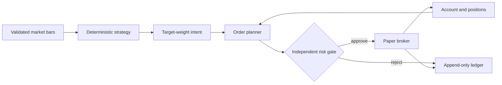

# Architecture

TradeAgent is a Python modular monolith built around one non-negotiable boundary:
strategies propose intent; deterministic code owns sizing, risk, and execution.

## Safety invariants

1. The executable mode is always `paper`; configuration validation rejects `live`.
2. A strategy cannot access a broker. It returns a bounded target weight.
3. Every new-risk order passes the risk engine immediately before submission.
4. Duplicate client order IDs return the original fill instead of trading twice.
5. Market timestamps are timezone-aware and normalized to UTC.
6. Intent, risk decision, submitted order, and fill share a deterministic trace ID.
7. The ledger is an audit copy. A future external broker must remain authoritative and
   be reconciled before trading after every restart.

## Modules

| Module | Responsibility |
| --- | --- |
| `domain` | Validated immutable bars, intents, orders, fills, positions, and reports |
| `data` | Canonical CSV ingestion and deterministic offline fixtures |
| `strategy` | Baseline signal generation; no sizing or execution authority |
| `engine` | Event sequencing, target sizing, trace IDs, and report assembly |
| `risk` | Fail-closed hard limits independent of strategy logic |
| `broker` | Fake-money fills, costs, cash, positions, and mark-to-market accounting |
| `ledger` | Append-only SQLite audit events |
| `cli` | Backtest, persistent paper simulation, and ledger inspection |

## Deliberate MVP boundaries

- Daily OHLCV bars and market orders only
- One long-only instrument per CLI run
- SQLite for local transactional state; no distributed services
- Deterministic SMA baseline, not an asserted source of alpha
- No LLM, web dashboard, external data vendor, or brokerage credentials

The next architecture increment adds point-in-time dataset manifests, walk-forward trial
tracking, reconciliation checkpoints, observability, and a read-only local operator API.

