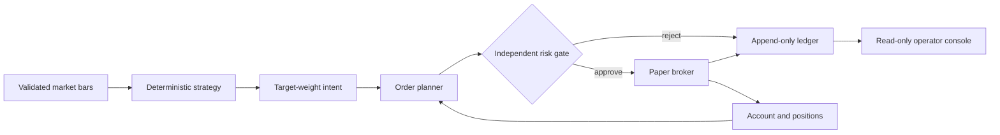

# Architecture

TradeAgent is a Python modular monolith built around one non-negotiable boundary:
strategies propose intent; deterministic code owns sizing, risk, and execution.

## Safety invariants

1. The executable mode is always `paper`; configuration validation rejects `live`.
2. A strategy cannot access a broker. It returns a bounded target weight.
3. Every new-risk order passes the risk engine immediately before submission.
4. Duplicate client order IDs return the original fill instead of trading twice.
5. Market timestamps are timezone-aware and normalized to UTC.
6. Intent, risk decision, submitted order, and fill share a deterministic trace ID.
7. The ledger is an audit copy. A future external broker must remain authoritative and
   be reconciled before trading after every restart.
8. Paper runs checkpoint broker state after fills and record progress after every bar;
   restart restores state and warms the strategy before processing only unseen bars.
9. Ordinary paper and backtest signals wait one bar before execution. Progress records
   contain a runtime configuration fingerprint, and resume fails on configuration drift.

## Modules

| Module | Responsibility |
| --- | --- |
| `domain` | Validated immutable bars, intents, orders, fills, positions, and reports |
| `data` | Canonical CSV ingestion and deterministic offline fixtures |
| `strategy` | Baseline signal generation; no sizing or execution authority |
| `engine` | Event sequencing, target sizing, trace IDs, and report assembly |
| `risk` | Fail-closed hard limits independent of strategy logic |
| `broker` | Fake-money fills, costs, cash, positions, and mark-to-market accounting |
| `ledger` | Append-only SQLite audit events |
| `research` | Dataset/config hashes, walk-forward folds, benchmark gates, and trials |
| `metrics` | Return, volatility, drawdown, risk-adjusted return, and turnover |
| `api` | Local read-only dashboard, health, status, events, experiments, and metrics |
| `alpaca` | Historical market-data client fixed to Alpaca's data endpoint |
| `alpaca_paper` | Typed brokerage client fixed to Alpaca's paper endpoint |
| `oms` | Risk-gated idempotent submission, order journal, and reconciliation |
| `cli` | Backtest, persistent paper simulation, and ledger inspection |

## Deliberate MVP boundaries

- Daily OHLCV bars and market orders only
- One long-only instrument per CLI run
- SQLite for local transactional state; no distributed services
- Deterministic SMA baseline, not an asserted source of alpha
- No LLM, external data vendor, or brokerage credentials

The OMS checks the durable kill switch and deterministic risk policy before submission,
looks up every client order ID before creating an order, and journals returned broker
state. Reconciliation treats Alpaca as authoritative and activates the kill switch for
missing or duplicate orders and blocked accounts. Direct model-to-client access is
prohibited. A continuous scheduling loop remains deliberately disconnected.
