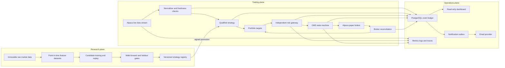

# Autonomous paper day-trading plan

## Executive decision

TradeAgent should become an **always-on, paper-only, low-frequency intraday agent** for
liquid U.S. ETFs before it considers any live capital. The initial universe is SPY, QQQ,
IWM, TLT, and GLD. The decision horizon is 5- to 15-minute bars, not high-frequency
trading.

The system must optimize for **positive expected return after realistic costs**, but
profit cannot be promised. If no candidate passes every research and operational gate,
the correct autonomous action is to remain in cash.

This plan follows the common conclusions of the four committed research reports:

- separate the research plane from the deterministic trading plane;
- never allow an LLM or model to call a broker directly;
- use point-in-time data, realistic event-driven replay, and untouched holdouts;
- make the broker authoritative and reconcile before trading;
- place an independent, fail-closed risk gateway before execution;
- progress through backtest, shadow, paper, and only then an optional human-approved
  canary;
- run the worker in a persistent cloud container or VM, not a browser or serverless
  function.

## Interpretation of "minimum trades"

The production agent will make the **minimum necessary number of trades**, not satisfy a
forced trade quota. A forced quota creates overtrading and converts transaction costs
into a guaranteed headwind.

Two different minimums are required:

1. **Minimum execution size:** initially $10–$25 paper notional so integration can be
   proven with very small fake-money exposure.
2. **Minimum evidence sample:** at least 200 out-of-sample closed trades during research
   and at least 60 closed paper round trips across at least 60 trading days before a
   strategy can be considered stable.

## Current baseline

Version 0.2 already provides:

- paper-only configuration and fixed Alpaca paper endpoints;
- canonical and aligned market data with dataset hashes;
- deterministic strategy boundaries and target weights;
- single-asset and portfolio event-driven simulation;
- commission, spread, slippage, delay, volume, and partial-fill assumptions;
- hard risk limits and a durable kill switch;
- idempotent order IDs, OMS state journaling, and broker reconciliation;
- walk-forward folds, benchmark comparison, cost/delay stress, and bootstrap bounds;
- a dashboard, metrics endpoint, Docker image, and documentation.

Current daily strategies are not qualified. The five-ETF momentum portfolio had 65%
positive folds but failed stressed and benchmark-relative gates. It must not be connected
to autonomous new exposure.

Major gaps are:

- no live intraday bar/quote stream;
- no exchange-calendar-aware daemon;
- the persisted OMS state machine is not yet wired to live Alpaca order updates;
- the PostgreSQL schema is not yet deployed to a managed database;
- the email outbox is not yet running as an always-on notifier service;
- no intraday strategy has qualified evidence;
- no always-on cloud deployment;
- no 60-day autonomous paper qualification.

## Implementation progress

The first v0.3.0 foundation batch is complete:

| Foundation | Status |
| --- | --- |
| Validated intraday mandate and small-size limits | Complete |
| PostgreSQL-compatible schema and Alembic migration | Complete |
| Exactly-one-worker lock and heartbeat repository | Complete |
| NYSE holiday/early-close session gates | Complete |
| Fail-closed 5/15-minute aggregation | Complete |
| Persisted OMS transition state machine | Complete |
| Position-cycle accounting and unique notification outbox | Complete |
| Idempotent Resend adapter | Complete |

The v0.4.0 shadow-runtime batch is complete:

| Runtime foundation | Status |
| --- | --- |
| Typed Alpaca IEX bar/quote websocket | Complete |
| Bounded reconnect backoff | Complete |
| Single-instance calendar-aware shadow worker | Complete |
| Startup and periodic broker reconciliation | Complete |
| Market-data freshness kill switch | Complete |
| Worker/reconciler/notifier heartbeats | Complete |
| Always-on outbox notifier command | Complete |
| PostgreSQL Docker Compose runtime | Complete |
| Azure Container Apps shadow deployment template | Complete |

The deployment remains shadow-only. Autonomous entries stay blocked until an intraday
strategy passes every research gate and is connected through the persisted OMS.

The v0.5.0 strategy-lab batch added fractional small-notional intraday replay,
regular-session filtering, opening-range breakout, session VWAP mean reversion, an
intraday equal-risk benchmark, and a 200-closed-trade evidence gate. Both initial
candidates failed real SPY/QQQ five-minute qualification and remain unauthorized.

The v0.6.0 evidence-hardening batch adds normalized hosted bars/quotes, point-in-time
features, regime-filtered intraday momentum, DSR/PBO gates, and an immutable one-time
holdout workflow. The fresh candidate failed on the 8,000-frame development segment, so
the 2,000-frame terminal holdout remains unopened.

The v0.7.0 forward-shadow batch adds synchronized hosted five-minute decisions,
hypothetical cost/P&L outcomes, PostgreSQL dashboard telemetry, and immutable promotions
binding strategy, dataset, configuration, Git, holdout, and exact human approval.
Autonomous entry remains blocked because no strategy qualifies.

Render is the preferred hosted fallback when Azure RBAC is unavailable. The root
`render.yaml` provisions managed PostgreSQL, dashboard, one shadow worker, and one
notifier using paid always-on services.

The Render PostgreSQL, dashboard, and shadow worker were deployed on September 4, 2026.
The notifier was subsequently deployed with a private one-recipient Resend configuration
after a successful test email.

## Target architecture



### Process topology

Deploy three containers:

| Service | Replicas | Public | Responsibility |
| --- | ---: | --- | --- |
| `tradeagent-worker` | Exactly 1 | No | Data stream, scheduler, strategy, risk, OMS, reconciliation |
| `tradeagent-api` | 1 | Authenticated | Read-only dashboard, status, research, metrics |
| `tradeagent-notifier` | Exactly 1 | No | Transactional email outbox delivery and retries |

Use PostgreSQL as the transactional source of truth and object storage for immutable raw
and normalized market data. SQLite remains for local development only.

## Default paper mandate

### Market and schedule

- U.S. ETFs only: SPY, QQQ, IWM, TLT, GLD.
- Long-only; no shorting, options, leverage, or margin.
- 5-minute primary decisions; 15-minute and daily regime context.
- Regular session only, 9:30 AM–4:00 PM America/New_York.
- No new positions during the first 5 minutes or after 3:30 PM.
- Begin flattening at 3:50 PM; hard flatten deadline at 3:55 PM.
- No overnight positions.
- Exchange calendar controls holidays and early closes.

### Small-size and low-turnover defaults

| Limit | Initial value |
| --- | ---: |
| Paper notional per entry | $10–$25 |
| Maximum position | 0.50% NAV and $25, whichever is lower |
| Maximum gross exposure | 1.00% NAV |
| Concurrent positions | 2 |
| Closed round trips per day | 2 maximum |
| Entry cooldown | 30 minutes per symbol |
| Minimum expected net edge | Greater of 15 bps or 3× estimated round-trip cost |
| Maximum daily loss | 0.50% NAV |
| Maximum intraday drawdown | 1.00% NAV |
| Consecutive rejected orders | 3, then kill switch |
| Reconciliation mismatch | Any mismatch activates kill switch |
| Stale quote | 10 seconds |
| Stale completed bar | 90 seconds |

These limits are intentionally stricter than the current general paper defaults. They may
be loosened only through a versioned configuration and a new qualification run.

## Exactly-once trade-result email

The user receives **one email per completed round trip**, after both the opening and
closing sides are reconciled. There is no separate buy email.

### Data model

Add these PostgreSQL tables:

```text
position_cycles
  cycle_id UUID PRIMARY KEY
  strategy_version TEXT
  symbol TEXT
  opened_at TIMESTAMPTZ
  closed_at TIMESTAMPTZ NULL
  opening_quantity NUMERIC
  opening_vwap NUMERIC
  closing_vwap NUMERIC NULL
  fees NUMERIC
  realized_pnl NUMERIC NULL
  outcome TEXT NULL  -- profit, loss, flat
  status TEXT        -- open, closing, closed, reconciled

notification_outbox
  notification_id UUID PRIMARY KEY
  cycle_id UUID REFERENCES position_cycles
  notification_type TEXT
  payload JSONB
  status TEXT        -- pending, sending, sent, failed
  attempts INTEGER
  provider_message_id TEXT NULL
  created_at TIMESTAMPTZ
  sent_at TIMESTAMPTZ NULL
  UNIQUE (cycle_id, notification_type)
```

### Delivery sequence

1. Broker reconciliation confirms net position is zero.
2. The worker calculates realized P&L from authoritative fills, fees, and crypto fees.
3. In one database transaction it marks the cycle `reconciled` and inserts one outbox row.
4. The notifier claims the row with `FOR UPDATE SKIP LOCKED`.
5. It sends through a provider adapter such as Resend, SendGrid, or AWS SES using
   `notification_id` as the idempotency key where supported.
6. It stores the provider message ID and marks the row `sent`.
7. Retries reuse the same outbox row. The unique constraint prevents a second email.

### Email contents

Subject:

```text
[PAPER] SPY round trip closed: PROFIT +$0.42
```

Body:

- PAPER banner;
- profit, loss, or flat result;
- symbol and strategy version;
- opening and closing timestamps;
- opening and closing VWAP;
- quantity and notional;
- fees, modeled slippage, and net realized P&L;
- holding duration;
- entry and exit rationale;
- risk checks and trace ID;
- link to the dashboard cycle.

Never include API credentials, account IDs, or full account balances.

## Strategy development program

### Strategy family 1: opening-range trend

Use the first 15 or 30 minutes to define a range. Enter only when:

- price closes outside the range;
- volume is above its point-in-time intraday baseline;
- spread and expected slippage are below thresholds;
- the daily and 15-minute trend agree;
- expected move exceeds 3× total round-trip cost.

Exit by trailing volatility stop, failed breakout, time stop, take-profit, or session
flatten.

### Strategy family 2: VWAP mean reversion

Enter only when:

- price is statistically far from session VWAP;
- the daily regime is not a strong trend;
- short-horizon momentum has decelerated;
- volume and spread permit entry;
- a realistic mean-reversion target exceeds total costs.

Exit at VWAP/partial reversion, volatility stop, time stop, or session flatten.

### Strategy family 3: cross-sectional intraday momentum

Rank the ETF universe on:

- previous-close-to-current return;
- 15-, 30-, and 60-minute momentum;
- volatility-adjusted momentum;
- relative volume;
- spread and liquidity.

Hold only the strongest one or two positive candidates. Compare with an equal-risk
passive ETF basket and cash.

### Strategy family 4: pairs/statistical spread

Only after the first three baselines:

- identify stable economic pairs;
- estimate point-in-time hedge ratios;
- use purged walk-forward estimation;
- reject unstable or structurally broken relationships;
- remain long-only initially by expressing relative views through allocation rather than
  short legs.

### Classical ML challenger

Only after deterministic baselines and data contracts are stable:

- logistic regression and Elastic Net;
- random forest or gradient-boosted trees;
- predict net-of-cost outcome or expected return, not raw direction;
- calibrate probability;
- use feature importance and drift monitoring;
- require performance above the best deterministic strategy.

Do not use reinforcement learning, sequence deep learning, or unrestricted LLM decisions
in this phase.

## How the agent "learns"

The production trading loop does not self-modify.

1. The research worker creates a candidate from immutable data.
2. It records dataset, feature, code, configuration, and seed hashes.
3. The candidate runs through chronological walk-forward replay.
4. A locked terminal holdout is evaluated once.
5. Shadow mode records what the candidate would have done.
6. A human promotes a signed version to autonomous paper.
7. The worker loads only the signed version and cannot retune it intraday.
8. Drift or degraded results demote the strategy to shadow/cash.

An LLM may summarize experiments, propose hypotheses, and draft reports. It cannot alter
risk limits, sign a promotion, or submit/cancel orders.

The agent also maintains point-in-time recent-news context from official and licensed
sources. News initially controls deterministic blackouts and uncertainty thresholds; an
LLM may produce cited operator summaries but never directional orders or risk overrides.

## Research and promotion gates

### Data gates

- Point-in-time bars and quotes with event, receive, and process timestamps.
- Exchange calendar, early closes, splits, dividends, symbol changes, and delistings.
- Raw immutable vendor payloads retained in object storage.
- Missing, duplicate, crossed, or stale data quarantined.
- Intraday quote/spread data; OHLCV alone is insufficient for execution claims.
- Independent vendor cross-check before production paper.

### Backtest gates

- Event-driven next-event execution; never same-close execution.
- Partial fills, order rejects, cancel latency, spread, impact, and participation.
- 1×, 2×, and 3× cost scenarios.
- One- and two-bar decision delays.
- Purged/embargoed rolling walk-forward evaluation.
- Locked terminal holdout.
- Bootstrap confidence intervals.
- Deflated Sharpe Ratio probability at least 95%.
- Probability of Backtest Overfitting below 20%.
- At least 200 closed out-of-sample trades.

### Performance gates

All must pass:

| Measure | Requirement |
| --- | --- |
| Positive folds | At least 60% |
| Net excess return | Positive after all costs |
| Bootstrap lower bound | Greater than zero |
| Benchmark wins | At least 60% of folds |
| Net Sharpe | At least 1.0 |
| Sortino | At least 1.25 |
| Profit factor | At least 1.20 |
| Maximum drawdown | At most 5% in research |
| 3× cost scenario | Still positive |
| Two-bar delay | Still positive |
| Trade concentration | No single trade supplies over 10% of profit |

These are promotion thresholds, not guarantees.

### Autonomous paper gates

- At least 60 trading days.
- At least 60 reconciled round trips.
- Positive net paper P&L after estimated fees and slippage.
- Paper Sharpe at least 0.75.
- Maximum drawdown below 3%.
- No unhandled exceptions.
- No duplicate orders.
- No unresolved reconciliation mismatch.
- 100% of closed cycles produce exactly one email.
- At least one controlled restart and one broker-disconnect drill.

## Order state machine

Implement explicit states:

```text
CREATED
  -> RISK_REJECTED
  -> APPROVED
  -> SUBMITTING
  -> ACKNOWLEDGED
  -> PARTIALLY_FILLED
  -> FILLED
  -> CANCEL_PENDING
  -> CANCELED
  -> REJECTED
  -> EXPIRED
  -> RECONCILIATION_REQUIRED
```

Rules:

- every transition is append-only and idempotent;
- transitions are validated;
- a lost acknowledgement triggers lookup by client order ID, never blind resubmission;
- partial fills update portfolio risk immediately;
- cancel/replace preserves lineage;
- startup blocks new exposure until all nonterminal orders are reconciled;
- broker state always wins over local projections.

## Autonomous worker lifecycle

### Startup

1. Acquire a PostgreSQL advisory lock so only one worker is active.
2. Load paper-only configuration and secrets from the secret manager.
3. Confirm the endpoint is `paper-api.alpaca.markets`.
4. Activate the kill switch by default.
5. Verify clock skew.
6. Load the exchange calendar.
7. Reconcile account, positions, open orders, and fills.
8. Load the signed qualified strategy and exact configuration hash.
9. Warm features from point-in-time history.
10. Start market-data streams.
11. Require healthy data for a full warm-up period.
12. Release the kill switch only after every startup gate passes.

### Intraday loop

1. Receive event.
2. Validate timestamp, sequence, freshness, and symbol.
3. Update feature state.
4. On completed decision bar, generate candidate targets.
5. Apply calendar, regime, spread, liquidity, cooldown, and edge filters.
6. Convert targets into orders using broker-confirmed NAV.
7. Apply the independent risk gateway.
8. Submit through the OMS.
9. Stream order updates and reconcile.
10. Update the position cycle.
11. On reconciled closure, enqueue exactly one result email.

### Shutdown

- Stop new entries at 3:30 PM.
- Cancel stale or unneeded entry orders.
- Flatten by 3:55 PM.
- Reconcile until positions and orders are terminal.
- Flush metrics and outbox.
- Retain the advisory lock until shutdown completes.

## Always-on deployment

### Recommended platform

Use **Azure Container Apps with minimum replicas set to 1** or a small Ubuntu VM running
Docker Compose. Container Apps is preferred for managed restarts and deployments; a VM is
simpler to debug. Neither depends on the laptop after deployment.

Do not deploy the trading worker to Vercel, browser JavaScript, a scheduled function, or
a scale-to-zero service.

### Managed resources

- Azure Container Registry for images.
- Azure Container Apps environment.
- `tradeagent-worker` with `minReplicas=1`, `maxReplicas=1`.
- `tradeagent-notifier` with `minReplicas=1`, `maxReplicas=1`.
- `tradeagent-api` with authenticated ingress.
- Azure Database for PostgreSQL Flexible Server.
- Azure Blob Storage for immutable Parquet/raw data.
- Azure Key Vault for Alpaca and email credentials.
- Azure Monitor/Application Insights for logs, metrics, and alerts.
- Resend, SendGrid, or Azure Communication Services Email.

### Deployment pipeline

1. Build a pinned, non-root Docker image.
2. Generate an SBOM and run dependency/security scans.
3. Run formatting, typing, unit, integration, replay, and migration tests.
4. Push the immutable image tagged with Git SHA.
5. Run database migrations as a one-shot job.
6. Deploy the API and notifier.
7. Deploy the worker with its kill switch active.
8. Run startup reconciliation and health checks.
9. Run shadow mode for one session.
10. Enable autonomous paper only through an audited promotion command.
11. Automatically roll back if health or reconciliation fails.

The GitHub OAuth token still needs `workflow` scope before the CI workflow can be
published. Until then, releases must not be considered production-ready.

### Required environment/secrets

```text
TRADEAGENT_MODE=paper
TRADEAGENT_DATABASE_URL=postgresql+...
TRADEAGENT_OBJECT_STORE_URL=...
TRADEAGENT_STRATEGY_VERSION=...
TRADEAGENT_CONFIG_HASH=...
ALPACA_KEY_ID=...
ALPACA_SECRET_KEY=...
ALPACA_FEED=sip
EMAIL_PROVIDER=resend
EMAIL_API_KEY=...
EMAIL_FROM=...
EMAIL_TO=...
```

Secrets never appear in images, logs, prompts, email bodies, frontend code, or database
event payloads.

## Monitoring and alerts

### Trading metrics

- NAV, realized/unrealized P&L, drawdown, gross/net exposure;
- decisions, orders, fills, rejects, cancels, partial fills;
- spread, expected versus realized slippage, and participation;
- round trips, win rate, profit factor, turnover, and holding time;
- strategy versus benchmark and expected versus realized edge.

### System metrics

- heartbeat age;
- market-data age and sequence gaps;
- broker request latency and error rate;
- reconciliation duration and mismatch count;
- database pool/lock health;
- queue depth and outbox retry count;
- process restart count and clock skew.

### Immediate alerts

- kill-switch activation;
- stale or disconnected market data;
- any reconciliation mismatch;
- duplicate order ID;
- broker authentication failure;
- daily-loss or drawdown breach;
- failure to flatten;
- email outbox repeatedly failing;
- worker heartbeat older than 60 seconds.

Send operational alerts separately from the one-per-round-trip result email.

## Failure-injection program

Automated tests must simulate:

- duplicate bars and out-of-order events;
- stale quote, frozen feed, and missing bar;
- broker timeout before acknowledgement;
- broker accepted order but client lost response;
- duplicate webhook/order update;
- partial fill followed by disconnect;
- cancel race with fill;
- process crash after fill but before local write;
- database failover;
- notifier crash before and after provider acceptance;
- clock skew;
- market halt and early close;
- restart with open orders or positions.

Every scenario must either recover idempotently or activate the kill switch and require
operator reconciliation.

## Delivery phases

| Phase | Duration | Deliverable | Exit criterion |
| --- | ---: | --- | --- |
| 0. Mandate and contracts | 2–3 days | Intraday config, schemas, calendars | Paper-only invariants tested |
| 1. Cloud data foundation | 1–2 weeks | PostgreSQL, object storage, migrations | Replay reproducible by hashes |
| 2. Intraday ingestion | 1–2 weeks | Alpaca stream, quotes, 5/15-minute bars | Freshness and gap tests pass |
| 3. OMS completion | 1–2 weeks | Full order state machine | Crash/retry tests pass |
| 4. Email outbox | 3–5 days | Exactly-once round-trip email | Duplicate/retry tests pass |
| 5. Strategy lab | 4–8 weeks | Three deterministic candidates | At least one passes research gates |
| 6. Autonomous daemon | 1–2 weeks | Calendar-aware paper worker | Shadow session clean |
| 7. Cloud deployment | 1 week | Always-on services and alerts | Laptop-off soak passes |
| 8. Shadow qualification | 2–4 weeks | No-order forward decisions | No safety incidents |
| 9. Autonomous paper | 60+ trading days | Small low-turnover paper trades | All paper gates pass |
| 10. Optional canary | Out of scope | Human-approved tiny live capital | Legal and operational approval |

Research can take longer than this estimate. No deadline overrides a failed gate.

## Ordered implementation backlog

1. Add PostgreSQL migrations for events, controls, orders, fills, cycles, experiments,
   heartbeats, and notification outbox.
2. Create repository interfaces so local SQLite tests and PostgreSQL production use the
   same contracts.
3. Add exchange calendar and UTC/event/arrival/processing timestamps.
4. Add Alpaca websocket ingestion for trades, quotes, bars, and order updates.
5. Build deterministic 5- and 15-minute bar aggregation with restart recovery.
6. Complete the order transition state machine.
7. Add scheduled startup, periodic, and shutdown reconciliation.
8. Add position-cycle accounting based on authoritative fills.
9. Add transactional email outbox and provider adapter.
10. Add exactly-once email integration tests.
11. Add spread, impact, queue, halt, and missing-data replay.
12. Add opening-range trend baseline.
13. Add VWAP mean-reversion baseline.
14. Add intraday cross-sectional momentum.
15. Add purged/embargoed validation, Deflated Sharpe, and PBO.
16. Lock the terminal holdout.
17. Add champion/challenger registry and signed promotion.
18. Build the calendar-aware autonomous worker.
19. Add structured logging, OpenTelemetry, and alert rules.
20. Provision cloud infrastructure as code.
21. Publish CI after granting the owner token `workflow` scope.
22. Run shadow mode, failure drills, and a laptop-off soak.
23. Start 60-day minimum-size autonomous paper qualification.

## Definition of done for this phase

The autonomous paper day-trading phase is complete only when:

- the cloud worker stays healthy with the laptop off;
- one and only one worker can trade;
- all starts and restarts reconcile before new exposure;
- only signed, qualified strategy versions can enter;
- each trade is small, intraday, long-only, and low-turnover;
- every closed round trip produces exactly one profit/loss email;
- every order and decision is traceable to data, strategy, risk, and deployment versions;
- failure drills recover or fail closed;
- at least one strategy passes all research gates;
- the strategy then passes at least 60 trading days and 60 closed paper round trips;
- no live endpoint or live credential is accessible.

If no strategy satisfies these conditions, TradeAgent remains a safe research and shadow
system rather than manufacturing trades.
